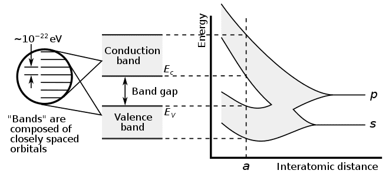
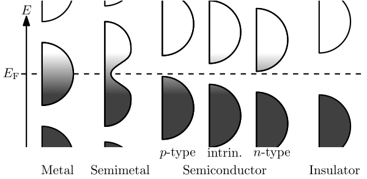
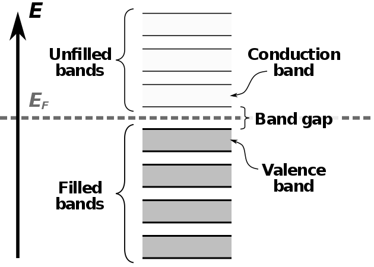
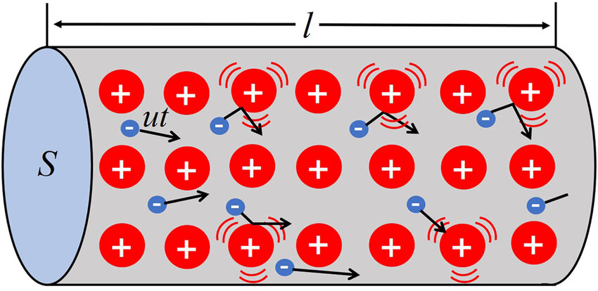
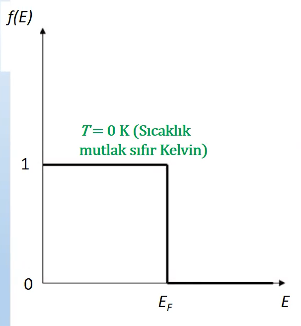
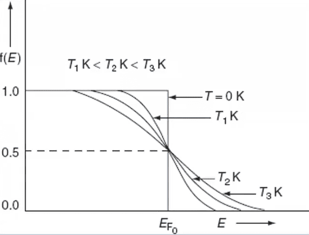
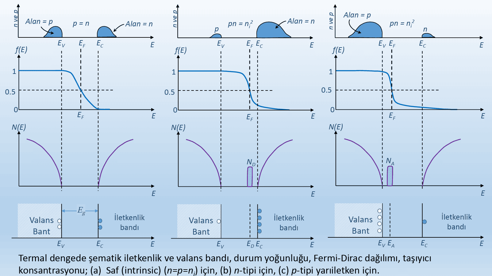
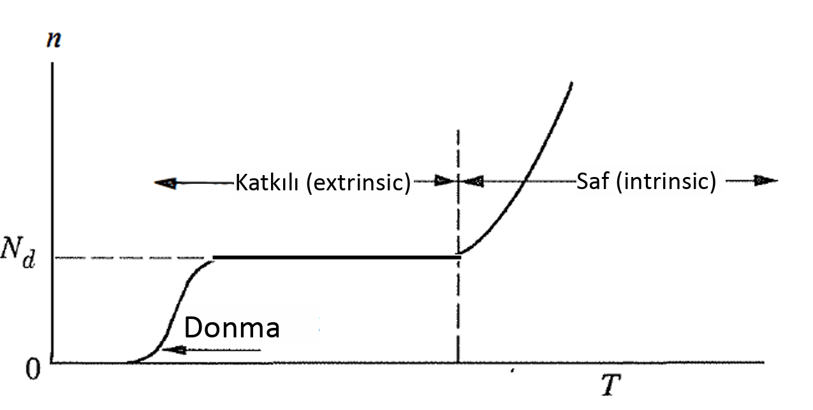

 
Fizik II'den bilinmesi gerekenler

# Baglar
----------
## Iyonik:
* Zit yuklu iyonlarin colomb yasasi geregi baglanmasiyla olusur.
* Bir elekktron alt yorungeye gecerek enerji verdigi zaman bu enerjiye *`elektron afinitesi`* denir. 
* *`Ayrisma Enerjisi`*, molekuler baglari kirmak ve atomu notr hale getirmek icin gereken enerji.
* Pozitif iyonlar elektron kaybettikleri icin notr atomdan daha kucuklerdir.
* Negatif iyonlar elekktron aldiklari icin notr atomdan daha buyuklerdir.
* Nispeten kararli ve kristal yapi olustururlar.
* Zayif elektrik ve isi iletkenleridir.
* Birbirlerine sikica baglanirlar.
* Erime noktalari yuksektir.
* Serbest elektron icermezler.
* Isik gecirgen ancak kizilotesi bolgede guclu sogurucudurlar.
----------
## Kovalent:
* Elementlerin elektron afinitesi ( elektron alma istegi ) birbirine yakinsa iyonik bag olusacagina **Kovalent bag** olusmaktadir.
* Iki veya daha fazla atomun elektronlarinin paylastiklari bag turudur.
* Guculudurler.
* Yonludurler.
* Cok iyi iletkenlik gostermezler.
* **Polar Olan:** Her iki atomun elektron afinitesi dusuk oldugundan elektron uzerine uygulanan cekim kuvveti esit olur ve polirazsyon gerceklesmez.
* **Polar Olmayan:** Ustteki durmun aksina cekim kuvveti esit olmadigindan polirazsyon gorulur.
----------
## Metalik:
* Dusuk sayida valans elektronlarina sahip olan elementler arasinda olusur.
* Yonden bagimsiz bir bag cesisididir.
* Atomlar valans elektronlarini vererek bir elektron denizi olustururlar.
* Bir potansiyel fark olusuturuldugu zaman bu elektronlar kolayca hareket eder.
* Elektrigi cok iyi iletirler ve gucludurler.

 
Enerji / Band Yapilari

* kati halde olan bir maddeyi inceledigimizde `band yapisina` bakarak biz elektronlarin enerji araliklarini gorebiliriz.
Yani, elektronlarin cikabilecekleri `bandlar` ve cikamayacaklari `yasak enerji araliklari`.
* temel sorumuz: atomlar yanyana geldiklerinde ne oluyor?

----------

    
    

----------

* Yukaridaki sekilde gordugumuz gibi ayni maddenin iki atomu birbirine yaklastikca zaman surecinde olusan band ve enerji araliklari 
degismektedir. Bandlarin olusumu, en dis katmanda olan elektronlarin, valans elektronlari, sayesinde olur. Bu valans elektronlari,
baglarin olusumundan ve akimin iletilmesinden sorumludurlar. Cekirdege daha yakin olan elektronlarin orbitalleri hatiri sayilmayacak
kadar kucuk derecede cakisirlar.

* `Yasak enerji araliklari`, bantlar tarafindan "kaplanmayan" araliklardir. Bunun sonucunda, sonlu miktarda bant olusur.
Bahsi gecen bantlarin genislikleri farklilik gostermektedir. Orbitallerin cakisma miktarina gore bu genislikler degismektedir.

* Atmolar birbirine yaklastikca bantlar genisler ve atomdan ne kadar uzaksa bu band o kadar genisler. Cunku orbitallerin yaricapi buyur
ve bu sekilde etkilsemesi daha fazla olur. Ayrica, fazla etkilesim de bant genisligini arttirir. Cekirdege yakin olanlar, daha sıkı bagli
olduklari icin ve yaricaplari da kucuk oldugu icin etkilesimleri cok daha azdir dolayisiyla genislemeleri de kucuktur.

* Bunlarin sonucunda, artik elektronlarin kati boyunca hareket edebilecekleri kristal orbitalleri vardir, atomik orbitaller yerine.

* Elektronun bu kristal yapidaki hareketi herhangi bir bosluktaki harektinden farkli olacaktir. Disaridan kuvvet uygulandigi gibi iceriden
etki eden kuvvetlerde olacaktir. ( proton notron cartcurt ). Bu ic kuvvetlerin etkisini hesaplamak oldukca zordur dolayiysiyla `etkin kutle`
hesabi devreye girer. Butun bunlarin hesaba katilmasi sarti ile elektrona klasik bir parcacik gibi bakilabilir ve hareketi klasik mekanikle
modellenebilir:
$$\Large a = \frac{eE}{m^*}$$

----------

    
    

----------

* Atomu dusunelim. Cekirdek var ortada ve onun etrafinda elektronlarin **izinli** ve **izinsiz** bolgeleri var.
* Elektron, bulundugu konumunu deigstirecekse baglama gore bir enerji alisi ya verisi gerceklesir. Cekirdekten uzaklasmak icin enerji alirken
yaklasmak icin enerji verir.

----------

----------

#### Kucuk bir ozet
* Herhangi bir elementin elektriksel iletkenliginden bahsedebilmek icin oncellikle valans elektronlarinin serbestce hareket edebilecekleri bir kristal
yapinin olmasi gerektigini ogrendik.
* Metallerden ornek alacak olursak bazilarinin valans bandinin yarim dolu oldugunu oburlerinin ise tam dolu biliyoruz. Sodyumun son yorungesi `3s1` olup yarim doludur.
Bu elemntin atomlari bir araya geldiklerinde bir kristal yapi olusturup valans elektronlarinin serbestce hareket edebilecekleri bir ortam olusturduklarini ogrendik. Peki,
Magnezyum gibi metallerde son orbital bos olmadigi halde iletkenlik gosteren ve vlans elektronlari serbest bir sekilde dolasan elementlerdeki durum nasil? Onlarda
bir sonraki band zaten valans bandin uzerine cakismis durumdadir. Yani, elektronlarin gezebilecekleri yer zaten var.
* Yalitkan ve Yariiletkenlerde durum farklidir. Onlarin valans bandlari zaten dolu durumdadir ve elektronlarin serbest gezebilecekleri bir yer yoktur. Dolayisiyla, bir enerji verip
bu elektronlari bulunduklari banddan atlatip baska bos bir banda gecirtme cabasindayz. Yalitkanlarda bu mumkun degil. Yaltikanlarin yasak enerji araligi oldukca buyuktur ve
yari iletkenlerden farki odur. Yari iletkenlerin yasak enerji araligi makul oldugu icin valans elektronrina belli bir miktar enerji vererek onlari bir sonraki bos banda gecirme
ihtimalimiz var.

----------

 
Elektron Mobilitesi

* Kati hal fiziginde, bir elektronun belli bir manyetik alan tarafindan cekilirken herhangi bir metal veya yari iletkenin icinden
ne kadar hizli gecebilecegini anlatan kavramdir mobilite.

* Bir Elektriksel Alan uygulandiginda, elektronlar ortalama hiz seklinde ifade edilen bir `drift hizi` ile cevap verir.
    $$\Large v_d = \mu E.$$

* Peki, sabit olmayan bir hiz olduguna gore bu hiza sebep olan bir ivme ve bu ivmeye sebep olan bir kuvvet olsa gerek. Bu kuvvet
elektriksel alanin sebep oldugu kuvvet. 

    $$ \Large F = -eE .$$

* Mobilitenin formulune gelecek olursak, 

$$e: \text{elekktron yuku} $$

$$t_c: \text{bir elektronun tekrar carpana kadar gedirdigi sure.}$$
$$\Large \mu_e = \frac{e \tau_c}{m_e^*}$$

    

 
Maddelerin ozelliklerine gore siniflandirmasi

### Iletkenler (Metaller) :
*  Değerlik elektronları bir `elektron gazı` oluşturur ve belirli bir iyona bağlı değildir
*  $$\large \sigma =  10^{-4} - 10^{-6}$$
*  `Sicaklik arttikca iletkenlik azalir.`
* Zaten butun valans elektronlari iletim bandinda oldugu icin verilecek olan sicaklik elektronlarin ve iyonlarin `stresini` 
artirarak mobiletenin azalmasina neden olacaktir dolayisiyla iletkenlik de azalir.

### Yari iletkenler:
*  Cougnulukla kovalent baglanma ve zayif baglar.
*  $$\large \sigma =  10^{-4} - 10^{10}$$
*  Hem iletken hem de yaliktan yapmak mumkun.
*  Katkilama ve sicaklik ile yuk tasiyici sayisi ve cesidi degisebilir.
*  Katkilama ile yapi icerisinde yapisal E.
*  `Sicaklik arttikca iletkenlik artar.`
* Valans bandinda cikmayi bekleyen elektronlar bulunmaktadir. Verilecek isi ile bu elektronlar iletim bandina
cikacaklardir. mobilitenin azalma durumu tabii ki de vardir ancak iletim bandina cikan elektron sayisi
oldukca buyuk oldugu icin her turlu iletkenlik artmis olur.

### Yalitkanlar  :
*  Degerlik elektronlari sikica baglanir (veya bireysel atomlarla paylaşılır)
en güçlü iyonik (kısmen kovalent) bağlanma.
*  $$\large \sigma \ge 10^{10}$$

----------

* Butun elementlerin `iletkenlik` skalasina bakacak olursak en kucuk ve en buyuk elementler arasindaki farkin 10 20 oldugunu gorebiliriz. Bu genis araligin baska hic bir
ozellikte bulunmadigini bilelim. Sebebi de yukarida acikladigimiz gibidir.

* Butun metallere ( iletkenler ) baktigimiz zaman bunlarin iletkenlik degerleri birbirlerine oldukca yakindir. Keza ayni durum yalitkanlar icin de gecerlidir.

* Ayni sicaklikta silisyuma gore germaniymun iletim bandinda daha fazla elektronun bulunma sebebi, germanyumda yasak enerji araliginin
daha kucuk olmasidir.

 
Bipolarlik

* Yari iletkenlerde, belli bir enerji verip valans elektronlarinin bir kismini iletim bandina gecirdikten sonra
kovalent baglarini kirip ancak iletim bandina gececek kadar yeterli enerjiye sahip olamayan elektronlarin
yaptigi sey uygulanan manyetik alanin yonune dogru olusan `bosuluklara` gecmektir. Bu hareketlilik ayrica
bir iletkenlik kazandirir ve bu iletkenlik hesaba katilir

* Bosluk hareketinin yonu elektronun hareketine ters olmakla beraber elektrik alaninin yonuyle aynidir.

* Iletim bandina gecen elektronlarin mobilitesi valans bandinda hareket eden elektronlarin mobilitesinden 
daha buyuktur. Bu elektornlar tekrar bosluga gecip bag kurduklari ve cekirdege daha yakin olduklari icin
mobiliteleri kucuktur iletim bandindaki elektronlarin mobiletsinden.

* Valans bandindaki elektron `lokalize`dir ve iletim bandindaki elektron `serbest`tir.

* `Bipolar iletkenlik:` hem elektronlar hem bosluklar yuk tasiyicisidir.

 
Yariletken tipleri

* `4.Grup elementler` temel yari iletkenlik ozellik gosteren elementlerdir. 
* Asal = Saf = Intrinsic
* Saf yari iletkenler tek atomluk da bulunabilir bilesik halinde de: GaAs
* `Carbonun` degisik formlari degisik iletkenlik ozellikler gosterir.
* Katkili -> `n-tipi` ve `p-tipi.`
* Katiklama mevzusu iletkenligi elimize verir. Artik istedigimiz gibi ayarlayabiliriz.
* Asal iletkenler de: `p_i = n_i`

## Asal

* $$\Large \sigma = e(p\mu_p + n\mu_n)$$

* $$\Large p_i = n_i$$
* $$\Large p_i . n_i = n_i^2 = p_i^2$$
* $$\Large E_g = E_c - E_v$$
* $$\small  E_g : Yasak Enerji Araligi$$
  $$\small  E_c : Iletim Bandinin Dibi$$
  $$\small  E_v : Valans  Bandinin Tavani$$

* $$\Large N = \int_{E_1}^{E_2} N(E)dE$$ 
* $$\small \text{E1 ve E2 arasinda bulunan N tane izinli enerji durumu.}$$

* $$\Large N_{C}(E) = \frac{1}{2\pi \hbar^3} \left(2m_e^*\right)^{3/2} \sqrt{E - E_C}$$
* $$\Large N_{V}(E) = \frac{1}{2\pi \hbar^3} \left(2m_h^*\right)^{3/2} \sqrt{E_V - E}$$
* $$\small \text{VB : Valans Bandi icin birim hacimde yogunluk.}$$
* $$\small \text{CB : Conduction  Bandi icin birim hacimde yogunluk.}$$

#### Fermi Enerjisi
* Bir kristal elektronu mevcut en dusuk enerjili seviyeyi isgal eder.
* Sanal bir enerji seviyesi olup saf iletkenlerde yasak araligin ortasindadir.
* `E_f` seklinde gosterilir.
* Bir kristalde elektronun alabilecegin en yuksek enerji olarak tanimlanir.
* Kristal surekli dengededir ve kendi enerjisini durduk yere degistiremez. ( d'Alembert Prensibi )
* Elektronlar mevcut orbitallere Pauli ilkesine gore yerlesirler `ters-spin`.

* Yari iletkendeki iletkenlik ve valans bandindaki izinli enerji seviyelerinin sayisina `Durum Yogunlugu` ve 
`N(E) durum yogunlugu denir.`
* Tam Spin -> `Bozon.`
* Yari Spin -> `Fermiyon.`

#### Dagilim Fonksiyonu
* `Fermi-Dirac dagilim fonksiyonu:` Belirli bir sicaklikta YI valans ve iletim bandlarindaki 
elektronlarin denge durmunun dagilimini, enerjinin fonksiyonu olarak tanimlar.
* Belirli bir E enerjili seviyenin belirli bir sicaklikta bir elektron tarafindan isgal edilme olsailigidir.
bu olasilik `0` ve `1` arasindadir.
* isgal edilmeme olasiligi `1-f(e)` seklinde hesaplanarak `1` elektornun varligini temsil ederken `0` yoklugunu 
temsil etmekte.

* $$\Large f(E) = \frac{1}{1 + e^{(E - E_F)/k_B T}}$$ 
* Bu durumda `T` degerini `0K` alirsak her turlu `sonsuz`a gidecegini biliyoruz. Ancak, eksi sonsuz mu
arti sonsuz mu onu `E - E_f` belirleyecektir. Sectigimiz `E` degeri fermiden buyukse eger yani `iletim bandinda`
ise e uzeri `sonsuz` olup degerimiz `0` olacaktir. Aksi takdirde, sectigimiz `E` degeri fermiden kucukse yani
`valans bandi` ise e uzer `- sonsuz` olur ve `1` degerini aliriz.     
Bu takdirde su yorummu yapabiliriz: `0K'de iletim
bandinda elektron bulunmaz iken valans bandinda bulunur.`

    
    
<i>Sicaklik Degisimi ile elektron dagilimi fonksiyonu.</i>

 

* Eger `E` sayisini fermiye esit alirsak elektron dagilimi `%50` yi verir. Bu da fermi araliginin sanal oldugunu
gosterir.
* Eger `E - E_f` sayisinin sonucu `KbT`den `oldukca buyukse` yanindaki `1` ihmal edilir ve soyle bir denklem
cikar:
$$\Large A e^{-E/k_B T} \small\text{, Boltzman Dagilimi}$$
* *Bu deger bize sunu soyluyor: `senin enerjin hangi banda cikmana izin veriyorsa oraya cikarsin, hehrangi bir engel yok.`*
* Eger `E - E_f` sayisinin sonucu `KbT`den `oldukca kucukse` sonuc `1` olur. Bu bize sunu soylemekte:
`sen sicakligi ne kadar artirirsan artir cekirdege daha yakin olan elektronlari sokemezsin.`

#### Elektron Yogunlugu
$$\Large n({E_1},{E_2}) = \int_{E_1}^{E_2}N(E)f(E)dE$$
*Bunun uzerinden bit kac yorum:*

* `Mutlak sifir sicaklikta` iletkenlik bandinda bulunan elektron yogunlugu:
* $$\Large n_{CB} = \int_{E_c}^{\infty}N(E)f(E)dE = 0$$

* `Mutlak sifir sicaklikta` valans bandinda bulunan elektron yogunlugu:
* $$\Large n_{VB} = \int_{-\infty}^{E_V}N(E)f(E)dE$$
* $$\Large p_{VB} = \int_{-\infty}^{E_V}N(E)[1-f(E)]dE$$

----------
* *Asal Yariletkende Serbest Elektron Yogunlugu*

$$\Large n_i = N_c \exp \left( -\frac{E_c - E_F}{k_B T} \right)$$

* *Asal Yariletkende Serbest Elektron Yougunlugu2*

$$\Large n_i = \sqrt{N_C N_V}\;\; exp\{-\frac{E_g}{2K_b T}\} $$

* *Asal Yariletkende Bosluk Yogunlugu*

$$\Large p_i = N_v \exp \left( -\frac{E_f - E_v}{k_B T} \right)$$

 
Katkili yari iletkenler

#### n-tipi
----------
* Pratikte bir `YI'in iletkenligini artirmak` icin sicakligi yuksek tutmak pek tercih edilmemektedir. Ayni zamanda, islem zorlugundan dolayi daha iletken olan Germanyum 
kullanilmamaktadir. `Cozum: Katkili yari iletken.`

* `n_i` -> `saf` yari iletkende serbest elektron.
* `n` -> `katkili` yari iletkende serbest elektron.

* `p_i` -> `saf` yari iletkende bosluk sayisi.
* `p` -> `katkili` yari iletkende bosluk.

* n-tipi icin katki olarak secilecek maddenin element grubu `4. grup`tan buyuk olmasi beklenir. Tercihcen, `5.grup`. Bu hesaplamalarimizi kolaylastirir ve yeterli iletkenligi 
cekmemize sebep olur. 

* Katki olarak secilecek maddenin `As` oldugunu varsayarsak bu As atomunun her biri sisteme fazladan 1 elektron saglar. Bu elektronlar `yasakli enerji araliginda` konumlanarak
`fermi enerji` seviyseini yukari tasirlar.

* `0K Sicaklikta` bu kattigim elektronlarin tamami `E_c`nin hemen altindadir.
* `Sicakligi artirmaya` basladigimiz anda butun bu kattigimiz elektronlar hemen iletim bandinda cikar. Normal elektronlarda ,her zamanki gibi, valans bandaindaki elektronlarin
bir kismi iletim bandina cikmistir.

* `10^20` kadar elektron kattigimizi varsayarsak ve onun yaninda da valans bandaindan `10^15` elektronun iletim bandina ciktigini soylersek bu bize sunu gosterir:
cogunluk yuk tasiyicilari `serbest elektronlardir` bosluklar onlarin yaninda hic bir seydir. Saf atomdan gelen elektron sayisi katkili olanindan o kadar az ki ihmal edeilebilir.

$$ n = n_i + N_D $$
$$ N_D >> n_i \;\; ise,$$
$$ n = N_D $$
$$ \sigma = N_D \; e \; \mu_n$$

* Bu tip safsizliklarla uretilen iletken `n_tipi` yari iletken denir.

----------

#### p-tipi

* Bu sefer, 4A grubundaki elementlerden daha yuksek grup numarasina sahip olan elementler degil de daha dusuk olanlari alalim. Orn: `3A`.
* Bu durumda, ekstradan elektron kazanmiyoruz. Aksine, `hole kazaniyoruz`.
* Kazandigimiz holler sayesinde `E_f duser`.
* `E_A` valans bandinin tavanina yani `E_V`ye yakindir.
* Ayrica, Valans bandindaki elektron artik hemen iletim bandina cikmamaktadir. Ilk once Katkili maddenin olusturdugu bosluklari doldurmaktadir.
* Bu sayede, bosluk sayisi cok yuksektir.

$$ p = p_i + N_A $$
$$ N_A >> n_i \;\; ise,$$
$$ p = N_A $$
$$ \sigma = N_A \; e \; \mu_P$$

* Cogunluk yuk tasiyici bosluklardir.

* Bu tip safsizliklarla uretilen iletken `p_tipi` yari iletken denir.

----------
#### Fermi Seviyesinin Yeri

*`n-tipi yari iletkende: `*

$$ n = N_c \exp \left( -\frac{E_c - E_F}{k_B T} \right)$$
$$ E_F = E_c + K_BT \ln(\frac{n}{N_c}) $$
$$ n = N_D $$

* Katkili maddenin miktarini arttirdikca `iletim` bandina yaklasan bir `E_F` soz konusudur. 

*`p-tipi yari iletkende: `*

$$ n = N_v \exp \left( -\frac{E_f - E_v}{k_B T} \right)$$
$$ E_F = E_c - K_BT \ln(\frac{p}{N_v}) $$
$$ p = N_A $$

* Katkili maddenin miktarini arttirdikca `valans` bandina yaklasan bir `E_F` soz konusudur. 

----------

#### Kompensasyon

* Pratikte bir yari iletkeni sadece `n-tipi` veya sadece `p-tipi` yapmak istemeyiz. p ve n tiplerini bulundurmak isteriz
tek bir hacimde.

* Silisyumun erime sicakligina cok yakin bir degerde firin kurup onun icine silisyum yerlestirip sonrasinda
herhangi bir gazi ( bor veya foshor ) iceri dogru gonderdigimiz zaman difuzyon olur ve o gazin atomlari
araya sikisir.

* Koydugumuz silisyumun `p-tipi` oldugunu varsayarsak onu notr edebilecek ( bor gazi ) gonderdigimiz zaman
silisyum `saf` ozellik gostermeye baslar. Tabii, giderek gaz gonderilirse `n-tipine donusur`.

* Belli bir bolgede hem `donor` hem `akseptor` varsa kimin sayisi daha buyukse ilgili bolgenin karakterini o belirler.

$$ n - N_D = p - N_A $$

$$ n_0 = \frac{(N_d - N_a)}{2} + \sqrt{\frac{(N_d - N_a)^2}{4} + n_i^2}$$

$$ p_0 = \frac{n_i^2}{n_0} $$

----------

#### Tipe gore n ve p dagilimlari.

* `Asal Yariletkenlerde:` ne kadar  bosluk varsa iletim bandinda o kadar elektorn vardir. Yani dagilim simetriktir.
* `n-tipinde:` iletim bandindaki elektron sayisi valans bandinda olusan bosluk sayisinda cok daha fazladir.
* `p-tipinde:` Valans bandinda olusan bosluk sayisi iletim bandinda olan elktron sayisindan cok daha fazladir.

----------

#### Sicakliga gore katkili madde konsentrastyonu.

* Elektron yogunlugu, belli bir sicaklik araliginda gittikca artmaya devam eder. Ta ki plateu'ya gelene kadar.
bu artma sirasinda aslinda enerji iyonlasma icin harcanir ve donor elektronlarin tamamini iletim bandina
cikana kadar devam eder. Tamami ciktiktan sonra belli bir sicaklik araliginda konsentrasyon sabit kalir.
ve bundan `KATKI MADDESI` sorumludur. Ardindan valans bandinda elektronlarin enerjisi yasak enerji araligini
gecmeye yeterli olur.

 
Akim Mekanizmalari

`Suruklenme Akimi:` Ancak ve ancak belli bir `elektrik alani` sayesinde yuk paracailkari hareket edebilirler, suruklenebilir, ve buna `suruklenme akimi` denir.

`Difuzyon Akimi:` Ancak ve ancak belli bir `isil enerji` sayesinde gerceklesir. Serbest elektronlarin, veya bosluklarin, yogun olduklari yerden seyrek oldugu yere
hareket etmeleriyle ortaya cikan bir akim turudur.

`Ikisi soz konusu olabilir !`

$$ I = I_s + I_d $$

----------

#### Akim

Elektron hareketinin tersine gerceklesen ve belli bir optansiyel fark altinda olusan bir niceliktir.

$$ J : \text{Akim Yogunlugu} \; \; \; | \; \; \; \sigma : \text{Oz iletkenlik}  \; \; \; | \; \; \;  n : \text{yuk tasiyisi yogunlugu} $$
$$ \sigma = nq \mu \; \; \; | \; \; \; I = \frac{dQ}{dt} \; \; \; |  \; \; \; J = \frac{I}{A} = nq \vec{v_s} = \sigma \vec{E}$$

----------

#### Suruklenme

* `n-tipi yariletkenlerde` yuk tasiyicilari, serbest elektronlar, elektrik alanin `tersine` dogru hareket ederler.  
* `p-tipi yariletkenlerde` yuk tasiyicilari, bosluklar, elektrik alanin `younune` dogru hareket ederler.

----------

* `ELektrik Alani yokken:` Serbest yuk tasiyicilari yapinin icersinde rastgele hareket yaparak bu kaotik ortamin icindeki hizlari 0dir.   
* `ELektrik Alani varken:` Serbest yuk tasiyicilari yapinin icersinde elektrik alanin tersine dogru hareket ederek `suruklenirler`. 

----------

$$ \mu_n = \frac{e \tau_n}{m_n^*} \;\;\;\;\; \mu_p = \frac{e \tau_p}{m_p^*}$$

* Bir elektronun mobilitesi, katkilama ve sicaklik miktarina bagli olarak degisir.
* Elektron yapinin icinde gezerken sacilma sonucunda yer degistirmesi 2 sebebten dolayi olabilir: `Fonon` veya `Iyonlar`.

`Saf` yari iletkenlerde sadece `Fonon veya orgu sacilmasi gerceklesir`. Bu sacilma turu yari iletkenin atomumndan kaynaklanir.
`Katkili` yari iletkenlerde sadece `Fonon` soz konusu degildir. Maddenin kendi yapisindan kaynaklanan atomlarin itmesinin yaninda `katkili maddenin iyonlari` da soz konusudur.

* Katkili YI'lerde, sicaklik arttikca mobilite azalir. Sebep: Fonomlarin titresiminin artmasi.
* Katkili yari iletkenlerde, katki maddelerinin iyonlari yuzunden mobilite her turlu azalacaktir. Ne kadar katki varsa mobilite o kadar azalir. Ayrica katki miktari artinca
azalis egimi de azalmaktadir. Yani, cok katkili bir yari iletkenin sicaklik arttikca mobilitesi az azalirken az katkili yari iletkenin mobilitesi cok daha hizli azalir.
* Katkili yari iletkenlerde, katkinin iyonlari ile olusan tepkiler `Colomb Tepkileridir`.

----------

#### Difuzyon

* Isinin etkisiyle, yari iletkenin belirli bir bolgesinde serbest elektronlarin yogun oldugu yerden daha seyrek olduklari yere gitmeleriyle olusan akim tipidir.
* Bu etki foton isinlariyla olabilirken iki farkli tipite yari iletken birlestirildigi zaman `compensation` sirasinda olabilir.
* `T = 0K'de difuzyon akimi yoktur.`
* Bunun sonucunda termal hiz `v_th` olusur `t -> ortalama serbest zaman. l -> ortalama serbest yol`:
$$ v_{th} = \frac{l}{t} $$

* Elektronlar `( -l , +l )` araliginda hareket ederken olusan akim yogunlugunu hesaplayabilecek bir formule ihtiyacimiz var:
$$ J_n = -e F_n = e \; v_{th} \; l \frac{dn}{dx} = e \; D_n \frac{dn}{dx} $$
$$ J_p = -e F_p = e \; v_{th} \; l \frac{dp}{dx} = -  e \; D_p \frac{dn}{dx} $$

* `D_n` ve `D_p` bir sabit olup hizin gecen yol ile carpilmasidir.
* Diferansiyeller de 

$$ D_n = \mu_n \frac{kt}{q} $$
$$ D_p = \mu_p \frac{kt}{q} $$

$$ J_{top} =  ( J_{surk} + J_{difu} )_n + ( J_{surk} + J_{difu} )_p $$
$$ J_{top} = ( e n \mu_n + e D_n \frac{dn}{dx} ) + ( e p \mu_p - e D_p \frac{dp}{dx} ) $$ 
$$ J_{top} = ( Eq n \mu_n + Eq D_n \frac{dn}{dx} ) + ( e p \mu_p - e D_p \frac{dp}{dx} ) $$ 
$$ I_{topAkim} = A J_{top} $$

----------

#### Hall Olayi

* Elektrik alan uygularken manyetik alan da uygularsak ne olur? sorusunun cevabi.
* Yani, bir elektrik alan uygulandiginda ani zamanda manyetik alan uygularsak iletim bandaindaki serbest elektronlara ne olur?
* Ilk once `metallerde` inceleyelim. Metaller, tasiyici elektron konsantrasyonu degismeyen bir madde olarak bilinir.
* Normal sartlarda metal bir cisim alip uclarina potansiyel fark ugyuladigimiz zaman, akim onun icinden bekledigimiz sekilde `dogrusal` ilerler. Ancak
manyteik alanin kuvvetine tabi tutarsak bu cismin serbest yuk tasiyicilari biraz daha egrisel bir yol cizer ve metal cismin diger uclarina dokunmaya baslar.
Bu uclara da voltmetere baglarsak artik bir potansiyel fark degeri de okuyabilecegiz.

* `Yari iletkenlerde` duruma bakalim. Dik dortgen prizmasi seklinde bir cisim hayal edelim. Bu cismin uclarina potansiyel fark olusturacak sekilde bir uretec baglarsak
`negatif` kutbundan `pozitif` kutbunda dogru bir elektron hareketi baslar. Bu bize `Elektriksel Kuvveti` gosterir. Elektriksel kuvvet varsa ona sebep olan bir alan da vardir.
Elektriksel alan da akimin yonuyle birlikte hareket etmektedir. Ayrica `Manyetik alan` da uyguladigimiz icin, parcaciklara bir baska yonde manyetik kuvvet de etki edecektir.
bu ters iki kuvvet, `manyetik vs elektriksel`, esitlenene kadar voltage degeri degismektedir. Elektronlarin yogunlastiklari bolge ve voltagin baglanma yonu bize bu cismin
`n-tipi` mi `p-tipi` mi oldugunu gosterecektir.

 
Optik Ozellikler

* Bir isik olusturmak icin `elektron`u hareket ettirmek yeterlidir.
* Sabit bir yuk elektrik alan olusturmak icin yeterlidir.
* Bir referans noktayi sectigimizi hayal edelim. Yaninda bir elektron da bulunsun. Eger bu elektron bu nokta
etrafinda git gel yapiyorsa bir `Elektriksel Alan` olusturur ayrica bu elektronun bir telden gectigini dusunursel
tel etradinda `Manyetik Alan` olusur.

$$ \large E = \frac{hc}{\lambda} $$
$$ h : plank sabiti \;\;\; c : isik hizi \;\;\; \lambda : dalga boyu $$

* Kristal yapiyi incelemek icin `x-ray` isinlari kullanilir. cunku atomlar arasi etkilesim veya mesafe 
x-isinlarinin seviyesindedir.

----------

$$ f = \frac{c}{\lambda}$$
ustteki formul frekansi belirlemekte cok onemlidir.

----------

* Bir yari iletken uzerine `hf` kadar bir elektromanyetik dalga, isik, verildigi zaman 3 durum olasidir:
    * Absorbe edilir.
    * Yansitilit.
    * Gecer.

$$ c = \sqrt{\frac{1}{\epsilon_0 . \mu_0}} $$

epsilon boslugun  gecirgenligini temsil ederken, mu manyetik gecirgenliktir.
ancak bu hiz bir YI'e girdikten sonra degismektedir.
bu degisim oranina da `kirma indisi` denir.

$$ n_r = \frac{c}{v} $$
`n_r` kirilma indisi olup `v` isigin maddenin icersindeki hizidir.

* isik girdikten sonra maddeye artik o maddenin `elektriksel ve manyetik`

$$ n^{\ast} = n_r - ilk = \sqrt{\epsilon}  $$

*Sureyya5 1.45.26*

