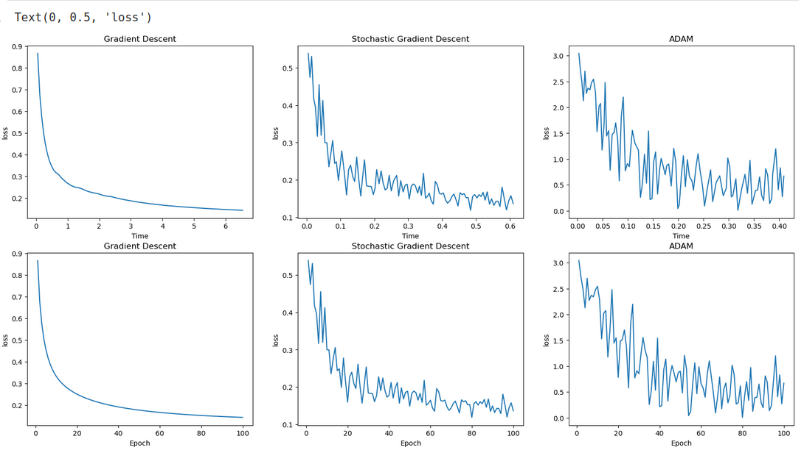
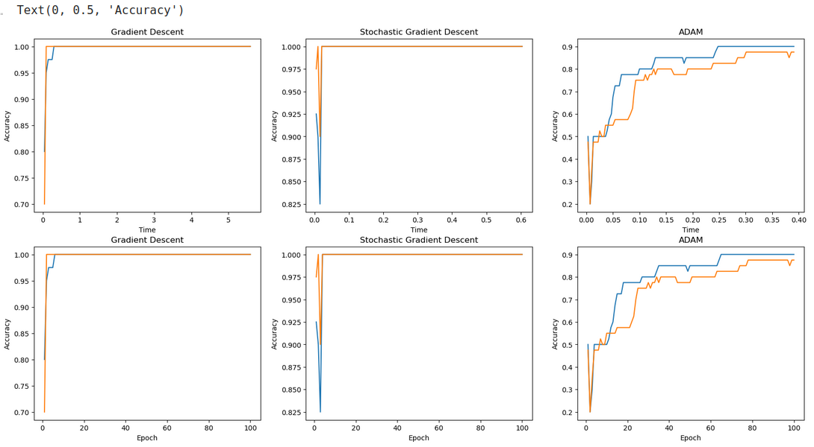

# Text-Classification-With-3-Different-Methods-Implemented-in-C

source is available at [link](https://github.com/MahmutEsadErman/Text-Classification-With-3-Different-Methods-Implemented-in-C)

This project implements classification of articles which is written about two different subjects. We used three different methods and finally we compared their results. The three methods we used are:

1. Gradient Descent
2. Stochastic Gradient Descent
3. ADAM (Stochastic)

In the example dataset we have articles about sport and business. Classification part is written in c, visualization (of plots) part is written in python.
to see the all plots you can look at "plots.ipynb" file.

## Some Plots

## Result

In the light of this project, there are some conclusion that we draw. One of them is even though in the stochastic gradient descent we are using less sample in each training it is faster and most of the time it is more accurate. The other is ADAM method is more efficient than the rest.

source of the dataset: https://www.kaggle.com/datasets/asad1m9a9h6mood/news-articles
