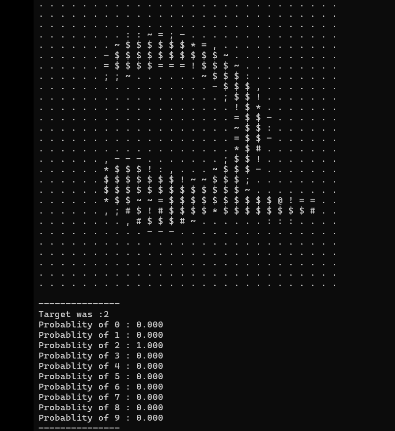
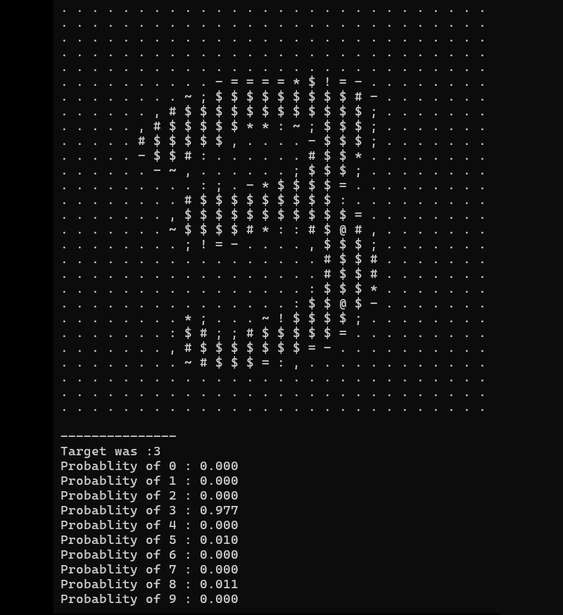

# Neural Network for Handwritten Digit Classification

## Overview
This project implements a fully connected neural network (MLP) from scratch in C to classify handwritten digits. The model achieves **96% accuracy** on the dataset using optimization techniques like **Gradient Descent (GD), Stochastic Gradient Descent (SGD), and ADAM optimizer**. The network supports softmax activation for multi-class classification and backpropagation for training.For detailed information, please read "Report.pdf".

 

## Features
- Custom implementation of a **feedforward neural network**
- **Backpropagation** for learning
- **Multiple optimizers**: GD, SGD, ADAM
- **Softmax activation** for classification
- **Load and save network states**
- **Dataset handling**: Reads structured input data
- **Shuffle and batch processing**
- **Memory management** for efficient computation

## File Structure
- `main.c` - Entry point for training and testing the model
- `network.c` - Neural network implementation
- `network.h` - Neural network structures and function prototypes
- `data.c` - Functions for reading and processing datasets
- `data.h` - Data structure definitions
- `utils.c` - Helper functions (randomization, activation, etc.)
- `utils.h` - Utility function prototypes

## How It Works
### 1. Network Structure
The neural network consists of multiple layers:
- **Input Layer**: Accepts feature values
- **Hidden Layers**: Process information with activation functions
- **Output Layer**: Uses softmax to classify input into different categories

### 2. Training Process
1. **Feedforward** - Computes activations through layers
2. **Error Calculation** - Uses loss functions to evaluate predictions
3. **Backpropagation** - Updates weights using gradients
4. **Optimization** - Applies selected optimizer (GD, SGD, ADAM)
5. **Repeat** for multiple epochs until convergence

### 3. Testing
- The trained network is evaluated on a separate test set.
- Accuracy is computed by comparing predicted and actual labels.

## Usage
### Compilation
Compile the code using `gcc`:
```sh
gcc -o neural_net main.c network.c data.c utils.c -lm
```

### Running the Program
#### Training
Run the program with a dataset file:
```sh
./neural_net train dataset.txt
```

#### Testing
Test the trained model:
```sh
./neural_net test dataset.txt
```

#### Saving and Loading the Model
To save the trained model:
```sh
./neural_net save model.dat
```
To load and use a saved model:
```sh
./neural_net load model.dat
```

## Results
- Achieved **96% classification accuracy** on the handwritten digit dataset.
- Performance depends on hyperparameters like learning rate, batch size, and optimizer.

## Future Improvements
- Implement Convolutional Neural Networks (CNNs) for better accuracy
- Experiment with different activation functions and loss functions
- Optimize memory usage for handling larger datasets


## License
This project is licensed under the **MIT License**.

