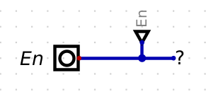

# BLM2022 - Bilgisayar Donanımı - Ödev 1

### Önder GÖRMEZ - 21501035

## Soru 1

Aşağıda doğruluk tablosu verilen 4 bitlik paralel yüklemeli register ın tasarımı yapınız.  

| E   | M2  | M1  | Q Outputs (Q4 Q3 Q2 Q1) | İşlem (Operation)                                           |
| --- | --- | --- | ----------------------- | ----------------------------------------------------------- |
| 0   | X   | X   | q                       | Önceki durumunu korur (No Operation).                       |
| 1   | 0   | 0   | q'                      | 1'e tümleyenini alır (1's complement - not)                 |
| 1   | 0   | 1   | -q                      | 2'ye tümleyenini alır (2's complement - negate)             |
| 1   | 1   | 0   | D4 D3 D2 D1             | Paralel girişteki değerleri çıkışa yansıtır (Parallel Load) |
| 1   | 1   | 1   | q - 1                   | Azaltma (Decrement) (0-1=15 kabul edilmelidir)              |

Yukarıdaki tablodan anlaşıldığı üzere M1 ve M2 4x1 multiplexer ın selection inputları olmalıdır.

JK Flip Flop doğruluk tablosu aşağıdaki gibidir.
| J   | K   | Q   |
| --- | --- | --- |
| 0   | 0   | q   |
| 0   | 1   | 0   |
| 1   | 0   | 1   |
| 1   | 1   | q'  |

4x1 Mux doğruluk tablosu aşağıdaki gibidir.
| F1  | F2  | Z   |
| --- | --- | --- |
| 0   | 0   | I1  |
| 0   | 1   | I2  |
| 1   | 0   | I3  |
| 1   | 1   | I4  |

# Input Tanımlamaları
* Logic devre çiziminde oluşabilecek karmaşıklıkları engellemek için girişlerde **input**, kablo bağlantılarının azaltılması için **tunnel** ve değerlerin (1 veya 0 gibi) gösterilmesi için **probe** elemanları kullanılmıştır.  

|         M1 M2 Inputs         |        D1 - D4 Inputs        |
| :--------------------------: | :--------------------------: |
|  |  |

* Bazı kısımlarda çıkışları temsil etmek için led lerde kullanılmıştır.

# JK Flip Flop Devresine Enable Pini Ekleme

| E   | J   | K   | Q   |
| --- | --- | --- | --- |
| 0   | X   | X   | q   |
| 1   | 0   | 0   | q   |
| 1   | 0   | 1   | 0   |
| 1   | 1   | 0   | 1   |
| 1   | 1   | 1   | q'  |

Yukarıda görülen doğruluk tablosunda yapılmak istenen enable pini 0 ise J ve K inputlarının değeri ne olursa olsun çıkışın eski değerini koruması istenmektedir. Yani aslında J ve K girişlerinin ikisininde sıfır olduğu durum ile aynı çıkışın üretilmesi istenmektedir.  
Enable pini 0 olduğu durumda girişlere bakılmaksızın çıkışlarda eski değeri görmek için aşağıdaki gibi bir tasarım yapılabilir.

Enable pini 0 değerine çekilirse eski çıkışını koruduğu gözlemlenecektir.

Enable'ın 1 olduğu durumlarda önceki JK Flip Flop çalışması korunur.

## JK Flip Flop ile Register İlişkisi

Böylelikle yukarıda verilen devre tasarımı ile 4 Bitlik paralel register ın giriş bağıntısında verilen özelliklerin hepsinin JK Flip Flop ile oluşturulabildiği görülmüştür. Çıkış bağıntılarındaki farklara göz atmak gerekirse aşağıdaki gibi olur.

| E   | M2 / J | M1 / K | Q Outputs of JK FF (Q4 Q3 Q2 Q1) | Q Outputs of Register (Q4 Q3 Q2 Q1) |
| --- | ------ | ------ | -------------------------------- | ----------------------------------- |
| 0   | X      | X      | q                                | q                                   |
| 1   | 0      | 0      | q                                | q'                                  |
| 1   | 0      | 1      | 0                                | -q                                  |
| 1   | 1      | 0      | 1                                | D4 D3 D2 D1                         |
| 1   | 1      | 1      | q'                               | q - 1                               |

Yukarıdaki tabloda 1. ve 2. satırdaki veriler dikkatle incelendiğinde Enable 0 iken JK Flip Flop çıkışının direkt Register çıkışına yansıtıldığı, Enable 1 iken JK Flip Flop çıkışının değilinin alınarak çıkışa yansıtıldığı görülebilir. Bunu gerçeklemek için XOR kapısından faydalanılabilir.

| Q1 Input = 0 --> m1 Output = 1 | Q1 Input = 0 --> m1 Output = 0 |
| :----------------------------: | :----------------------------: |
|     |     |

Yukarıdaki örnekten anlaşılacağı üzere m1 çıkışı için istenen durum sağlanmış olmaktadır.

## Sadeleştirme

* Devrede eleman tekrarını önlemek için M1 ve M2 nin girişleri aşağıdaki şekilde sadeleştirilecektir.
* Clock lar ortak olacağı için aşağıdaki şekilde sadeleştirilerek tunnel bağlantı yapılacaktır.

Bu şekilde bir sadeleştirme aracılığıyla JK Flip Flopların çıkışları aşağıdaki gibi olmaktadır.

* Register yapısına geçmek için çıkış değerlerinin girişe uygulanması veya girişten verilen değerlerin register a load edilebilmesi gerekmektedir. Bu nedenle aşağıdaki gibi bir düzenlemeye gidildi. (Not: M2 = 0, M1 = 0 ve M2 = 1, M1 = 0 durumları bu şemada düzgün çalışmaktadır.)

## 2'ye Tümleyen Alma
* M2 = 0, M1 = 1 yani 2 ye tümleyenini almak için 1 e tümleyene 1 eklemek gerekir. Zaten devre çıkışında Q' elimizde olduğu için bu çıkışa 1 değerini eklememiz yeterlidir. 
* Bunun içinde half adder devresi kullanılabilir. Doğruluk tablosu aşağıdaki gibidir.

| A   | B   | Sum | Cout |
| --- | --- | --- | ---- |
| 0   | 0   | 0   | 0    |
| 0   | 1   | 1   | 0    |
| 1   | 0   | 1   | 0    |
| 1   | 1   | 0   | 1    |

Sum = f(A, B) = A'B + B'A = A xor B  
Cout = f(A,B) = AB = A and B

|  Sum = 1 --> Carry = 0  |  Sum = 0 --> Carry = 1  |
| :---------------------: | :---------------------: |
|  |  |

Ekleme yaparken son bitleri kaskat bağlarken elde bitlerini sonraki bite veririz.

* Bu düzenlemeden sonra mux girişleri aşağıdaki gibi olmuştur.

## Azaltma İşlemi

Azaltma işlemide yukarıdaki gibi half substractor devresi ile yapılabilir.

Doğruluk tablosu aşağıdaki gibidir.  

| A   | B   | Difference | Borrow |
| --- | --- | ---------- | ------ |
| 0   | 0   | 0          | 0      |
| 0   | 1   | 1          | 1      |
| 1   | 0   | 1          | 0      |
| 1   | 1   | 0          | 0      |

Diff = f(A, B) = A'B + B'A = A xor B
Borrow = f(A, B) = A'.B

# Soru 1 Son Hali

## Kaynaklar

1. [Bilgisayar Donanımı - Ödev 1](https://online.yildiz.edu.tr/upload/ytu/Evaluation/fd097107-3694-4108-ac20-0ad4f1605376.pdf)
2. [Digital: A digital logic designer and circuit simulator.](https://github.com/hneemann/Digital)
