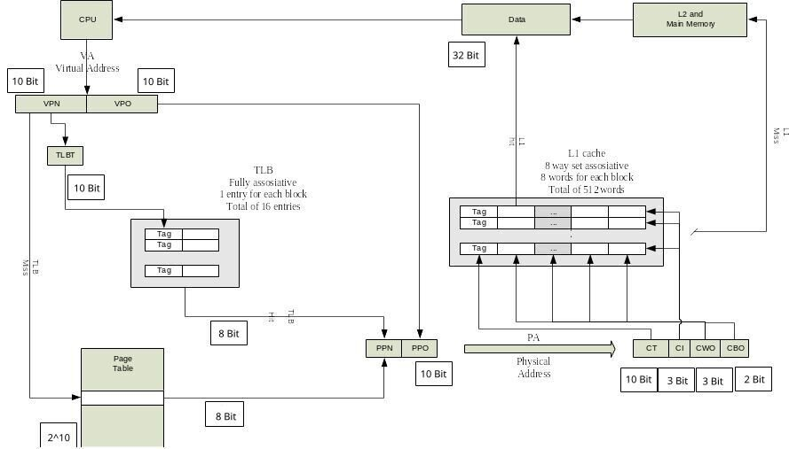
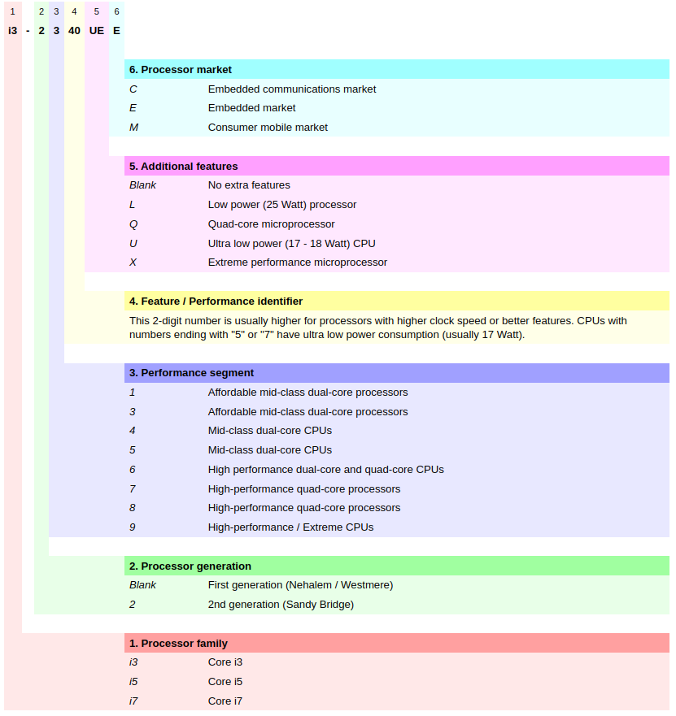
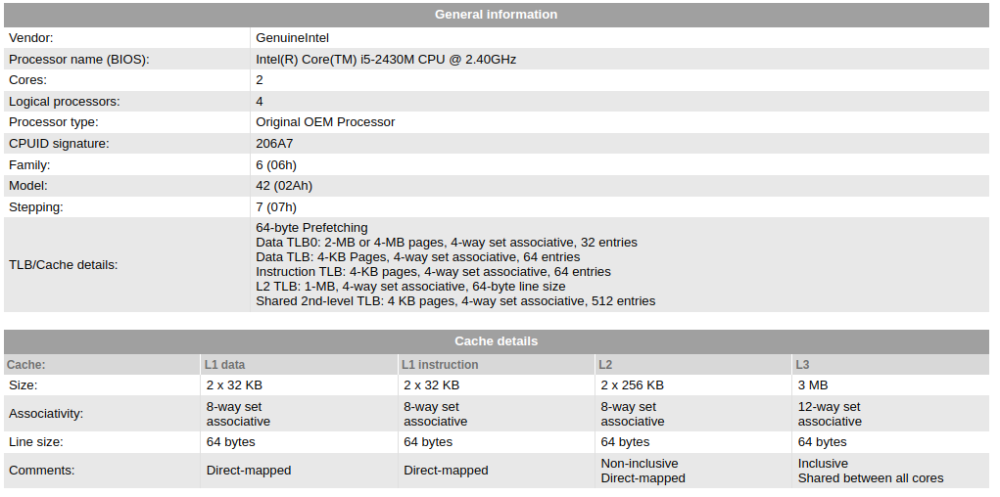

# BLM2022 Bilgisayar Donanımı
# Ödev - 2
# Bilimsel Hazırlık Öğrencisi
# Önder GÖRMEZ - 21501035

# Soru 1

## Kullanılan Terimler
Central Processing Unit (CPU): Merkezi İşlem Birimi  
Page Size: Sayfa Boyutu  
Data Path Width: Veri Yolu Genişliği  
Virtual Address Width: Sanal Adres Genişliği  
Physical Address Width: Fiziksel Adres Genişliği  

Virtual Address (VA): Sanal Adres  
Virtual Page Number (VPN): Sanal Sayfa Numarası  
Virtual Page Offset (VPO): Sanal Sayfa Ofseti  

Physical Address (PA): Fiziksel Adres  
Physical Page Number (PPN): Fiziksel Sayfa Numarası  
Physical Page Offset (PPO): Fiziksel Sayfa Ofseti  

Translation Lookaside Buffer Tag (TLBT): ?

Cache Byte Offset (CBO): Önbellek Byte Ofseti  
Cache Word Offset (CWO): Önbellek Kelime Ofseti  
Cache Index (CI): Önbellek İndeksi  
Cache Tag (CT): Önbellek Etiketi  

## Verilen Bilgiler

Page Size: 1 KB  
Data Path Width: 32 Bit  
Virtual Address Width: 20 Bit  
Physical Address Width: 18 Bit  

# Çözüm 1
Aşağıda verilen mimaride solda verilen kısım virtual memory kısmını, sağda verilen kısım ise veri cache leme kısmını göstermeketdir.

  
**Referans**: Bu resim [Dr. Öğr. Üyesi Erkan USLU
](https://avesis.yildiz.edu.tr/euslu/) hocamızın çalışmalarından alıntılanarak düzenlenmiştir.

## Virtual Memory Kısmı

* Verilen ***Page Size*** bilgisine bakarak bu sayfanın her bir gözüne ulaşabilmek için;
1 KB = 2^10 Byte ==> 10 Bitlik bir adreslemeye ihtiyaç vardır.  
Bu nedenle;  
<span style="color:red">***VPO: 10 Bit***</span> ve  
<span style="color:red">***PPO: 10 Bit***</span> olur.

* Verilen ***Virtual Address Width*** bilgisine bakarak;  
VA = VPN + VPO ==> VPN = VA - VPO = 20 - 10  
<span style="color:red">***VPN = 10 Bit***</span> olur.

* Fully Associative TLB'lerde TLB'nin Tag alanı VPN ile aynı olmak zorundadır.  
Bu nedenle;  
<span style="color:red">***TLBT = 10 Bit***</span> olur.

* Verilen ***Physical Address Width*** bilgisine bakarak;  
PA = PPN + PPO ==> PPN = PA - PPO = 18 - 10  
Bu nedenle;  
<span style="color:red">***PPN = 8 Bit***</span> olur.  
Buda demek oluyor ki ***hit durumunda TLB den miss durumunda Page Table dan*** okuyacağımız adress değerlerinin 8 Bit olması gerekiyor.

TLB hit olursa, sanal adresten fiziksel adrese dönüşüm işlemi **TLB'nin sağladığı PPN değeri ile**, TLB miss olursa **Page Table içerisindeki** ilgili adresin içeriğinden okunan **PPN değeri ile** işlemlere devam edilir.

* VPN, Page Table daki adress bilgisini ifade ettiği için Page Table <span style="color:red">***2^10 satırlık bir page***</span> olur.

## Cache Kısmı

* Cache in toplam kapasitesi 512 Word olarak verilmiştir. Aynı zamanda cache in;
  * <span style="color:green">***8 way set associative***</span> ve
  * <span style="color:green">***8 words for each block***</span> olduğu verilmiştir.

Dolayısıyla cache in bir satırında  bulunan bilgi;  
8 way x 8 words = 64 words olur.

* Bu bilgiye dayanarak cache in **satır sayısı**;  
512 words / 64 words = 8 satır olur.  
Satır sayısı Cache Index bitlerine çevrilirse;  
log2(8) = 3 Bitlik bir adresleme ile temsil edilir.  
Bu nedenle;  
<span style="color:red">***CI = 3 Bit***</span> olur.

Word: Kullanılan mimaride veri yolundan aynı anda aktarılabilecek bit sayısını temsil eden bir büyüklüktür.  
* Soruda verilen veri yolu 32 Bit olduğu için;
**1 word içerisinde 4 Byte** tutulabilir.  
Tutulan byte lardan hangisine işaret edildiğini;
log2(4) = 2 Bitlik bir adreslemeyle temsil edebiliriz.  
Bu nedenle;  
<span style="color:red">***CBO = 2 Bit***</span> olur.

* Cache içerisinde 1 Block = 8 Word olduğu verilmiştir. Block içerisindeki hangi word değerine erişeceğimizi bulmak için;  
log2(8) = 3 Bitlik bir adreslemeye ihtiyacımız var.   
Bu nedenle;  
<span style="color:red">***CWO = 3 Bit***</span> olur.

* Verilen ***Physical Address Width*** bilgisine bakarak;  
PA = CT + CI + CWO + CBO ==> CT = PA - CI - CWO - CBO = 18 - 3 - 3 - 2  
Bu nedenle;  
<span style="color:red">***CT = 10 Bit***</span> olur.

L1 tag uyuşursa yani hit olduysa, 1 satırda bulunan 8 word (yani 8 x 4 Byte = 32 Byte) veriden sadece 1 word lük olanı okuyup veri yolu üzerinden CPU ya aktarabiliriz. 

Bu nedenle;  
Data boyutumuz <span style="color:red">***32 Bit***</span> olur.

# Soru 2

Bilgisayarınız üzerinde, verilen kodları derleyip valgrind programı ile çalıştırarak cache hit ve miss oranlarını yorumlayınız.

# Çözüm 2

## CPU Tipini Tespit Etme
[How do I determine the type and speed of my processor?](https://www.computerhope.com/issues/ch000046.htm)

```sh
onder@debian-onder:~$ cat /proc/cpuinfo 
processor       : 0
vendor_id       : GenuineIntel
cpu family      : 6
model           : 42
model name      : Intel(R) Core(TM) i5-2430M CPU @ 2.40GHz
stepping        : 7
microcode       : 0x1b
cpu MHz         : 809.492
cache size      : 3072 KB
physical id     : 0
siblings        : 4
core id         : 0
cpu cores       : 2
apicid          : 0
initial apicid  : 0
fpu             : yes
fpu_exception   : yes
cpuid level     : 13
wp              : yes
flags           : fpu vme de pse tsc msr pae mce cx8 apic sep mtrr pge mca cmov pat pse36 clflush dts acpi mmx fxsr sse sse2 ht tm pbe syscall nx rdtscp lm constant_tsc arch_perfmon pebs bts nopl xtopology nonstop_tsc cpuid aperfmperf pni pclmulqdq dtes64 monitor ds_cpl vmx est tm2 ssse3 cx16 xtpr pdcm pcid sse4_1 sse4_2 x2apic popcnt tsc_deadline_timer aes xsave avx lahf_lm epb pti tpr_shadow vnmi flexpriority ept vpid xsaveopt dtherm ida arat pln pts
vmx flags       : vnmi preemption_timer invvpid ept_x_only flexpriority tsc_offset vtpr mtf vapic ept vpid unrestricted_guest
bugs            : cpu_meltdown spectre_v1 spectre_v2 spec_store_bypass l1tf mds swapgs itlb_multihit
bogomips        : 4789.22
clflush size    : 64
cache_alignment : 64
address sizes   : 36 bits physical, 48 bits virtual
power management:

# NOT: Yukarıdaki bilgiler kalan 3 core içinde aynı şekilde tekrar etmektedir.

onder@debian-onder:~$ 
```

```sh
onder@debian-onder:~$ lscpu
Architecture:                    x86_64
CPU op-mode(s):                  32-bit, 64-bit
Byte Order:                      Little Endian
Address sizes:                   36 bits physical, 48 bits virtual
CPU(s):                          4
On-line CPU(s) list:             0-3
Thread(s) per core:              2
Core(s) per socket:              2
Socket(s):                       1
NUMA node(s):                    1
Vendor ID:                       GenuineIntel
CPU family:                      6
Model:                           42
Model name:                      Intel(R) Core(TM) i5-2430M CPU @ 2.40GHz
Stepping:                        7
CPU MHz:                         850.084
CPU max MHz:                     3000.0000
CPU min MHz:                     800.0000
BogoMIPS:                        4789.22
Virtualization:                  VT-x
L1d cache:                       64 KiB
L1i cache:                       64 KiB
L2 cache:                        512 KiB
L3 cache:                        3 MiB
NUMA node0 CPU(s):               0-3
Vulnerability Itlb multihit:     KVM: Mitigation: VMX disabled
Vulnerability L1tf:              Mitigation; PTE Inversion; VMX conditional cache flushes, SMT vulnerable
Vulnerability Mds:               Vulnerable: Clear CPU buffers attempted, no microcode; SMT vulnerable
Vulnerability Meltdown:          Mitigation; PTI
Vulnerability Spec store bypass: Vulnerable
Vulnerability Spectre v1:        Mitigation; usercopy/swapgs barriers and __user pointer sanitization
Vulnerability Spectre v2:        Mitigation; Full generic retpoline, STIBP disabled, RSB filling
Vulnerability Srbds:             Not affected
Vulnerability Tsx async abort:   Not affected
Flags:                           fpu vme de pse tsc msr pae mce cx8 apic sep mtrr pge mca cmov pat pse36 clflush dts acpi mmx fxsr sse sse2 ht tm pbe syscall nx rdtscp lm constant_tsc arch_perfmon pebs bts nopl xtopology nonstop_tsc cpu
                                 id aperfmperf pni pclmulqdq dtes64 monitor ds_cpl vmx est tm2 ssse3 cx16 xtpr pdcm pcid sse4_1 sse4_2 x2apic popcnt tsc_deadline_timer aes xsave avx lahf_lm epb pti tpr_shadow vnmi flexpriority ept vpid 
                                 xsaveopt dtherm ida arat pln pts
onder@debian-onder:~$ 
```

## CPU Özelliklerini Detaylı Olarak Görme

[cpu-world.com](https://www.cpu-world.com/) sitesi üzerinde arama kutucuğuna CPU model bilgisi (i5-2430M)yazıldığında aşağıdaki gibi bir çıktıyla karşılaşılır.  

**First/Second generation mobile Core i3, Core i5 and Core i7 identification**
For identification of second generation (Sandy Bridge) and later mobile microprocessors please see further below.



Ayrıca daha detaylı bilgiye ürün sayfasından ulaşılabilir.

[Intel Core i5-2430M Mobile processor - FF8062700995505](https://www.cpu-world.com/CPUs/Core_i5/Intel-Core%20i5%20Mobile%20i5-2430M.html)   

Ürün sayfasında aşağıdaki bilgi verilmiştir.

> The CPU has three cache levels, where each processor core has dedicated 64 KB level one and 256 KB level two caches, and two cores share 3 MB level three cache. The L3 cache is also shared with the graphics processing unit.

[Level 1 cache (L1 cache)](https://www.cpu-world.com/Glossary/L/Level_1_cache.html) ile ilgili bilgi.  
[Level 2 cache (L2 cache)](https://www.cpu-world.com/Glossary/L/Level_2_cache.html) ile ilgili bilgi.



## Hesaplamalar

* Yukarıda verilen resimlerden her core için 64 KB olan L1 cache in **32 KB ının data** için, kalan **32 KB ının ise instruction** için kullanıldığını görüyoruz.
* Her bir satırda 64 byte olduğu bilgiside yukarıda verilmiş.
  
Bu iki bilgiye dayanarak L1 cache in **satır sayısı**;  
(32 * 1024) bytes / 64 bytes = <span style="color:red">***512 satır***</span> olur.  
Satır sayısı Cache Index bitlerine çevrilirse;  
log2(512) = 9 Bitlik bir adresleme ile temsil edilir.  
Bu nedenle;  
<span style="color:red">***CI = 9 Bit***</span> olur.

Word: Kullanılan mimaride veri yolundan aynı anda aktarılabilecek bit sayısını temsil eden bir büyüklüktür.  
* Çalışılan laptop üzerinde veri yolu 64 Bit olduğu için;
**1 word içerisinde 8 Byte** tutulabilir.  
Tutulan byte lardan hangisine işaret edildiğini;
log2(8) = 3 Bitlik bir adreslemeyle temsil edebiliriz.  
Bu nedenle;  
<span style="color:red">***CBO = 3 Bit***</span> olur.

* Cache içerisinde 1 satırın 64 Byte olduğu verilmiştir. Dolayısyla bir satırda 8 adet word tutulabilir. Satır bloğu içerisindeki hangi word değerine erişeceğimizi bulmak için;  
log2(8) = 3 Bitlik bir adreslemeye ihtiyacımız var.   
Bu nedenle;  
<span style="color:red">***CWO = 3 Bit***</span> olur.

* Verilen ***Physical Address Width*** bilgisine (36 bits) bakarak;  
PA = CT + CI + CWO + CBO ==> CT = PA - CI - CWO - CBO = 36 - 9 - 3 - 3  
Bu nedenle;  
<span style="color:red">***CT = 21 Bit***</span> olur.


## Valgrind Çıktıları

## Genel Yorumlar

* Miss rate hesabı **en iyi durum 2.c ve 64 dimension** için yapılmıştır. Diğerleri benzer olduğu için tekrarlanmamıştır.
* **Dimension 256 iken** üretilen dizi boyutları;  
(256 * 256 * 8 byte) / 1024 = 512 KB veriye(data) sahip olur.  
Bilgisayarımdaki 32 KB lık L1 Data Cache oluşan toplam veriye oranla çok küçük olduğu için yapılan matrix toplama ve çarpma ve çarpma işlemlerindeki **miss rate ler daha yüksek** çıkmaktadır.
* **Dimension 64 iken** üretilen dizi boyutları;  
(64 * 64 * 8 byte) / 1024 = 32 KB veriye(data) sahip olur.  
Bilgisayarımdaki 32 KB lık L1 Data Cache oluşan toplam veriye nispeten yakın olduğu için yapılan matrix toplama ve çarpma ve çarpma işlemlerindeki **miss rate ler daha düşük** çıkmaktadır.

* Kodları analiz etmek ve dizilerin hangi indexlerine erişildiğini görmek için konsol çıktıları eklenmiştir.

Önemli Not: Konsol çıktısı olan kod ile valgrind ve süre ölçümleri kaydedilmemiştir. Orjinal haliyle ölçümler yapılmıştır. Konsol çıktıları sadece anlaşılabilirlik için koyulmuştur.

```C
for (i = 0; i < dimension; i++)
                for (k = 0; k < dimension; k++)
                        for (j = 0; j < dimension; j++)
                        {
                                C[dimension * i + j] += A[dimension * i + k] * B[dimension * k + j];
                                printf("C[%d] = C[%d] + A[%d] * B[%d];\n", dimension * i + j, dimension * i + j, dimension * i + k, dimension * k + j);
                                // write to file
                                fprintf(out_file, "C[%d] = C[%d] + A[%d] * B[%d];\n", dimension * i + j, dimension * i + j, dimension * i + k, dimension * k + j);
                        }
```
* Bunlara ek olarak sadece for döngüsünün en içindeki matrix işlemi yorum satırına alınarak kodun kalan kısmında ne kadar cache kullanıldığı ve aslında bizim atama için ne kadar cache kullanıldığı analiz edilmiştir.

## valgrind --tool=cachegrind ./1.out

### With Dimension = 256

```sh
onder@debian-onder:~$ valgrind --tool=cachegrind ./1.out 
==974084== Cachegrind, a cache and branch-prediction profiler
==974084== Copyright (C) 2002-2017, and GNU GPL'd, by Nicholas Nethercote et al.
==974084== Using Valgrind-3.16.1 and LibVEX; rerun with -h for copyright info
==974084== Command: ./1.out
==974084== 
--974084-- warning: L3 cache found, using its data for the LL simulation.

secs:4.353713
==974084== 
==974084== I   refs:      782,579,822
==974084== I1  misses:          1,151
==974084== LLi misses:          1,135
==974084== I1  miss rate:        0.00%
==974084== LLi miss rate:        0.00%
==974084== 
==974084== D   refs:      306,904,971  (288,802,403 rd   + 18,102,568 wr)
==974084== D1  misses:     16,895,829  ( 16,870,547 rd   +     25,282 wr)
==974084== LLd misses:         27,261  (      2,086 rd   +     25,175 wr)
==974084== D1  miss rate:         5.5% (        5.8%     +        0.1%  )
==974084== LLd miss rate:         0.0% (        0.0%     +        0.1%  )
==974084== 
==974084== LL refs:        16,896,980  ( 16,871,698 rd   +     25,282 wr)
==974084== LL misses:          28,396  (      3,221 rd   +     25,175 wr)
==974084== LL miss rate:          0.0% (        0.0%     +        0.1%  )
onder@debian-onder:~$ 
```

```sh
onder@debian-onder:~$ ./1.out 

secs:0.182096
onder@debian-onder:~$ 
```

### With Dimension = 64


```sh
onder@debian-onder:~$ valgrind --tool=cachegrind ./1.out
==977337== Cachegrind, a cache and branch-prediction profiler
==977337== Copyright (C) 2002-2017, and GNU GPL'd, by Nicholas Nethercote et al.
==977337== Using Valgrind-3.16.1 and LibVEX; rerun with -h for copyright info
==977337== Command: ./1.out
==977337== 
--977337-- warning: L3 cache found, using its data for the LL simulation.

secs:0.061095
==977337== 
==977337== I   refs:      12,937,963
==977337== I1  misses:         1,173
==977337== LLi misses:         1,158
==977337== I1  miss rate:       0.01%
==977337== LLi miss rate:       0.01%
==977337== 
==977337== D   refs:       5,085,661  (4,727,311 rd   + 358,350 wr)
==977337== D1  misses:        53,799  (   51,556 rd   +   2,243 wr)
==977337== LLd misses:         4,226  (    2,093 rd   +   2,133 wr)
==977337== D1  miss rate:        1.1% (      1.1%     +     0.6%  )
==977337== LLd miss rate:        0.1% (      0.0%     +     0.6%  )
==977337== 
==977337== LL refs:           54,972  (   52,729 rd   +   2,243 wr)
==977337== LL misses:          5,384  (    3,251 rd   +   2,133 wr)
==977337== LL miss rate:         0.0% (      0.0%     +     0.6%  )
onder@debian-onder:~$ 
```

```sh
onder@debian-onder:~$ ./1.out 

secs:0.005672
onder@debian-onder:~$ 
```

## valgrind --tool=cachegrind ./2.out

### With Dimension = 256

```sh
onder@debian-onder:~$ valgrind --tool=cachegrind ./2.out 
==974142== Cachegrind, a cache and branch-prediction profiler
==974142== Copyright (C) 2002-2017, and GNU GPL'd, by Nicholas Nethercote et al.
==974142== Using Valgrind-3.16.1 and LibVEX; rerun with -h for copyright info
==974142== Command: ./2.out
==974142== 
--974142-- warning: L3 cache found, using its data for the LL simulation.

secs:4.286290
==974142== 
==974142== I   refs:      782,579,834
==974142== I1  misses:          1,154
==974142== LLi misses:          1,138
==974142== I1  miss rate:        0.00%
==974142== LLi miss rate:        0.00%
==974142== 
==974142== D   refs:      306,904,976  (288,802,406 rd   + 18,102,570 wr)
==974142== D1  misses:      2,141,781  (  2,116,499 rd   +     25,282 wr)
==974142== LLd misses:         27,261  (      2,086 rd   +     25,175 wr)
==974142== D1  miss rate:         0.7% (        0.7%     +        0.1%  )
==974142== LLd miss rate:         0.0% (        0.0%     +        0.1%  )
==974142== 
==974142== LL refs:         2,142,935  (  2,117,653 rd   +     25,282 wr)
==974142== LL misses:          28,399  (      3,224 rd   +     25,175 wr)
==974142== LL miss rate:          0.0% (        0.0%     +        0.1%  )
onder@debian-onder:~$ 
```

```sh
onder@debian-onder:~$ ./2.out 

secs:0.144622
onder@debian-onder:~$ 
```

### With Dimension = 64

```sh
onder@debian-onder:~$ valgrind --tool=cachegrind ./2.out 
==977674== Cachegrind, a cache and branch-prediction profiler
==977674== Copyright (C) 2002-2017, and GNU GPL'd, by Nicholas Nethercote et al.
==977674== Using Valgrind-3.16.1 and LibVEX; rerun with -h for copyright info
==977674== Command: ./2.out
==977674== 
--977674-- warning: L3 cache found, using its data for the LL simulation.

secs:0.068703
==977674== 
==977674== I   refs:      12,937,963
==977674== I1  misses:         1,173
==977674== LLi misses:         1,158
==977674== I1  miss rate:       0.01%
==977674== LLi miss rate:       0.01%
==977674== 
==977674== D   refs:       5,085,661  (4,727,311 rd   + 358,350 wr)
==977674== D1  misses:        15,352  (   13,109 rd   +   2,243 wr)
==977674== LLd misses:         4,226  (    2,093 rd   +   2,133 wr)
==977674== D1  miss rate:        0.3% (      0.3%     +     0.6%  )
==977674== LLd miss rate:        0.1% (      0.0%     +     0.6%  )
==977674== 
==977674== LL refs:           16,525  (   14,282 rd   +   2,243 wr)
==977674== LL misses:          5,384  (    3,251 rd   +   2,133 wr)
==977674== LL miss rate:         0.0% (      0.0%     +     0.6%  )
onder@debian-onder:~$ 
```

```sh
onder@debian-onder:~$ ./2.out 

secs:0.005795
onder@debian-onder:~$ 
```


Yukarıdaki bilgiler ışığında matrix erişimi konsol çıktılarında görüldüğü üzere aşağıdaki gibidir;  
```sh
C[0] = C[0] + A[0] * B[0];
C[1] = C[1] + A[0] * B[1];
...    ...    ...    ....
C[62] = C[62] + A[0] * B[62];
C[63] = C[63] + A[0] * B[63];
C[0] = C[0] + A[1] * B[64];
C[1] = C[1] + A[1] * B[65];
...    ...    ...    ....
C[62] = C[62] + A[1] * B[126];
C[63] = C[63] + A[1] * B[127];
...    ...    ...    ....
C[0] = C[0] + A[2] * B[128];
C[1] = C[1] + A[2] * B[129];
...    ...    ...    ....
C[4094] = C[4094] + A[4095] * B[4094];
C[4095] = C[4095] + A[4095] * B[4095];
```
Yukarıdaki çıktılara göre ilk döngü başladığında
C[0], A[0] ve B[0] için veriler cache te olmadığı için bellekten 64 byte lık blok lar halinde çekilecektir.  
Örneğin B[0] 8 byte lık bir veri olduğu için çekilen 64 byte B[0] ... B[7] bloğuna kadar olan dataları kapsamaktadır.  
Yani sonraki döngülerde B[7] ye kada olan datalar L1 cache hit olacaktır. Dolayısıyla B matrix inden okuma yaparken L1 Cache 1 kez miss 7 kez hit olacaktır.

B matrisinin toplam boyut 4096 olduğu için (4096 / 8) = **512 kez miss** yaptıktan sonra programın tüm çalışması boyunca kalan kısımda hit edecektir.

* Döngü O(n^3) karmaşıklığında bir işlem olduğu için 64 x 64 x 64 = 262144 kez tekrar edecektir.  
* Dolayısıyla B (262144 - 512) = 261632 kez hit edecektir.

* Aynı durumun döngü analiz edildiğinde A ve C matrix leri için de geçerli olduğu görülmüştür. 3 * 512 = 1536 miss olduğu düşünülebilir.
  * Toplam hit (261632 * 3) = 784846 hit olur.

* Okuma için miss rate (1536 / (1536 + 784846)) * 100 = <span style="color:red">***0.19% miss rate***</span> çıkmıştır.
* <span style="color:red">***Valgrind den okuduğumuz yukarıdaki miss rate (0.3%) ile karşılaştırırsak, L1 Cache in önceden dolu olması ve sadece bizim programımız tarafından kullanılmıyor olması miss rate in gerçek uygulamada daha yüksek çıkmasına neden olmuştur.***</span>

* Bu miss rate hesabı sadece okuma içindir. İstenirse yazma içinde aynı şekilde yapılabilir.

## valgrind --tool=cachegrind ./3.out

### With Dimension = 256

```sh
onder@debian-onder:~$ valgrind --tool=cachegrind ./3.out 
==974191== Cachegrind, a cache and branch-prediction profiler
==974191== Copyright (C) 2002-2017, and GNU GPL'd, by Nicholas Nethercote et al.
==974191== Using Valgrind-3.16.1 and LibVEX; rerun with -h for copyright info
==974191== Command: ./3.out
==974191== 
--974191-- warning: L3 cache found, using its data for the LL simulation.

secs:4.396360
==974191== 
==974191== I   refs:      782,579,810
==974191== I1  misses:          1,150
==974191== LLi misses:          1,134
==974191== I1  miss rate:        0.00%
==974191== LLi miss rate:        0.00%
==974191== 
==974191== D   refs:      306,904,967  (288,802,399 rd   + 18,102,568 wr)
==974191== D1  misses:     18,968,147  ( 18,942,865 rd   +     25,282 wr)
==974191== LLd misses:         27,261  (      2,086 rd   +     25,175 wr)
==974191== D1  miss rate:         6.2% (        6.6%     +        0.1%  )
==974191== LLd miss rate:         0.0% (        0.0%     +        0.1%  )
==974191== 
==974191== LL refs:        18,969,297  ( 18,944,015 rd   +     25,282 wr)
==974191== LL misses:          28,395  (      3,220 rd   +     25,175 wr)
==974191== LL miss rate:          0.0% (        0.0%     +        0.1%  )
onder@debian-onder:~$ 
```

```sh
onder@debian-onder:~$ ./3.out 

secs:0.178124
onder@debian-onder:~$ 
```

### With Dimension = 64

```sh
onder@debian-onder:~$ valgrind --tool=cachegrind ./3.out
==977893== Cachegrind, a cache and branch-prediction profiler
==977893== Copyright (C) 2002-2017, and GNU GPL'd, by Nicholas Nethercote et al.
==977893== Using Valgrind-3.16.1 and LibVEX; rerun with -h for copyright info
==977893== Command: ./3.out
==977893== 
--977893-- warning: L3 cache found, using its data for the LL simulation.

secs:0.070185
==977893== 
==977893== I   refs:      12,937,963
==977893== I1  misses:         1,173
==977893== LLi misses:         1,158
==977893== I1  miss rate:       0.01%
==977893== LLi miss rate:       0.01%
==977893== 
==977893== D   refs:       5,085,661  (4,727,311 rd   + 358,350 wr)
==977893== D1  misses:        77,985  (   75,742 rd   +   2,243 wr)
==977893== LLd misses:         4,226  (    2,093 rd   +   2,133 wr)
==977893== D1  miss rate:        1.5% (      1.6%     +     0.6%  )
==977893== LLd miss rate:        0.1% (      0.0%     +     0.6%  )
==977893== 
==977893== LL refs:           79,158  (   76,915 rd   +   2,243 wr)
==977893== LL misses:          5,384  (    3,251 rd   +   2,133 wr)
==977893== LL miss rate:         0.0% (      0.0%     +     0.6%  )
onder@debian-onder:~$ 
```

```sh
onder@debian-onder:~$ ./3.out 

secs:0.005650
onder@debian-onder:~$ 
```

# Program Kurulumları

```sh
sudo apt install valgrind
```

# Referanslar

* [Ödev Linki](https://online.yildiz.edu.tr/upload/ytu/Evaluation/9014b775-c6e0-458c-a44d-5d27a282fce0.zip)
* [www.computerhope.com](https://www.computerhope.com)
* [www.cpu-world.com](https://www.cpu-world.com)
* [www.valgrind.org](https://www.valgrind.org/)

# Teşekkürler

Kurs boyunca bilgilerini bizden esirgemeyen [Dr. Öğr. Üyesi Ali Can KARACA](https://ackaraca.wordpress.com/) hocamıza teşekkürü bir borç biliriz.
