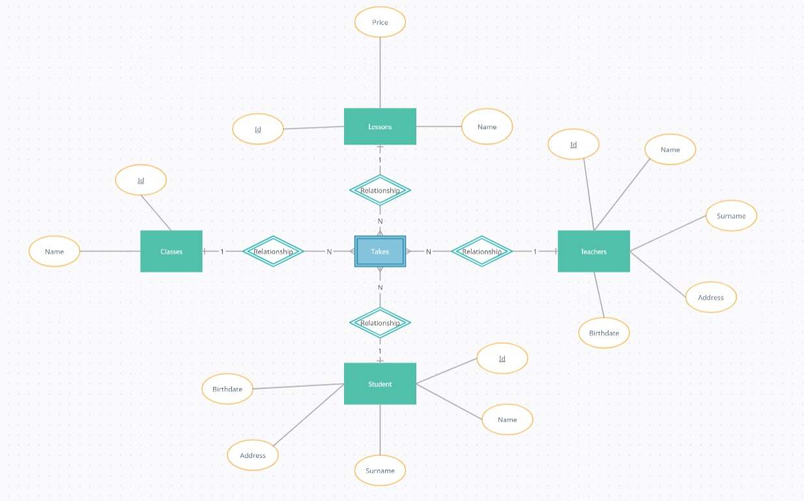
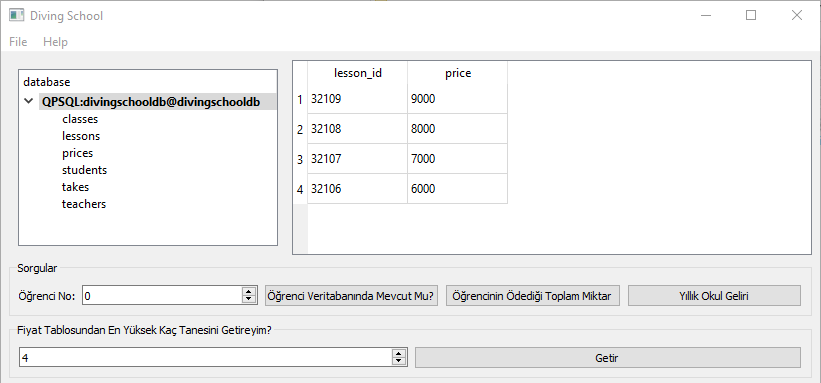
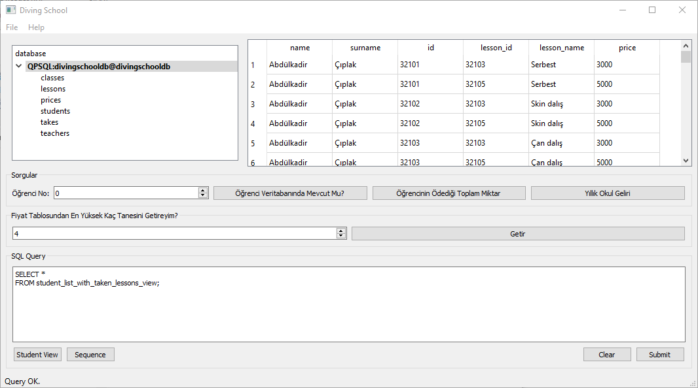
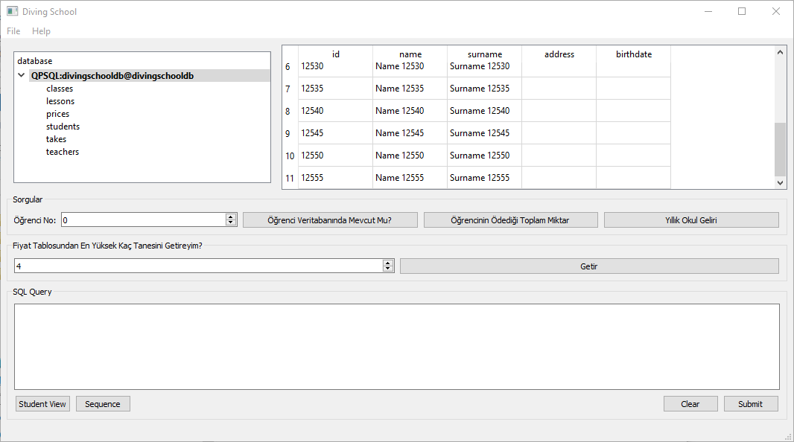
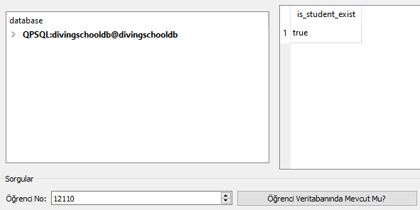
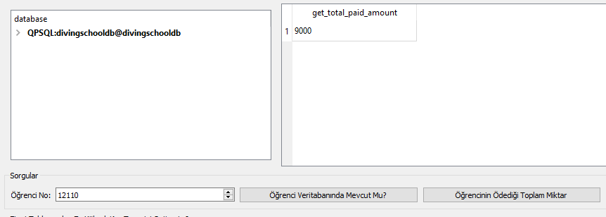

# Dalış Okulu Uygulaması

### Enes Doğan ŞALVARLI - 21501081
### Önder GÖRMEZ - 21501035
### Samet AVERBAK - 21501036

## ER Diyagramı



## Veritabanındaki Tablolar

### Students Tablosu

|     Student ID     |      Name     |    Surname    |    Address     |    Birthdate     |
|:------------------:|:-------------:|:-------------:|:--------------:|-----------------:|
|       12101        |  Ali          |   Demir       |   Bagcilar     | 5 May 2007       |
|       12102        |  Ahmet        |   Babagil     |   Kartal       | 3 November 2002  |
|       12103        |  Serkan       |   Kaya        |   Eminonu      | 13 June 2003     |
|       12104        |  Veli         |   Ozen        |   Kadikoy      | 19 April 2004    |
|       12105        |  Saglim       |   Ucler       |   Uskudar      | 3 July 2009      |
|       12106        |  Mehmet       |   Ulker       |   Fatih        | 11 October 2006  |
|       12107        |  Hasan        |   Koc         |   Eyup         | 9 September 2008 |
|       12108        |  Ibrahim      |   Dogan       |   Besiktas     | 17 August 2007   |
|       12109        |  Hakan        |   Ercetin     |   Basaksehir   | 27 June 2001     |
|       12110        |  Salih        |   Isık        |   Maltepe      | 23 March 2009    |
|       12111        |  Mustafa      |   Aksoy       |   Kartal       | 18 November 2000 |
|       12112        |  Mahmut       |   Yetim       |   Şile         | 1 May 1997       |
|       12113        |  Abdülkadir   |   Çıplak      |   Beylikdüzü   | 12 June 2010     |
|       12114        |  Erkan        |   Aktemur     |   Bağcılar     | 25 December 1999 |
|       12115        |  Hayati       |   Taştekin    |   Sultangazi   | 19 August 2003   |

### Öğretmen Tablosu

|     Teacher ID     |      Name     |    Surname    |    Address     |    Birthdate     |
|:------------------:|:-------------:|:-------------:|:--------------:|-----------------:|
|       22101        |  Iraz         |   Gürcan      |   Bagcilar     | 5 May 1990       |
|       22102        |  Sudem        |   Fındık      |   Bayrampaşa   | 1 March 1991     |
|       22103        |  Kumru        |   Karadavut   |   Çatalca      | 19 July 1980     |
|       22104        |  Mehmet       |   Pekcan      |   Güngören     | 23 October 1987  |
|       22105        |  Sertaç       |   Sökmen      |   Silivri      | 16 January 1992  |
|       22106        |  Petek        |   Çakal       |   Tuzla        | 7 June 1989      |
|       22107        |  Demen        |   Üresin      |   Üsküdar      | 17 May 1995      |
|       22108        |  Hazal        |   Sağır       |   Sultangazi   | 13 August 1993   |
|       22109        |  Cem          |   Tan         |   Sultanbeyli  | 21 April 1994    |
|       22110        |  Zübayda      |   Benekli     |   Eyüpsultan   | 11 February 1983 |
|       22111        |  Tayyar       |   Nar         |   Güngören     | 18 November 1984 |
|       22112        |  Hacı         |   Özata       |   Büyükçekmece | 2 September 1991 |
|       22113        |  Fatma        |   Kuralay     |   Maltepe      | 14 March 1985    |
|       22114        |  Seda         |   Toy         |   Sancaktepe   | 22 July 1979     |
|       22115        |  Aydın        |   Emet        |   Kartal       | 15 December 1997 |

### Ders Tablosu

|     Lesson ID      |      Name          |
|:------------------:|:------------------:|
|       32101        |  Serbest dalış     |
|       32102        |  Skin dalış        |
|       32103        |  Çan dalış         |
|       32104        |  Destekli dalış    |
|       32105        |  Scuba dalış       |
|       32106        |  Saturasyon dalış  |
|       32107        |  Kasklı dalış      |
|       32108        |  Satıhtan dalış    |
|       32109        |  Aletli dalış      |
|       32110        |  Aletsiz dalış     |

### Sınıf Tablosu

|     Class ID       |  Name |
|:------------------:|:-----:|
|       42101        |   A1  |
|       42102        |   A2  |
|       42103        |   B1  |
|       42104        |   B2  |
|       42105        |   C1  |
|       42106        |   C2  |
|       42107        |   D1  |
|       42108        |   D2  |
|       42109        |   E1  |
|       42110        |   E2  |

### Prices Tablosu

|     Class ID       | Name |
|:------------------:|:----:|
|       32101        | 1000 |
|       32102        | 2000 |
|       32103        | 3000 |
|       32104        | 4000 |
|       32105        | 5000 |
|       32106        | 6000 |
|       32107        | 7000 |
|       32108        | 8000 |
|       32109        | 9000 |
|       32110        | 1001 |

### Öğrencinin Aldığı Dersler Tablosu

|  Student ID |  Lesson ID  |  Teacher ID |  Class ID   |
|:-----------:|:-----------:|:-----------:|:-----------:|
|    12108    |    32101    |    22103    |    42101    |
|    12109    |    32101    |    22103    |    42101    |
|    12101    |    32101    |    22103    |    42101    |
|    12102    |    32101    |    22103    |    42101    |
|    12112    |    32101    |    22103    |    42101    |
|    12108    |    32102    |    22104    |    42102    |
|    12103    |    32102    |    22104    |    42102    |
|    12107    |    32102    |    22104    |    42102    |
|    12106    |    32102    |    22104    |    42102    |
|    12115    |    32103    |    22105    |    42103    |
|    12104    |    32103    |    22105    |    42103    |
|    12105    |    32103    |    22105    |    42103    |
|    12110    |    32103    |    22105    |    42103    |
|    12113    |    32103    |    22105    |    42103    |
|    12114    |    32103    |    22105    |    42103    |
|    12115    |    32104    |    22106    |    42104    |
|    12112    |    32104    |    22106    |    42104    |
|    12107    |    32104    |    22106    |    42104    |
|    12101    |    32105    |    22107    |    42105    |
|    12112    |    32105    |    22107    |    42105    |
|    12102    |    32105    |    22108    |    42105    |
|    12109    |    32105    |    22108    |    42105    |
|    12114    |    32106    |    22111    |    42106    |
|    12110    |    32106    |    22111    |    42106    |
|    12104    |    32106    |    22111    |    42106    |
|    12106    |    32101    |    22101    |    42107    |
|    12105    |    32104    |    22114    |    42108    |
|    12111    |    32104    |    22114    |    42108    |
|    12113    |    32105    |    22113    |    42109    |
|    12106    |    32103    |    22115    |    42110    |
|    12107    |    32103    |    22115    |    42110    |

## Kod Blokları
### 1. Oluşturacağınız veritabanı en az 4 tablo içermelidir. Her tabloda en az 10 kayıt bulunmalıdır.
### 2. Tablolarınızda PRIMARY KEY ve FOREIGN KEY kısıtlarını kullanmalısınız.

#### Öğrenci Tablosu
```SQL
CREATE TABLE Students(
    id CHAR(5) NOT NULL PRIMARY KEY,
    name VARCHAR(20) NOT NULL,
    surname VARCHAR(20) NOT NULL,
    address VARCHAR(255),
    birthdate DATE
);
```

#### Öğretmen Tablosu
```SQL
CREATE TABLE Teachers(
    id CHAR(5) NOT NULL PRIMARY KEY,
    name VARCHAR(20) NOT NULL,
    surname VARCHAR(20) NOT NULL,
    address VARCHAR(255),
    birthdate DATE
);
```

#### Sınıf Tablosu
```SQL
CREATE TABLE Classes(
    id CHAR(5) NOT NULL PRIMARY KEY,
    name VARCHAR(20) NOT NULL
);
```

#### Dersler Tablosu
```SQL
CREATE TABLE Lessons(
    id CHAR(5) NOT NULL,
    name VARCHAR(20) NOT NULL,
    CONSTRAINT pk_lessons PRIMARY KEY (id)
);
```

#### Fiyat Tablosu
```SQL
CREATE TABLE Prices(
    lesson_id CHAR(5) NOT NULL PRIMARY KEY,
    price INTEGER NOT NULL,
	CONSTRAINT fk_prc FOREIGN KEY (lesson_id) REFERENCES Lessons (id) ON DELETE CASCADE,
	CONSTRAINT price_ck CHECK (price < 10000)
);
```

#### Alınan Dersler Tablosu
```SQL
CREATE TABLE Takes(
    student_id CHAR(5) NOT NULL,
    lesson_id CHAR(5) NOT NULL,
    teacher_id CHAR(5) NOT NULL,
    class_id CHAR(5) NOT NULL,
    CONSTRAINT pk_takes PRIMARY KEY (student_id, lesson_id, teacher_id, class_id ),
    CONSTRAINT fk_studt FOREIGN KEY (student_id) REFERENCES Students (id) ON DELETE CASCADE,
    CONSTRAINT fk_teach FOREIGN KEY (teacher_id) REFERENCES Teachers (id) ON DELETE CASCADE,
    CONSTRAINT fk_clas FOREIGN KEY (class_id) REFERENCES Classes (id) ON DELETE CASCADE,
    CONSTRAINT fk_lessons FOREIGN KEY (lesson_id) REFERENCES Lessons (id) ON DELETE CASCADE
);
```

### 3. En az bir tabloda silme kısıtı ve sayı kısıtı olmalıdır.

```SQL
-- Lessons tablosundan silindiğinde prices tablosundan da otomatik olarak dersin fiyatı siliniyor.
DELETE
FROM lessons;
WHERE id = '32101';

-- 10 Bin TL den büyük değer eklenemiyor.
INSERT INTO Prices VALUES(32110, 10001);
```

### 4. Arayüzden en az birer tane INSERT, UPDATE ve DELETE işlemi gerçekleştirilebilmelidir.

```SQL
INSERT INTO Lessons VALUES(32101, 'Serbest dalı');
INSERT INTO Prices VALUES(32101, 2500);

UPDATE Lessons SET name = 'Serbest dalış' WHERE id = '32101';
UPDATE Prices SET price = '3500' WHERE lesson_id = '32101';

INSERT INTO Lessons VALUES(32222, 'Silinecek');
DELETE FROM Lessons WHERE id = '32222';
```

### 5. Arayüzden girilecek bir değere göre ekrana sonuçların listelendiği bir sorgu yazmalısınız.

```C++
void Browser::onPushButtonFetchPricesClicked()
{
    QString queryString;
    queryString += "SELECT lesson_id, price\n"
                   "FROM Prices\n"
                   "GROUP BY lesson_id, price\n"
                   "ORDER BY price DESC\n"
                   "LIMIT %1;";

    queryString = queryString.arg(spinBoxHighPriceCount->value());

    sqlEdit->clear();
    sqlEdit->setText(queryString);
    exec();
}
```



### 6. Arayüzden çağrılan sorgulardan en az biri "VIEW" olarak tanımlanmış olmalıdır.
Student View butonu ile bu iş gerçekleştirilmiştir.  

```SQL
-- Ders alan öğrencileri aldığı derslerle birlikte (ders fiyatlarını içererek) listeleyen view tasarımını yapınız.
CREATE OR REPLACE VIEW student_list_with_taken_lessons_view AS
SELECT DISTINCT s.name, s.surname, l.id, t.lesson_id, l.name AS lesson_name, price
FROM Students AS s, Takes AS t, Prices AS p, Lessons l
WHERE s.id = t.student_id AND t.lesson_id = p.lesson_id;

-- Kullanımı
SELECT * 
FROM student_list_with_taken_lessons_view;
```

```C++
void Browser::onPushButtonStudentViewClicked()
{
    sqlEdit->clear();
    sqlEdit->setText("SELECT *\n"
                     "FROM student_list_with_taken_lessons_view;");
    exec();
}
```



### 7. En az bir adet "SEQUENCE" oluşturmalı ve arayüzden yapılacak INSERT sırasında ilgili sütundaki değerlerin otomatik olarak atanmasını sağlamalısınız.

```SQL
-- SEQUENCE Oluşturma
CREATE SEQUENCE AutoIncrementStudentNumberSeq
INCREMENT BY 5
MINVALUE 12210
MAXVALUE 18000;

-- SEQUENCE Bilgilerini Görme
SELECT *
FROM AutoIncrementStudentNumberSeq;

-- SEQUENCE Değer Arttırma
SELECT NEXTVAL('AutoIncrementStudentNumberSeq');
```

```SQL
-- SEQUENCE ile oluşturulan kayıtları silme
DELETE 
FROM Students
WHERE name LIKE 'Name %';
```

```C++
void Browser::onPushButtonSequenceClicked()
{
    sqlEdit->clear();
    sqlEdit->setText("DO $$ "
                     "DECLARE uniqueIDValue INTEGER := NEXTVAL('AutoIncrementStudentNumberSeq'); "
                     "BEGIN "
                     "INSERT INTO Students(name, surname, id) VALUES(CONCAT('Name ', uniqueIDValue), CONCAT('Surname ', uniqueIDValue), uniqueIDValue); "
                     "END $$;");
    exec();

    qDebug() << sqlEdit->toPlainText();

    sqlEdit->clear();
    sqlEdit->setText("SELECT * FROM Students WHERE name LIKE 'Name %';");
    exec();

    sqlEdit->clear();
}
```



### 8. Arayüzden çağrılan sorgulardan en az birinde UNION veya INTERSECT veya EXCEPT kullanmış olmalısınız.
Fiyatı 5 Bin TL'nin üzerinde olup hiçbir öğrenci tarafından alınmayan derslerin id lerini ve isimlerini bulunuz.

```SQL
SELECT p.lesson_id, name
FROM Prices p
INNER JOIN lessons l ON p.lesson_id = l.id
WHERE p.price > 5000

EXCEPT

SELECT t.lesson_id, name
FROM Takes t
INNER JOIN lessons l ON t.lesson_id = l.id
```

### 9. Sorgularınızın en az biri aggregate fonksiyonlar içermeli, HAVING ifadesi kullanılmalıdır.

```SQL
-- Kursun 3 Bin TL'den yüksek kurs alan kişilerin sayısını listeleyiniz.
SELECT DISTINCT s.id, s.name, p.price, COUNT(s.id)
FROM Students AS s, Takes AS t, Prices AS p
WHERE s.id = t.student_id AND t.lesson_id = p.lesson_id
GROUP BY s.id, s.name, p.price
HAVING price > 3000;
```

### 10. Arayüzden girilen değerleri parametre olarak alıp ekrana sonuç döndüren 3 farklı SQL fonksiyonu tanımlamış olmalısınız. Bu fonksiyonlarda en az birer tane "RECORD" ve "CURSOR" tanımı-kullanımı olmalıdır.

#### Öğrenci Sorgusu Fonksiyonu
```SQL
-- ID si verilen öğrencinin tabloda olup olmadığını bulan fonskiyondur.
CREATE OR REPLACE FUNCTION is_student_exist(std_id CHAR(5))
RETURNS BOOL AS $$
BEGIN
    IF EXISTS (SELECT 1 FROM Students WHERE id = std_id) THEN
        RETURN TRUE;
    ELSE
        RETURN FALSE;
    END IF;
END; $$
LANGUAGE PLpgSQL;
```

```C++
void Browser::onPushButtonFindStudentClicked()
{
    QString queryString;
    queryString += "SELECT is_student_exist('%1');";

    queryString = queryString.arg(spinBoxStudentID->value());

    sqlEdit->clear();
    sqlEdit->setText(queryString);
    exec();
}
```



#### Öğrencinin Okula Ödedeği Toplam Ücret
```SQL
-- ID si verilen öğrencinin okula toplam ne kadar ödediği bulan fonksiyondur.
CREATE OR REPLACE FUNCTION get_total_paid_amount(std_id CHAR(5))
RETURNS INTEGER AS $$
DECLARE
total_paid INTEGER := 0;
row_values_record RECORD;
prices_cursor CURSOR FOR (SELECT s.name, s.surname, p.lesson_id, price
                          FROM Students AS s, Takes AS t, Prices AS p
                          WHERE s.id = t.student_id AND t.lesson_id = p.lesson_id AND t.student_id = std_id);
BEGIN

    IF is_student_exist(std_id) = FALSE THEN
      RAISE EXCEPTION 'Student ID (%) not found in the database!', std_id;
      RETURN 0;
    END IF;
    -- prices_cursor den alınan her bir kayıt 
    -- row_values_record RECORD değişkeninin içerisine atanıyor
    FOR row_values_record IN prices_cursor
    LOOP
      total_paid := total_paid + row_values_record.price;
    END LOOP;

    RETURN total_paid;

END; $$
LANGUAGE PLpgSQL;
```

```C++
void Browser::onPushButtonTotalPaidClicked()
{
    QString queryString;
    queryString += "SELECT get_total_paid_amount('%1');";

    queryString = queryString.arg(spinBoxStudentID->value());

    sqlEdit->clear();
    sqlEdit->setText(queryString);
    exec();
}
```



#### Okulun Yıllık Kazancı
```SQL
-- Dalış okulunun yıllık kazancını gösteren fonksiyonu yazınız.
CREATE OR REPLACE FUNCTION get_annual_revenue()
RETURNS INTEGER AS $$
DECLARE
total_revenue INTEGER := 0;
student_record RECORD;
student_cursor CURSOR FOR (SELECT id FROM Students);
BEGIN
  FOR student_record IN student_cursor
  LOOP
    total_revenue := total_revenue + get_total_paid_amount(student_record.id);
  END LOOP;
  RETURN total_revenue;
END; $$
LANGUAGE PLpgSQL;
```

```C++
void Browser::onPushButtonGetAnnualRevenueClicked()
{
    sqlEdit->clear();
    sqlEdit->setText("SELECT get_annual_revenue();");
    exec();
}
```


### 11. 2 adet trigger tanımlamalı ve arayüzden girilecek değerlerle tetiklemelisiniz. Trigger’ın çalıştığına dair arayüze bilgilendirme mesajı döndürülmelidir.

#### insert_student_observer_trigger
```SQL
-- Students tablosuna her ekleme yapıldığında üzerinde çalışılan öğrencinin bilgilerini veren trigger ı yazınız.
CREATE OR REPLACE FUNCTION insert_student_observer_trigger_func()
RETURNS TRIGGER AS
$$
  BEGIN
      RAISE WARNING 'New student (named % %) added to database with id number: %!', NEW.name, NEW.surname, NEW.id;
      RETURN NEW;
  END;
$$
LANGUAGE PLpgSQL;

-- DROP TRIGGER student_observer_trigger ON Students;
CREATE TRIGGER insert_student_observer_trigger
AFTER INSERT
ON Students
FOR EACH ROW
EXECUTE PROCEDURE insert_student_observer_trigger_func();

INSERT INTO Students VALUES(12190, 'Hayati', 'Taştekin', 'Sultangazi', '19 August 2003');
```


#### delete_student_observer_trigger
```SQL
-- Students tablosuna her çıkarma yapıldığında üzerinde çalışılan öğrencinin bilgilerini veren trigger ı yazınız.
CREATE OR REPLACE FUNCTION delete_student_observer_trigger_func()
RETURNS TRIGGER AS
$$
  BEGIN
      RAISE WARNING 'Student (named % %) deleted from database with id number: %!', OLD.name, OLD.surname, OLD.id;
      RETURN NEW;
  END;
$$
LANGUAGE PLpgSQL;

-- DROP TRIGGER student_observer_trigger ON Students;
CREATE TRIGGER delete_student_observer_trigger
AFTER DELETE
ON Students
FOR EACH ROW
EXECUTE PROCEDURE delete_student_observer_trigger_func();

DELETE FROM Students WHERE id = '12190';
```


```SQL
INSERT INTO Students VALUES(NEXTVAL('AutoIncrementStudentNumberSeq'), 'Hayati', 'Taştekin', 'Sultangazi', '19 August 2003');
DELETE FROM Students WHERE id = '12190';
```
#### Yetkilendirme Ayarları
Kullanıcının yeni bir database oluşturma yetkisi bulunmamaktadır.


### Bağlantı Ayarları Penceresi
Bağlantı ayarları penceresi aşağıdaki resimdeki gibidir. Bu pencere üzerinden veritabanına bağlantı kurmak için gerekli olan tüm bilgiler ayarlanır.  


### Referanslar - Used Framework

