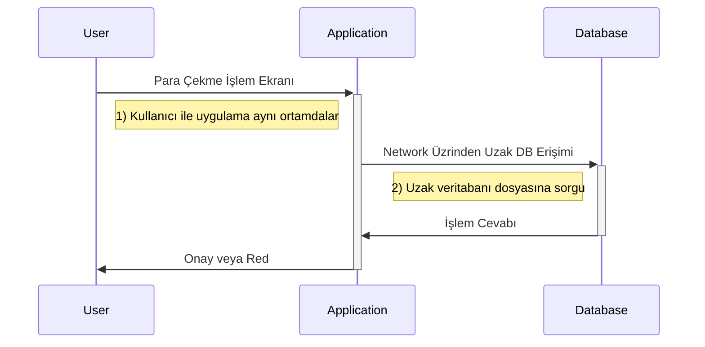
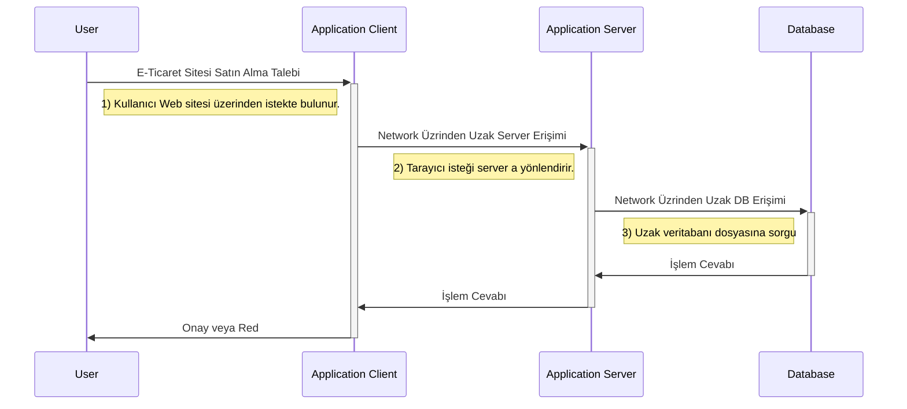

# 1. Hafta - 7 Ekim 2021 Perşembe

İlk 7 haftası Dr. Öğretim Üyesi Serkan Ayvaz Hoca ile işlenecek.  
Son 7 haftası Utku Hoca ile işlenecek.  

Kullanılan Slaytlar: [Database System Concepts, Seventh Edition](https://www.db-book.com/)

Vize, final ve proje ödevi olarak 3 farklı notlandırmaya tabi tutulacağız.

# Chapter 1: Introduction

* Neden excel  veya txt dosyası değilde veri tabanı?
    * Aynı anda birden çok kişinin aynı dosyaya erişilebilmesi sağlanır.
    * veri tekrarını engellemek.
    * Verinin izolasyonu ile ilgili sorunları çözüyor. Kim hangi veriye erişebilecek?
    * Verinin bütünlüğü ile ilgili sorunlar çıkabilirdi.
    * Güvenlik problemleri. Kullanıcının verinin tamamına değilde bir kısmına erişiminin sağlanabilmesi.
    * Kayıtların güncellenmesi atomiktir.

## Data Model

* Relational Model: Gerçek dünyadaki bir şeyi ifade eden mantıksal karşılığı olan modellerdir.
* Entity-Relationship Data Model (mainly for database design):
* Object-Based Data Model (Object-oriented and Object-relational): MongoDB
* Semi-Structured Data Model (XML):
* Other Data Models:
    * Network Model
    * Hierarchical Model

IBM laboratuvarlarında çalışırken, Ted Codd 1981 lerde database kavramını ortaya atmıştır.

## View of Data
Aşağıdan yukarıya doğru leveller;  
* View Level (view 1, view 2, view 3)
* Logical level: Mantıksal kavramsal
* Physical level: Fiziksel level

## Instances and Schemas
İlişkiler şemalar ile ifade edilir.  
Programlama dillerindeki tür ve değişkenlere benzemektedir.  
* Logical Schema: Tür gibi
* Physical Schema: Tür gibi
* Instance: Değişken olarak tanımlanmış hali gibi

## Physical Data Independence
Veri tabanına yeni bir sutün eklemek verinin tutulduğu dosyanın yeri ve konumu gibi bilgileri değiştirmez.  
Yani physical scheme logical şemadan ayrıdır.   

## Data Definition Language (DDL)
* Notation for definition the database scheme  
    * CREATE/ALTER/DELETE/DROP TABLE or index
* DDL generates **data dictionary**
* Data dictionary contains **metadata**
    * Database scheme
    * Integrity constraints (PRIMARY KEY etc.)

## Data Manipulation Language (DML)
Tablo oluşturmak için değil, tabloda bulunan verileri sorgulamak/çekmek için kullanılan dildir. Sorgu dili (query language) olarakda bilinir.  

* SELECT/INSERT/UPDATE/DELETE

## SQL Query Language
Uygulamalar genel olarak veri tabanlarına;  
* Programlama dili içerisindeki embedded SQL kullanılarak bağlanıp SQL ile ilgili işlemleri gerçekleştirebilir.
* API (Application Program Interface) üzerinden (ODBC veya JDBC gibi connecter lar ile) database e sorgular yaparak erişim sağlayabilir.

## Database Design
Verinin kendisi ile ilgili değişikliklerin her zaman veri tabanı içerisinde yapılması gerekmektedir. Kod içerisinde yapılması scheme nın değişmesi durumunda kodunda değiştirilmesi gerekliliğini getirir.  
* Logical Design: 
    * Business Desicion: Hangi bilgiler kaydedilecek?
    * Computer Science Desicion: Hangi ilişkisel şema kullanılacak?
* Physical Design:

## Database Engine
Birçok alt sistemden oluşur;  
* **Storage Manager:** Tutulacağı yeri ve dosyayı yönetir.  
* **Query Processor:** Sorguların en optimum şekilde çalışmasını sağlar.  
* **Transaction Management Component:** Veri bütünlüğünü ve transaction ları yönetir.

## Storage Manager
* Data files: Stores the database itself
* Data dictionary: Stores metadata
* Indices: İndexleri tutuyor

## Query Processing
* Sorguyu parçalayıp dönüştürür.  
* Optimizasyonunu yapar.  
* Değerlendirmesini yapar.  

## Transaction Management
Her işlemde transaction uygulanmaz.

**Transaction-Management Component:** Bir tablodan diğer tabloya datayı gönder ve sonra eski tablodan sil işlemi için ilk önce datanın diğer tabloya kaydedildiğinden emin olunur. Sonra eski tablodan silme işlemi gerçekleştirilir.  
**Concurrency-Control Manager:**

## Database Architecture
* Centralize Database: Bir database var ve herkes bu database e erişerek işlemlerini yapıyor.
* Client-Server: 
* Parallized Database: Birbirinin eşleniği veritabanı sistemleridir (Mirroring).
* Distributed Database: Coğrafi olarak ayrı yerlerde tutulması, güvenlik gibi kriterler vs.

## Two-tier: İki Bacaklı Uygulama
Bankada bankacılık işlemlerini yapan bankacının database den para bilgisi çekmesi.  
User ile Application aynı noktada, database uzakta.  
User -> Application ----> Network ---->  Database System  

## Three-tier: Üç Bacaklı Uygulama
User -> Application Client ----> Network ----> Application Server ----> Network ----> Database System  

## Database Administrator (DBA)
Tüm database den sorumlu kişidir. Veritabanı üzerinde tablo ekleme, silme, düzenleme gibi işlemleri yapabilen kişilerdir.  
Application developer lar bu kişiden database içerisindeki tablolara vs erişim yetkisi isterler.  
