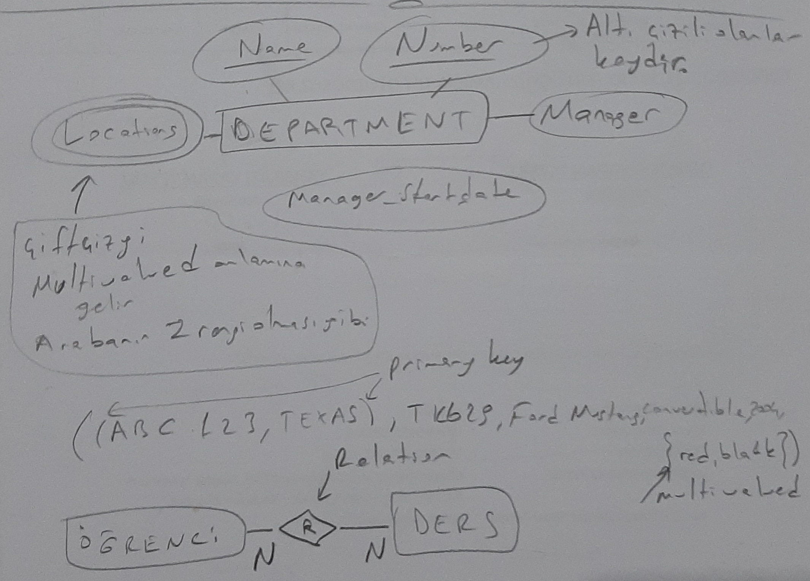
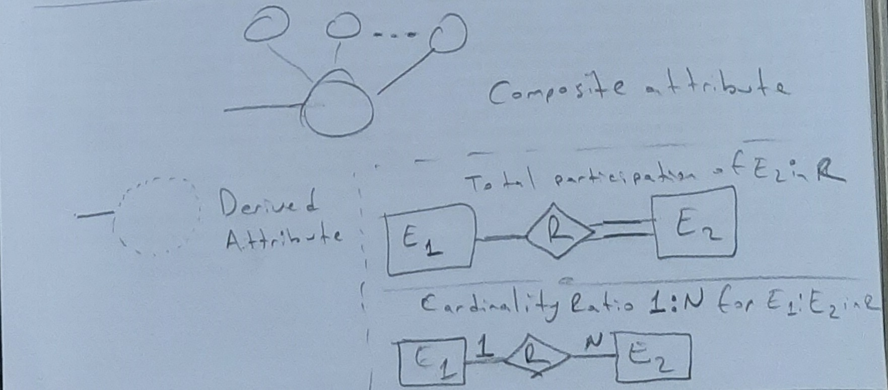

# 9. Hafta - 2 Aralık 2021 Perşembe

Mustafa Utku Kalay hocamız ile devam ediyoruz.

# Veritabanı Tasarım Prosesi
* VT Tasarımı
  * Veri modelleme
  * Veri mühendisliği, bilişim uzmanlığı ile ilgili
* Uyulama tasarımı
  * Program akış ve arayüzlerin tasarımı
  * Yazılım mühendisliği ile ilgili 
```
| Information Requirements |            Logical Design                       |  
Determine Requirements --> Model --> Transform to SQL Tables --> Normalize --> Select Indexes --> Implement
```

# ER Diyagramları
ER diyagramları database lerin tasarlanması sırasında modelleme için kullanılmaktadır. Bunun yerine UML de kullanılabilir. Yaygın olarak ER diyagramları kullanılmakla birlikte UML diyagramlarına geçiş söz konusudur.  

# Varlık/Bağıntı (Entity-Relationship) Kümeleri

TODO: Bunları finalde boşluk doldurma olarak sorarlar.     
* Var olan ve diğerlerinden ayırdedilebilen her nesneye **varlık** denir. Benzer varlıkların oluşturduğu kümeye **varlık kümesi** denir.  
* Varlıkların **nitelikleri (attributes)** vardır. Bu nitelikler ile varlıklar birbirinden ayırdedilir.
* İki ya da daha çok varlığın arasındaki **olayı** tanımlamaya yarayan kavrama **bağıntı** denir. Aynı türdeki benzer bağıntıların kümesine ise **bağıntı kümesi** denilir.


# Temel Yapı Taşları: Varlık ve Bağıntı

TODO: Örnek bir ER diyagramı çizdirebilirler

Bir nitelikten başka alt nitelikler çıkıyorsa buna **birleşik nitelik (composite attribute)** denir.
Altı çizili nitelikler bir anahtarı temsil eder.  
Multivalued attribute lar 2 tane çember ile temsil edilir.  



Bağıntı (relationship) aşağıdakilerden herhangi biri gibi olabilir;  
1:1 -->   
1:N --> Bir öğrenci birden çok ders alabilir.  
N:1 --> Bir departmanda birden çok çalışan olabilir.  
N:N -->  


# ER Notasyonları

Entity: Dikdörtgen  
Weak Entity: İç içe 2 Dikdörtgen  
Relationship: Çembere benzer dörtgen  




## Var Olma Bağımlılığı (Existence Dependency)
B varlık kümesindeki her bir b varlığı, A varlık kümesindeki bir a varlığı ile mutlaka bir bağlantı kurması gerekiyorsa, "**B varlık kümesi A varlık kümesine var olma bağımlıdır**" denir.


## Anahtar ve Güçlü/Zayıf Varlık Kümeleri
Varlık/Bağıntı kümesindeki varlık/bağıntıları birbirinden ayırd etmek için kullanılan nitelik veya nitelik grubuna **anahtar** denir.  
Bir varlık kümesinde anahtar bulunulamıyorsa (bütün nitelikler birarada olsa da anahtar olmuyorsa) bu varlık kümesine **zayıf varlık kümesi** denir.  
Anahtarı olan varlık kümesine **güçlü varlık kümesi** denir.

## EER - Genelleme (Is a Relationship - Ait Olma Bağıntısı)
EER: Extended Entity Releationship

Katılım Kısıtlaması:
* Zorunlu
* Seçimli

Ayrılık Kısıtlaması:
* OR
* AND

## Aggregation
Aggregation allows us to treat a relationship set as an entity set for purposes of participation in (other) relationships.  
Aggregation vs. ternary relationships: Bazı durumlarda aggregation bazı durumlarda ternary relationship tercih edilir.


Aggregation: Parçalar kendi başlarına bir mana ifade ediyorlar. Örneğin bir kurs için, kullanılan kitap ve dersi veren öğretmen bağıntısında, kurs kaldırılsa da öğretmen mevcut olarak kalıyor.

## Composition

Composition: Parçalar tek başına bulunamaz, bir mana ifade etmiyorlar. Parça, kümeye var olma bağımlıdır. Örneğin bir yazılım ürünündeki, kod ve kodun çalıştığı elektronik kart bağıntısında, elektronik kart yoksa kod bir işe yaramaz. Sadece elektronik kart üzerindeyken bir anlam ifade eder.

Yukarıdaki bilgiler 6. Database Design Using The E-R Model slayt ına denk gelmektedir.  


