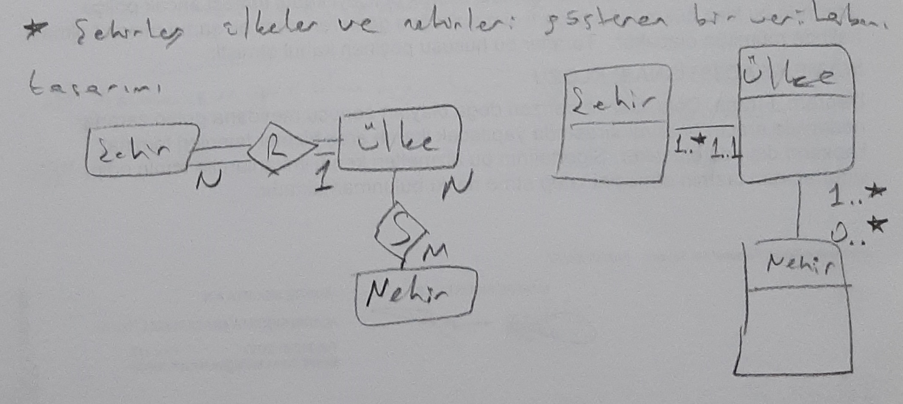

# 10. Hafta - 9 Aralık 2021 Perşembe

Bu hafta ve gelecek hafta kavramsal tasarım ve normalizasyon hakkında bilgiler vereceğiz. Sonrasında vizeye gireceğiz.  
Vize sonrasında kalan 2 haftada ise index leme ile ilgili konulara bakacağız.

## Company Database

### İlk Tasarım Sonrası İyileştirmeler 1
* Eğer mevcut nitelik başka bir varlığa işaret ediyorsa;
  * Nitelik --> bağıntı haline dönüştürülmesi
* Eğer mevcut nitelik çok değer alabiliyorsa ...
* Multivalued değerler (örneğin lokasyon bilgisi), normalizasyon için farklı tabloya alınmalıdır. Aksi halde tablolar arasındaki ilişkileri tanımlarken hatalara neden olabilir. Hangi tür hata olduğunu bilmiyorum.  

TODO: Sınavda bir tasarımın kurallara uygun olup olmadığını soran bir soru olacak.  

Örnek 4: Satış formu ile ilgili bir database i tuttuğumuzu düşünürsek;

* genelToplam ve satırToplamFiyatı nitelikleri türetilmiş niteliktir. Kavramsal tasarımda yazılmasa da our. Derive edilmiş bir nitelik olarak tanımlanabilir. Ufak bir fonksiyonla genel toplam bilgisine ulaşılabilir.  
* Örneğin yaş bilgisi her an değişen bir bilgi olduğu için bunun saklanmasına da gerek yoktur. Bu bilgiyi bugünün tarihinden doğum gününün tarihini çıkararak bulabiliriz.  

ER diyagramlarında **"IS A"** (Ait Olma) bağıntısı;
  * Katılım, zorunlu ise çift çizgi ile, zorunlu değil ise tek çizgi ile
  * Ayrıklık, AND (disjoint) ise yuvarlak içinde "**d**" ile, OR (not disjoint) ise yuvarlak içinde "**o**" ile ifade ediliyor.

ER diyagramından yola çıkıldığında genel olarak;
  * Güçlü ve zayıf varlıklar
  * N .. N bağıntılar
  * Multi valued lar için tablo oluşturulması gerekliliği gözlenmektedir.

