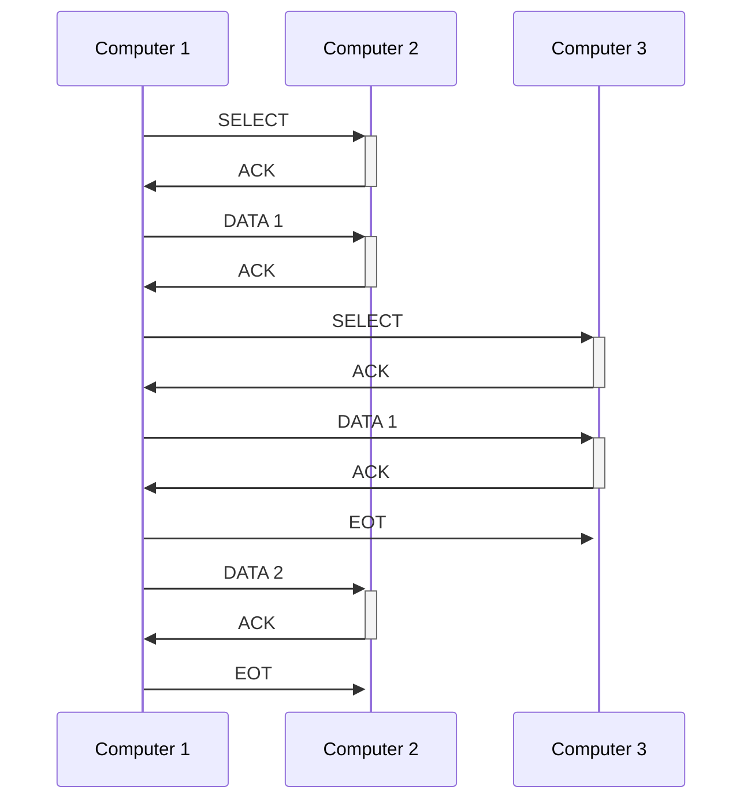

# 7. Hafta - 15 Kasım 2021 Pazartesi

Önümüzdeki hafta sınav. Sınav süresi kısıtlı olacaktır. O nedenle geç kalmayın.

# Bağlantı Yönetimi

Bağlantı üzerinden hangi anda ve kimin veri aktarımı yapabileceğinin belirlenmesi gerekmektedir.
  * Geniş alan ağlarında bağlantılar noktadan noktaya (point to point)
  * Yerel alan ağlarında ise çok noktaya (multipoint) yapılabilir

## Enq/Ack (Enquiry/Acknowlegment)
Point to point yapılan bağlantılarda kullanılır.  
Kimin iletime bağlayacağına, karşı tarafın buna hazır olup olmadığına (veya iletişimi kabul edip etmediğine) karar vermek üzere kullanılmaktadır.  
Bu yöntemde iletişimde bulunacak olan birimlerin eşit özelliklerde olması beklenir.  
Taraflardan birtanesi ENQ isimli frame i karşı tarafa gönderir. Hazır olup olmadığını sorgular.  
  * Alıcı buna ACK (hazırım bekliyorum) gönderebilir.
  * NACK (hazır değilim kabul etmiyorum) gönderebilir.

## Poll/Select
Çok noktalı (multi-point) bağlantılarda kullanılan bu teknikte birincil (primary) bir bilgisayara bağlı olarak çalışan ikincil (secondary) cihazlar bulunmaktadır.  
Birincil bilgisayar poll çerçeveleri ile ikincillerin gönderecek verisi olup olmadığını sorgular. İkinciller buna verisi varsa verileri ile cevap verebilir. Verisi yoksa NACK çerçevesi ile cevap verir.  
Poll frame i içerisinde kime gittiğini belirten (to) bir adresleme bilgisi gönderilir.

# Akış Kontrolü (Flow Control)
Akış kontrolü göndericinin alıcıyı veri ile boğmasını (overwhelm) engellemek üzere geliştirilmiştir.  
  * Alıcı, göndericinin yolladığı verileri bir tampon bellekte (buffer) depolamakta,
  * Gelen veri üzerinde işlemler yaparak bunu üst katmana iletmeye çalışmaktadır.

Göndericinin veri akış hızını sınırlandırmak üzere dur ve bekle (stop & wait) ve kayan pencere (sliding window) tekniklerinden yararlanılır.

## Dur ve Bekle (Stop & Wait) Akış Kontrol Tekniği
Gönderdiğimiz her veri için bir cevap bekliyoruz. Alındığına dair bir geri besleme (ACK) beklemektedir. ACK frame i alıcıdan geldikten sonra yeni bir frame göndericiden çıkmaktadır.  
Bu işlem göndericinin yollayacağı veri bitinceye (yani gönderici EOT frame i yollayıncaya) kadar devam etmektedir.  
Alıcı geri besleme bilgisini geciktirerek göndericinin veri aktarım hızını kendisininki ile uyumlu hale getirebilir.  

tframe: iletim süresi

tprop: frame in alıcıya ulaşması için geçen süre

tack: acknowledge ın alıcıdan çıkma süresi

TF = tframe + tprop + tack + tprop

TF = tframe + 2tprop

TODO: Slayt 19 da örnek bir soru var. Bu sorunun çözümünü yap. Sınavda çıkabilir.  

## Kayan Pencere (Sliding Window) Akış Kontrol Tekniği
Amaç beklemenin yarattığı olumsuz etkiyi ortadan kaldırmak.  
Pencere büyüklükleri çerçeve sıra numaraları ile belirlenir. Sıra numarası 3 bit ise toplam 2^(n -1) çerçeve gönderilebilir. 8 değilde 7 kullanılmasının nedeni aynı anda aynı window numaralı frame in 2 tane oluşmasını engellemektir.  
Alıcı aldığı ve doğrulayabildiği kadar data için ack gönderebilir.  
w >= 2a + 1

U = w / (2a + 1)

## Hata Kontrolü
ARQ (Automatic Repeat reQuest): Hatalı çerçevenin tekrar yollanması işlemidir.  

Stop & Wait use **ARQ** method.  
Sliding Window uses either **Go back N** or **Selevtive Repeat** method.  

### Stop & Wait ARQ

ACK: Acknowledge  
NACK: Negative Acknowledge

### Sliding Window ARQ

Go back N ARQ daha kolay implemente edilebilen bir yapıdır. 7 frame gönderildi. 3. fram reject edildi. Gönderici 3. frame den itibarent tekrar göndermeye başlar.  
  
Selective Reject / Selective Repeat ARQ

* Büyük dataların işlenmesi durumu maliyetli olacağı için  Selective Reject kullanabilir
* Go back N durumunu bufferlama yapamayacak olan küçük bir memorye sahip cihazlar için seçebiliriz.

Vize yüz yüze, çoktan çok seçmeli, doğruları seçtiğiniz sürece bir sorun yok.  
Vizeden sonra Furkan Hoca devam edecektir.