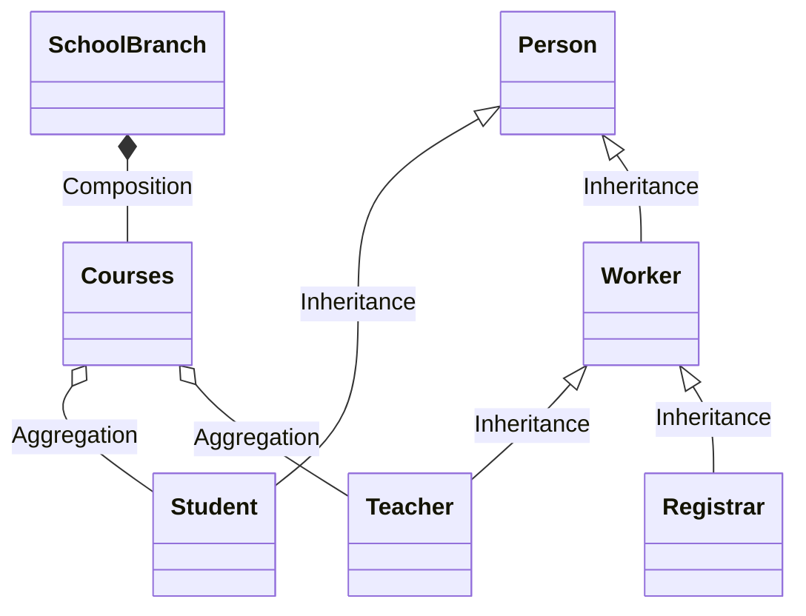
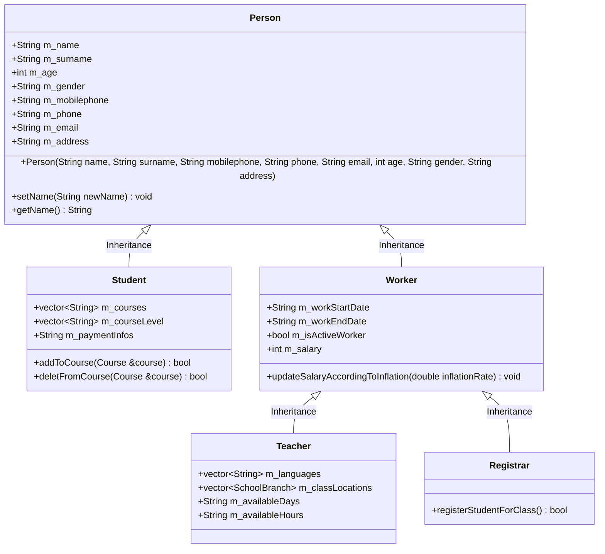
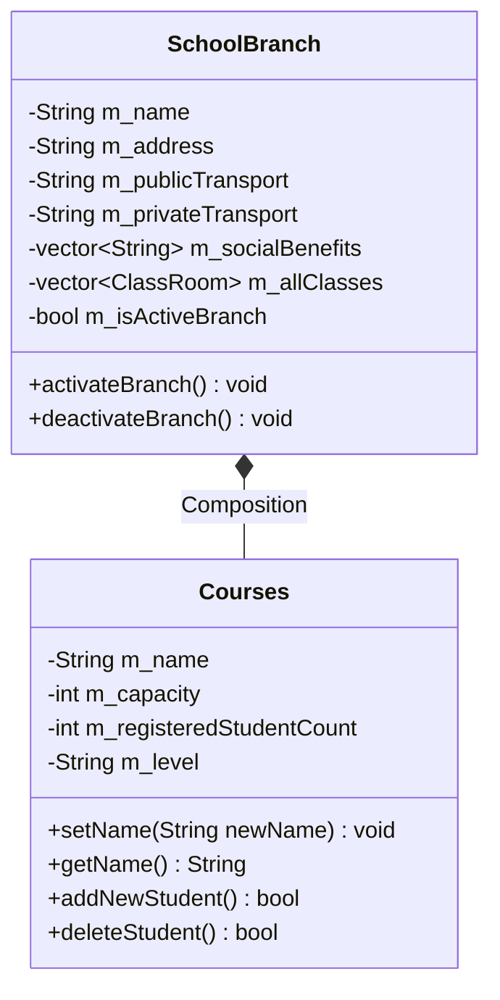

## Kısıtlamalar
* Tool içi dolu ok çizdiği için türetmelerde kullanılan okların içi dolu olarak gösterilmiştir.
* Tool otomatik olarak çizdiği için görsellerde karmaşık görünüm ortaya çıkabiliyor.

TODO: Dışardan erişilemeyenleri "-" ile ifade et.
TODO: Variable lar ile method lar arasına boşluk koy
TODO: 2 class definition arasına boşluk koy

TODO: 
BTool böyle okun içi dolu
classA --|> classB : Inheritance
classC --* classD : Composition
classE --o classF : Aggregation
classG --> classH : Association
classI -- classJ : Link(Solid)
classK ..> classL : Dependency
classM ..|> classN : Realization
classO .. classP : Link(Dashed)

* Yukarıda detayı verilen sınıfların detayları tekrar yazılmamıştır.

## Kaynaklar
[Class Diagram](https://mermaid-js.github.io/mermaid/#/classDiagram)
