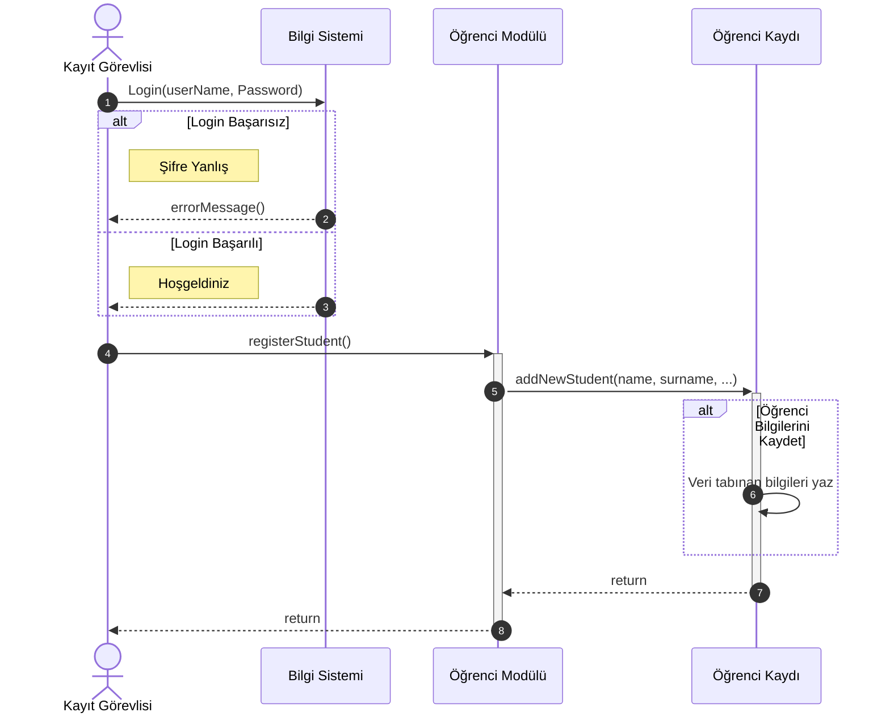

```mermaid
sequenceDiagram
    autonumber
    actor Kayıt Görevlisi
    %%actor Bilgi Sistemi
    %%actor Öğrenci Modülü

    Kayıt Görevlisi->>Bilgi Sistemi: Login(userName, Password)
    alt Login Başarısız
        Note right of Kayıt Görevlisi: Şifre Yanlış
        Bilgi Sistemi-->>Kayıt Görevlisi: errorMessage()
    else Login Başarılı
        Note right of Kayıt Görevlisi: Hoşgeldiniz
        Bilgi Sistemi-->>Kayıt Görevlisi: 
    end
    Kayıt Görevlisi->>+Öğrenci Modülü: registerStudent()
    Öğrenci Modülü->>+Öğrenci Kaydı: addNewStudent(name, surname, ...)
    alt Öğrenci Bilgilerini Kaydet
        Öğrenci Kaydı->>Öğrenci Kaydı: Veri tabınan bilgileri yaz
    end
    Öğrenci Kaydı-->>-Öğrenci Modülü: return
    Öğrenci Modülü-->>-Kayıt Görevlisi: return
```
