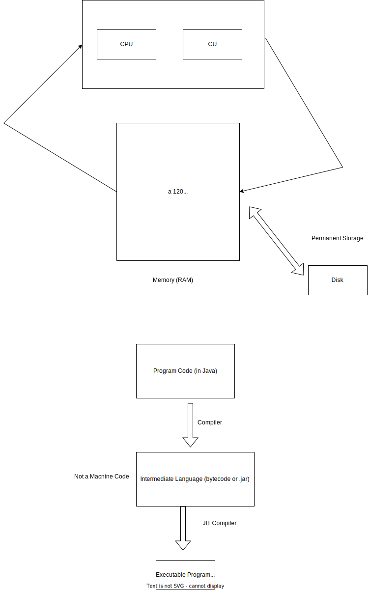

# 12. Week - 20 December 2022 Tuesday

# Final Exam

* Hadoop MapReduce not included.
* In the final we responsiple after Hadoop
* Cassandra, Spark, Streaming included.
* Similiar to midterm exam.
* But some short coding included

# Spark Programming: Using Scala

* If you need Spark Programming, the best option to you use is Scala Programming Language.
* Scala has nice features
    Traits
    Implicit conversions
    Pattern matching
    XML literals
    Parser combinations, ...

Scala: **Sca**lable **La**nguage
Scala is a functional programming language

* Procedural Languages (Imperative): Java, C, C++, C#
    Variable driven languages

* Logical Languages: Prolog

* Functional Languages: Scala, F#, Ruby
    Everything is a function

* Markup Languages: XML, HTML

* Declarative Language: SQL


```C
int main()
{
    int a = 5;
    int b = 24;
    a = a * b;
    println(a);
}
```




# Scala Continious

* Bytecode is hardware/system independent.
* Built-in garbage collection
* Just - in - Time Compilation (bytecode --> machine code)
Often as fast as C.


A standalone Scala application needs to have a singleton object with a method called main.


```Scala
object HelloWorlkd {
    def main(args: Array[Seting]) Unit = {
        println("Hello World);
    }
}
```

* Java have primitive types (int, double, etc.), and class types (Int, Double, Float, etc.). but in Scala has just class type (Int, Double, Float, etc.)

## Defining Variables

Dynamically learn the types of the variable and you can not assign other types to this variable.

```Scala
scala> var msg : String = "Hello"
msg: String = Hello

scala> msg = "Hi"
msg: String = Hi
```

vars can be reassigned. But val cannot be assignment. Read only

var number1 = 243;
number1 = 77; // Correct

val number = 20;
number = 3; // fail...

String
Symbol an 'Interned' string. Enumeration gibi kullanabiliriz 'red, 'green, 'blue gibi bir yapısı var.


## Everything is an Expression

```Scala
scala> val z : Int { val x = 4; val y = 2; x / y}
z Int = 2

If not return specific type then return Unit()
```

for (y<-List(1, 2, 3)) {println(y)}

Assignment: <-
Equality: = assignment, condition check, parameter passing in arguments

# Range Objects

scala> 1 to 3 // or 1.to(3)
res1: scala.collection.immutable.Range.Inclusive
Range(1, 2, 3)

# For as an Expression

for (seq) yield expression

scala> for { x <- to 7 // generator
             y = x % 2 //

}

## Calling Functions

Sadece ismini yazmamız yeterli çağrım için parantezlere ihtiyacımız yok.


# Function Literals

Function Literals =~ Lambda functions
Anonymous Function = No named function


A method that takes a function as an input parameter is called a hiher*order method.
* A high-order function is a function that takes another function as input
* helps recude code duplication

Can be used higher-order functions:
val code = encode (10 , (x: Int) => x +100)


(x: Int) => {
    x + 100
}

Or you can define like below
(x: Int) => x + 100

# Classes

Class --> Normal class
case Class --> Slight different

// Normal class
val mustang = new Car("Ford", "Mustang", "Red")

// case Class no need for new
Car mustang

# Singletons

object olarak oluşturulduğunuz zaman 1 kez oluşturulabilir.

# Case Class

case class Message(from: String, to: String, content: String)

val request Message("Harry", "Sam", "Conversation")

# Pattern Matching

def f(x: Int, y: Int, operator: )

# All Operators are Methods

scala> x = 3
x: Int = 3

scala> x.+(2)
res1: Int = 5

scala> x.==(5)
res2: Boolean = true

# Traits

* Traits like interface in Java
* Unlike Java, a Scala trait can include implementation of a method.

```Scala
trait Shape {
    def area(): Int
}

class Square(length: Int) extends Shape {
    def area = length * length;
}

```

# Tuples

val threeElements("10", "harrry", true)

index start from 1
val first = threeElements._1
val second = threeElements._2
val third = threeEleemnts._3

# Option Type

Option --> have 2 --> (Some: Can be any type) or (none: Missing values)

def colorCode(color: String): Option[Int] = {
    color match {
        case "red" => Some(1)
        case "blue" => Some(2)
        case _ => None
    }
}

val code = colorCode("orange")
code match {
    case Some(c) => println("code for: ", 
    case None => println("undefined"))
}


# Array
Mutable: Changable
But fixed length data structure

val arr = Array(10, 30, 20)
arr(0) = 40
val first = arr(0)

# List

Immutable: Not changable, not modifiable

Like linked list, it has head and tail, isEmpty

val xs = List(10, 20, 40)
val ys = 1.toList(10, 20)

# Vector

val v1 = Vector(0, 10, 20)
val va2 = v1 :+ 50 // append from end
val v3 = va2 :+60


# Map
Map is a collection of key-value pairs. It known as a dictionary, associative array or hash map
* It is an efficient data structure for looking up a valu by its key
Its is not be confuse Hadoop MapReduce

val capitals = Map("USA" -> "Washington", "UK -> "Londan")

# High-Order Methods on Map

val xs = List(1, 2, 3)
val ys = xs.map((x: Int) => x * 10.0)
Output: ys List(10.0, 20.0, 30.0)

xs is of type List[Int] bu ys is of Lis[Double]

# FlatMap

It takes a function as input, applies it to each element in a collection.

# Filter

val xs = (1 to 100). toList
val even = xs filter {x => x % 2 = 1}

# Foreach

val words = "Scala is fun".split(" ")
words.foreach(println)

# Reduce

val xs = List(1, 2, 3, 4)
val sum = xs reduce { (x, y) => x + y}
1, 2 yi alır 3 döner
Dönüş 3 ile 3 ü alır 6 döner
Dönüş 6 ile 4 ü alır 10 döner.

Sonuç 10 olarak çıkar.