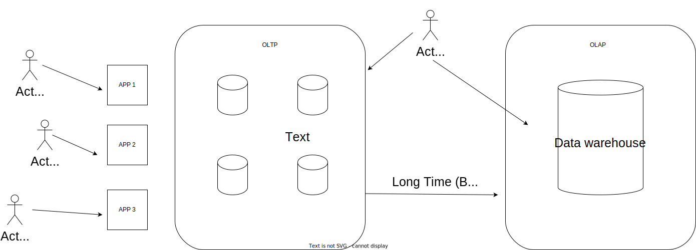

# 13. Week - 27 December 2022 Tuesday


Next week we have a presentation. It's gonna be online.
5 to 10 minutes enough.

# Streaming in Big Data

## Type of Data

* Reletional Data (Tables/Transaction/Legacy Data)
* Text Data (Web)
* Semi-Structured Data (XML)
* Graph Data
  * Social Network, Semantic Web (RDF)

* Streaming Data
  * You can only scan the data once

* You can not apply complex queries data on streaming. Because of the data size (huge) and speed.

## What is a Data Stream?

* Squence of items:
  - Structured (e.g., tuples)
  - Ordered (implicitly or timestamped)
  - Arriving continously at high volumes
  - Not possible to strore entirely
  - Sometimes not possible to even examine all times


TODO:



This is not applicable if the batch copy longer than the 24 hour.

## Data Streams

* Huge, fast, and changing

Window Models
* Snapshot of the data
* Landscape window (Entire Data Stream)
* Sliding Window
* Damped Window

* Question Can Be Answered with the window (snaphot)
  * How many number 5 observed?
  * The avarage, min, max value?


* Mining Data Stream

## A Simple Problem
* Counting the balls and balls' color.
* Fazla olacak top %70 olasılıkla mavidir. Gibi bir çıkarımda bulunabiliriz.
* Tüm gelen toplara bakamıyorum. Fakat baktıklarım arasından karar vererek çıkarımda bulunuyorum.

## KRP Algorithm
* KRP, et. al (TODS' 03)


m: frame içerisindeki top sayısı
N: data setin toplam boyutu
M:
k: 

Theta (Threshold)
k = 1/Theta

## DBMS vs. DSMS

DBMS: Data Base Management System
DSMS: Data Streaming Management System


```SQL
# Streaming avarage temperature between 5 second
SELECT avarage(temperature)
FROM R[Duration 5s]
WHERE type = 3
```


## What makes it hard?

* Intrinsic Challanges:
  * Volume
  * Velocity
  * Limited storage
  * Strict latency requirements
  * Out-of-order delivery

* System challanges:
  * Load balancing
  * Unreliable message delivery
  * Fault-tolerance
  * Consistency semantics (lossly, )

Streaming Solutions;
* Apache Storm
* Apache Spark Streaming
* Apache Flink

## Storm

* Open-source real-time distributed stream processing system
  * Started at BackType
  * BackType acquired by Twitter in 2011
  * Now an Apache project

* Storm aspires to be the Hadoop of real-time processing!

Java Based
Belli Bir kısmı python, bir kısmı scala olarak yazılmış.


## Storm Architecture

* Dağıtanlar Spout
* İşleyenler bolt


## Storm: Example

```Java

// instantiate a new topology
TopologyBuilder builder = new TopologyBuilder();


// set up a new spout with five tasks
builder.setSpout("spout", new RandomSentenceSpout(), 5);

// the sentence splitter bolt with eight tasks
builder.setBolt("split", new SplitSentence(), 8)
.shuffleGrouping("spout"); // shuffle grouping for the output

// word counter with twelvw taksk
setBolt("count", new WordCount(), 12)
.fieldsGrouping("split", new Fields("word")); // field grouping

Config conf = new Config();

// set the number of workers for the topology; the 5x8x12=480 tasks
// will be allocated roun-robin to the three workers, each task
// running as a separate thread
conf.setNumWorkers(3)


// submit the topology to the cluster
StormSubmitter.submitTopology("word-count", conf, builder.createTooplogy());
```


## Spark and Spark Streaming

* Streaming support in Spark
  *  Data model: Continuous stream of RDDs (batches of tuples)
  *  Fault tolerance: Checkpointing of states

* Not all data can be accessed at a given time.

## Processing of Streams

* Basic processing concept is the same as for RDDs, example:
words = lines.flatMap(lambda l : l.split(" "))


// Reduce a window of 30 seconds of data every 10 seconds
rdd = words.reduceByKeyAndWindow(lamda x, y : x + y, 30, 10)

## Example Streaming Application

```Python
from pyspark.streaming import streamingContext

# Create batches every seconds
src = streamingContext(src, batchDuration=1)
# We should use ssc.getOrCreate() to allow restoring the storesd checkpoint

# Create a stream from a TCP? socket
lines = ssc.socketTextStream("localhost", 9999)

# Alternatively: read newly created files in the directory and process them
# Move files into this directory to start computation
# line s= scc.textFilesStream("myDir")

# sptlit lines into tokens and return tuples (word, 1)
words = lines.flatMap(lambda l : l.split(" ").map(lambda x : (x, 1)))

# track the count for each key (word)
def updateC(val, stateVal):
  if stateval is None:
    stateval = 0
  return sum(val, stateVal)

counts = words.updateStateByKey(updatewc) # requires checkpointing

# Print the first 10 token of each stream RDD
counts.pprint(num=10)

# Start computation, after that we can not change processing pipeline
ssc.start()

# wait until computation finishes
ssc.awaitTermination()

# Terminate computation
ssc.stop()

```

## Flink

2015 developed by Germans
Also implemented in Scala and Java.
Mostly used in Java

Souce


Transformation


Transformation

Sink

```Java

DataStream<String> lines = env.addSource( new FlinkKafkaConsumer<>(...));


// ...

```

Final including cassandra and later subject
code snippets can be included in the final exam
