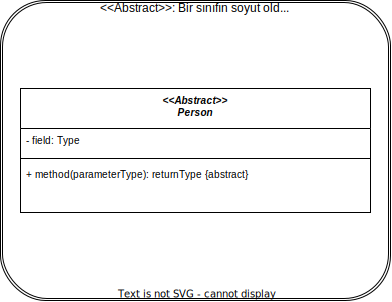

# 1. Week - 6 October 2022 Thursday

Dersi Veren: Dr. Öğr. Üyesi Yunus Emre SELÇUK

# Kısım 1: Gang of Four Tasarım Kalıpları
Kaynak: Design Patterns - Elements of Reusable OO Software, Erich Gamma et.al (Gang of Four), Addison-Wesley, 1994

## Kısım 2: Code Smells and Refactoring (Birim sınamaları ile)
Kaynak: Refactoring: Improving the Design of Existing Code, Martin Fowler. Addison-Wesley, 1999

## Gereksinimler
* UML: Unified Modeling Language sınıf şemalarına hakimiyet

TODO: Finalde 1, 1.5 sayfalık bir kod verilecek. Bu kodun kusurlu (code smell) olan yerlerini bulunuz. Kusurların teknik isimlerini yazınız. Ve nasıl düzeltildiği hakkında önerinizi yazınız. Move method ve extract metod dan soru gelebilir.  
TODO: UML sınıf şeması çizimi yapılacak sınavlarda.

## Yazılım Kalitesi

* '**İyi**' tasarım ile '**kaliteli**' yazılıma ulaşmak amaçlanır.

Ölçütler:
* Dış kalite özellikleri (Kullanıcıya Yönelik)
* İç kalite özellikleri (Programcıya Yönelik)

* Yeniden kullanılabilirlik için yapılan tasarımlar sektörde yapılan araştırmalarda en fazla %30'luk bir avantaj sağlamıştır. Bunun nedeni reusable kod çıkarmak için daha fazla zaman harcamamızdır.

## Low Coupling (Düşük Bağlaşım)

## High Cohesion (Yüksek Uyum)

Bir parçanın sorumluluklarının birbirleri ile uyumlu olma oranı.

Yararları
* Sınıfın anlaşılma kolaylığı artar
* Yeniden kullanılabilirlik artar.
* Bakım kolaylığı artar
* Sınıfın değişikliklerden etkilenme olasılığı düşer.

## Seperation of Concerns (İlgi Alanlarının Ayrılması)

* Yazılımın sadece belirli bir amaç, kavram veya hedef ile ilgili kısımlarının tanımlanabilmesi, birleştirilebilmesi ve değiştirilebilmesi yeteneğine işaret eder.
* Her programlama yaklaşımı, sorunu parçalara bölmek için yollar sunar.
* Parçaların düşük bağlaşıma ve yüksek uyuma sahip olması istenir.

## Kütüphane Kaynaklarına Erişim
Üniversite üzerinden erişim için kampüs local ip si alınması gerekiyor.  
[ktp.yildiz.edu.tr](ktp.yildiz.edu.tr)
* Kampüs Dışı Erişim [linkine](https://ktp.yildiz.edu.tr/ktp/38/Uzaktan-Eri%C5%9Fim) tıklanır.

Önemli Kaynaklar;
* ACM (Association for Computing Machinery) Digital Library
* IEEE/IEE Explore Digital Library
* ISI Web of Science - Özet bölümü için arama yapar
* Science Direct - Mühendislik odaklıdır
* Springer Engineering E-Books
* Springer Computer Science E-Books
* Wiley Online Libarary
