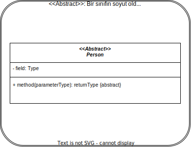
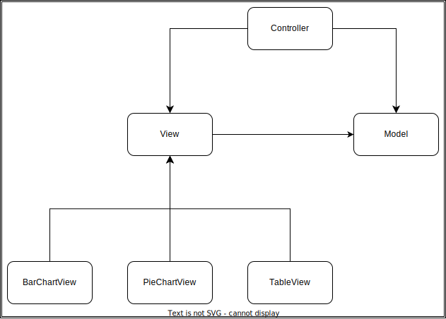

# 2. Week - 13 October 2022 Thursday

# Tasarım Kalıplarına Giriş

* Yazılım tasarımında karşılaşılan belirli sorunların yalın ve güzel çözümlerinin tarifidir (soyut veya somut olabilir).

Kalıpların Ana Bileşenleri:
* İsim: Kalıbı en güzel şekilde anlatacak bir isim.
* Sorun: Çözülen sorunun tarifi.
* Çözüm: Önerilen tasarım bileşeni.
* Tartışma/Sonuçlar: Çözümün sistemin geneline esneklik, genişletilebilirlik ve diğer kalıplar ile ilişkisi yönünden incelenmesi.

Yararları:
* Tekerleği yeniden icat etmemek.
* Üzerinde birçok deneyimli kişinin emeği geçtiğinden, 'kaliteli' bir çözüm.
* Deneyimin yazılı biçimde aktarılabilmesi.
* Yazılım ekibi arasında ortak bir sözlük oluşturulması.

Gang of Four: Dörtlü Çete

Kullanılan sınıf şemalarında italik yazı soyut anlamına gelmektedir.



## Creational Design Patterns: Yaratımsal Tasarım Kalıpları
Nesnelerin oluşturulması, temsili ve ilişkilendirilmelerindeki bağımlılığı azaltmaya yönelik kalıplardır.
## Structural Design Patterns: Yapısal Tasarım Kalıpları
Sınıflar ve nesnelerin bir araya getirilerek daha büyük yapılar elde edilmesine yönelik kalıplardır.
## Behavioral Design Patterns: Davranışsal Tasarım Kalıpları
Sorumlulukların nesnelere dağıtılması ve algoritma seçimine yönelik kalıplardır.

# MODEL-VIEW-CONTROLLER (MVC) DESIGN PATTERN
Behavioral Design Pattern olarak nitelendirilir.  
Sorun:
* Aynı veriyi farklı biçimlerde gösterebilmek istiyoruz.

Çözüm:
Veriyi, verinin gösterimini ve gösterimin yönetimini ayrı sınıflar olarak temsil etmek.

Model Sınıfı: Ham veriyi simgeler.  
View Sınıfı: Verinin çeşitli gösterim biçimlerini oluşturur.  
Controller Sınıfı: Kullanıcı komutlarını alıp işler. View yönteminin değiştirilmesi gibi işlemler.



# ABSTRACT FACTORY DESIGN PATTERN
Creational Design Pattern olarak nitelendirilir.  

Amaç: Birbirleri ile ilişkili yada aynı aileden olan nesneleri, sınıflarını belirtmeden oluşturabilmek.  
Amaç: Neyin sık değiştiğini bul ve onu sarmala. Böylece bu konu ile ilgili değişiklikler sadece bu kısmı etkiler.

Switch-Case ile enum değerleri yönetilerek yapılacak.

Zayıf Yönü: Switch-Case ler her yeni bir sınıf eklendiğinde güncellenecektir.

```Java
abstract class Renderer {
    public void renderOpA();
    public void renderOpB();
}

class OpenGLRenderer extends Renderer {
    public void renderOpA() {
        // Implementation...
    }

    public void renderOpB() {
        // Implementation...
    }
}

class DirectXRenderer extends Renderer {
    public void renderOpA() {
        // Implementation...
    }

    public void renderOpB() {
        // Implementation...
    }
}

// Aşağıdaki bizi bir noktaya kadar idare eder.
// Yeni DirectX sürümleri çıktı (10, 11, 12, etc.)?
// Yeni bir switch eklenmesi gerekecek.
// Daha iyisi abstract factory ile mümkün.

Renderer renderer;

switch (library) {
    case OpenGL:
        renderer = new OpenGLRenderer();
        break;
    case DirectX:
        renderer = new DirectXRenderer();
        break;
}

abstract class ComponentFactory {
    public Renderer createRenderer();
}

class OpenGLFactory extends ComponentFactory {
    public Renderer createRenderer() {
        // Implementation...
    }
}

class DirectXFactory extends ComponentFactory {
    public Renderer createRenderer() {
        // Implementation...
    }
}

Renderer renderer;
ComponentFactory factory;

// Böylelikle yeni bir nesne oluşturulacağı alelen
// beyan edilmiş olmaktadır. Tüm kontroller factory
// sınıfına devrediliyor. Yeni bir renderer implementasyonu
// için sadece factory de değişiklik yapılması yeterli.
renderer = factory.createRenderer();
```
