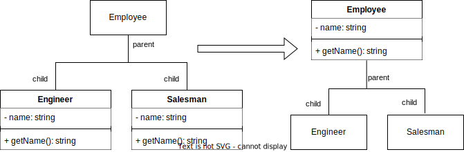

# 10. Week - 8 December 2022 Thursday

TODO: Final sınavında code smells ve refactoring konuları üzerinden sorular gelecek. Bunları iyi anla.

# REFACTORING

* Mümkün olduğunca dışarıya verilen hizmeti değiştirmeden içeride düzenlemelerin yapılması anlamına gelmektedir.
* Yeniden kullanım olasılığı arttırılır.
* Uyum yükselir.

# CODE SMELLS - DUPLICATED CODE
* Aynı kodun veya çok benzer kod yapısının birden fazla yerde tekrarlanması durumudur.

## Solution: Refactoring - Extract Method
* Bir metot içindeki kodun bir kısmını yeni bir metot olarak belirlemeye dayanır.
* Böylece kod tekrarı azalır. Oluşturulan metoda anlamlı anlaşılabilir bir isim verilir.

## Solution: Refactoring - Pull Up Method
Yenilenen kod kalıtım ağacında kardeş veya kuzen sınıflara yayılmışsa, oluşturulan metot ortak bir üst sınıfa çekilir.

* getName metodu Employee sınıfına taşınabilir. Aşağıdaki gibi;



* Bazı durumlarda alt sınıflarda farklılaşma oluşmuş olabilir. Bu durumda template kalıbı kullanılarak farklılaşmaları işleyerek üst sınıfa taşıma işlemi gerçekleştirilebilir.

# CODE SMELLS - LONG METHOD
Uzunluk arttıkça;
* Anlaşılması zorlaşır.
* Değişikliklerden etkilenme olasılığı artar.
* Birden fazla ilgi alanını kapsama olasılığı artar. (Uyumun düşmesi)

## Solution: Refactoring - Extract Method
* Uzun metodu kısa kısa metodlara ayırabilir ve bunları uzun metod içerisinde çağırabiliriz.


# REFACTORING - DECOMPOSE CONDITIONAL
* if statement ın içerisinde oldukça karmaşık bir ifade varsa bunu fonksiyon haline getirip isimlendirerek daha kolay anlaşılmasını sağlayabiliriz.

# CODE SMELLS - LONG PARAMETER LIST
Metod 3-4 taneden fazla parametre alıyorsa, refactoring gerekliliği üzerine düşünülebilir.

## Solution: Refactoring - Introduce Parameter Object
* Çok paremetre alıyorsa, uygun parametreleri bir sınıf haline getirirsek işimiz kolaylaşılır.
* amountReceivedIn(start: Date, end: Date) ---> amountReceivedIn(range: DateRange)

## Solution: Refactoring - Preserve Whole Object

```Java
int low = daysTempRange().getLow();  
int high = daysTempRange().getHigh();

plan.withinRange(low, high);
// yerine aşağıdaki gibi bir çağrım yapılarak metod parametre sayısı azaltılabilir.
plan.withinRange(daysTempRange());
```

Bu eylem tüm objenin aktarılmasına neden olduğu için, çok büyük objeler için tavsiye edilen bir refactoring işlemi değildir.

## Solution: Refactoring - Replace Temp with Query
* Geçici değişken yerine erişim metodu kullanımını tercih edelim.
```Java
int temp = employee.getAge();
if (temp > 30)
// yerine aşağıdaki gibi
if (employee.getAge() > 30)
```
* Kodun anlaşılabilmesi için method çağrısı daha iyi olabilir. Yada temp variable ismini güzel seçilmesi gerekir.

* Eğer performans konusunda bir endişe varsa (20 yerde çağrıldı?), profiling tool ları ile çağrım süresi incelenerek bakılabilir. Metod çağrısının çok büyük yük getirdiği tespit edilirse bu refactoring işleminden vazgeçilebilir.

## Solution: Refactoring - Replace Method with Method Object
Metodu kaldırmadan (arayüz değiştirmeden) içini farklı (daha anlamlı) bir metoda taşıyarak refactoring gerçekleştirme işlemi.

# CODE SMELLS - LARGE CLASS
Sınıfın büyük olması, sınıfa ilgisiz sorumlulukların atandığının göstergesidir.

## Solution: Refactoring - Extract Class
Birden fazla sınıfa bölüyoruz. Parent - child ilişkisi oluşturuyor olabiliriz.
