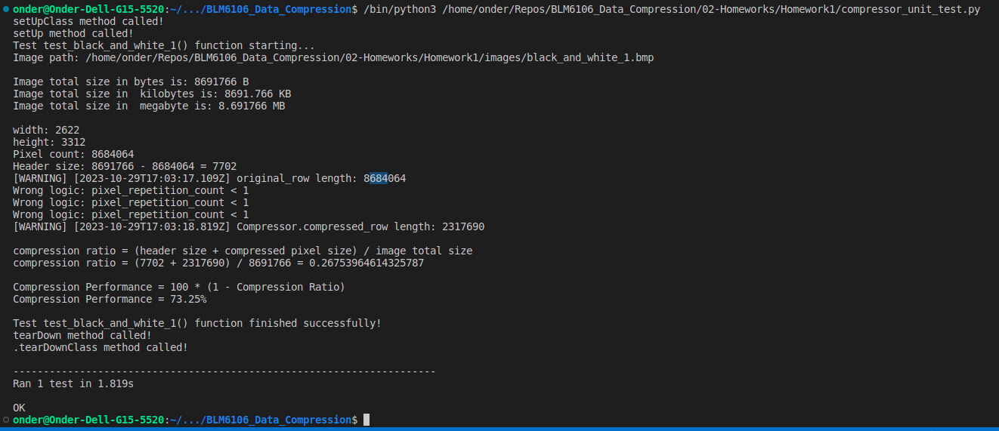

# Veri Sıkıştırma 1. Ödev Raporu

Öğrenci: Önder Görmez  
No: 21501035

## Algoritma

Ödevin çözülebilmesi için Compressor isimli bir sınıf yazılmıştır. Bu sınıf kısaca aşağıdaki işlemleri yapar.

* Bitmap resim dosyası okunur
* Header kısmı hariç pixel ler sıkıştırma işlemine dahil edilir.
* Her bit, 1 pixel i yani 1 byte ı temsil edecek şekilde 8 byte alan ayrılır. Bu alan kendisinden sonra gelecek olan 64 byte ın içerisinde hangi byte ların tekrar sayısı, hangi byte ların gerçekten pixel değeri olduğunu ayrıştırmakta ve decompression yapmakta kullanılır.

## Algoritma Unit Testleri ve Sonuçları

```Python
    # Tüm pixellerin aynı değerden oluştuğu durum
    original_row = bytearray([50, 50, 50, 50, 50, 50, 50, 50])
    expected_compressed_row = bytearray([0x80, 0, 0, 0, 0, 0, 0, 0, 8, 50])

    self.assertEqual(compressor.Compressor.compress_row(original_row),expected_compressed_row)

    # Son pixel farklı olduğu durum
    original_row = bytearray([50, 50, 50, 50, 50, 50, 50, 60])
    expected_compressed_row = bytearray([0x80, 0, 0, 0, 0, 0, 0, 0, 7, 50, 60])

    self.assertEqual(compressor.Compressor.compress_row(original_row).hex(), expected_compressed_row.hex())

    # Son iki pixelin aynı olduğu durum
    original_row = bytearray([50, 50, 40, 50, 50, 50, 60, 60])
    expected_compressed_row = bytearray([0x94, 0, 0, 0, 0, 0, 0, 0, 2, 50, 40, 3, 50, 2, 60])

    self.assertEqual(compressor.Compressor.compress_row(original_row).hex(), expected_compressed_row.hex())

    # 255 pixelin aynı olduğu durum
    original_row = bytearray([100] * 255)
    expected_compressed_row = bytearray([0x80, 0, 0, 0, 0, 0, 0, 0, 255, 100])

    self.assertEqual(compressor.Compressor.compress_row(original_row).hex(), expected_compressed_row.hex())

    # 300 pixelin aynı olduğu durum
    original_row = bytearray([100] * 300)
    expected_compressed_row = bytearray([0xA0, 0, 0, 0, 0, 0, 0, 0, 255, 100, 45, 100])

    self.assertEqual(compressor.Compressor.compress_row(original_row).hex(), expected_compressed_row.hex())

    # 800 pixelin aynı olduğu durum, for döngüsü içindeki if bloğu çalışsın diye
    original_row = bytearray([100] * 800)
    expected_compressed_row = bytearray([0xAA, 0, 0, 0, 0, 0, 0, 0, 255, 100, 255, 100, 255, 100, 35, 100])

    self.assertEqual(compressor.Compressor.compress_row(original_row).hex(), expected_compressed_row.hex())

    # 800 pixelin aynı olduğu durum, for döngüsü dışındaki if bloğu çalışsın diye
    original_row = bytearray([100] * 800) + bytearray([50, 70, 60])
    expected_compressed_row = bytearray([0xAA, 0, 0, 0, 0, 0, 0, 0, 255, 100, 255, 100, 255, 100, 35, 100, 50, 70, 60])

    self.assertEqual(compressor.Compressor.compress_row(original_row).hex(), expected_compressed_row.hex())

    # 1'den 300'e kadar olan sayıların olduğu durum
    original_row = bytearray(range(0, 256)) + bytearray(range(0, 44))
    expected_compressed_row = bytearray([0, 0, 0, 0, 0, 0, 0, 0]) + bytearray(range(0, 64)) 
        + bytearray([0, 0, 0, 0, 0, 0, 0, 0]) + bytearray(range(64, 128))
        + bytearray([0, 0, 0, 0, 0, 0, 0, 0]) + bytearray(range(128, 192))
        + bytearray([0, 0, 0, 0, 0, 0, 0, 0]) + bytearray(range(192, 256))
        + bytearray([0, 0, 0, 0, 0, 0, 0, 0]) + bytearray(range(0, 44))

    self.assertEqual(compressor.Compressor.compress_row(original_row).hex(), expected_compressed_row.hex())
```

## Kullanılan Hazır Kütüphaneler

* from PIL import Image
  * Grayscale image üzerinden pixellerin değerini almak için
* import cv2
  * RGB image üzerinden pixellerin değerini almak için

## Gray Scale Compression

Aşağıdaki resimlerin sıkıştırılması ve performansının değerlendirmesi yapılmıştır.  
Source: [link](https://files.3axis.co/docs/bmp/ro6yqkq7.bmp)


Programın çıktısı aşağıdaki gibidir. Sıkıştırma işlemi satır satır okuyarak yapılmıştır.


**Compression Ratio:** size of the output stream / size of the input stream
ise

CR = 0,241

**Compression Performance** = 100 * (1 - CR)

CP = 100 * (1 - 0,241) = % 75,9 performansı ile Black & White resmi sıkıştırabilmektedir.

Başka bir örnek üzerinde yine sıkıştırma performansı denenerek ölçümlenmiştir.  
Source: [link](https://files.3axis.co/docs/bmp/075ydl3o.bmp)


Sonuçlar aşağıdaki gibidir.



Sonuçlardan görüldüğü üzere sıkıştırma performansı yine %70 in üzerinde çıkmıştır.

## RGB Compression

* Görüntü işlemede bir klasik haline gelen aşağıdaki RGB resmin sıkıştırma oranına bakalım. Resmin bitmap hali bulunamadığı için internette bulunan bir bitmap converter yazılımı kullanılarak png den çevrim yapılmıştır.  
* Bu nedenle resmin köşelerinde beyaz alanlar oluşmuştur.


Programın çıktısı aşağıdaki gibidir. Sıkıştırma işlemi satır satır okuyarak yapılmıştır.


## Sonuçlar

* RLE'nin performansının Black & White resim üzerinde daha iyi olduğu gözlemlenmiştir.
* RLE'nin renkli resimlerde çok yüksek bir sıkıştırma performansı olmadığı (%32.56) gözlemlenmiştir.
  * Bmp dosyasına sonradan dönüşüm yapıldığı için resmin köşelerinde oluşan beyaz alan nedeniyle bu kadar (%32.56) çıktığı düşünülmektedir.
  * Bu beyazlık olmasaydı daha küçük değerlerde sıkıştırma oranı elde edilirdi.
