# Üniversite Ders Notları Readme Oluşturucu

Bu reponun amacı temel olarak herhangi bir üniversitenin herhangi bir bölümündeki öğrencilerin oluşturduğu ders notları reposuna readme oluşturma işini kolaylaştırmaktır.

# Örnek olarak [Linkteki](https://github.com/baselkelziye/YTU_Bilgisayar_Muhendisligi_Arsiv) repoyu ziyaret edebilirsiniz.

Bu repodaki tüm _**README.md**_ dosyaları bu arayüzle oluşturulmuştur.

## Gereksinimleri İndirme 📦

Projeyi başarıyla çalıştırabilmek için aşağıdaki adımları izleyerek gerekli kütüphaneleri ve bağımlılıkları yükleyiniz:

1. **Python 3 Kurulumu:** Projeyi çalıştırmak için Python 3'ün bilgisayarınızda yüklü olması gerekmektedir. Python'ı [buradan](https://www.python.org/downloads/) indirebilirsiniz (linux için `sudo apt install python3`). Kurulum tamamlandıktan sonra terminali açın ve `python3 --version` komutu ile kurulumun başarılı olduğunu doğrulayın. 🐍

1. **Pip3 Kurulumu:** Pip, Python paketlerini yönetmek için kullanılan bir araçtır. Python 3 ile birlikte genellikle otomatik olarak yüklenir. Kurulumunu doğrulamak için terminali açın ve `pip3 --version` komutunu çalıştırın. Eğer kurulu değilse, [Pip'in resmi belgelerini](https://pip.pypa.io/en/stable/installing/) takip ederek kurulum yapabilirsiniz.(linux için `sudo apt install python3-pip`) 🛠️

1. **Gerekli Kütüphanelerin Yüklenmesi:** Projede kullanılan kütüphaneleri yüklemek için, terminalinize `pip3 install -r gereksinimler.txt` komutunu girin. Bu komut, `gereksinimler.txt` dosyasında listelenen tüm paketleri yükleyecektir. 📚

## Nasıl Kullanılır

Proje dosyaları arasında, hocalar, dersler, dönemler ve diğer bilgileri içeren JSON formatında çeşitli dosyalar bulunmaktadır. Bu dosyalar, projenin çeşitli yerlerinde kullanılarak dinamik bir içerik oluşturur.

Örneğin:

- `hocalar.json` hoca bilgilerini içerir ve README'leri oluşturmakta kullanılır.
- `dersler.json` ders bilgilerini tutar.
- `donemler.json` dönem bilgilerini tutar.
- `giris.json` README dosyasının giriş bilgilerini içerir.

Bu dosyalarla birlikte, her dersin ve her dönemin klasöründe README dosyaları oluşturulur.

### Arayüzü Çalıştırmak

Bu bölümde, projenin arayüzünün nasıl çalıştırılacağı adım adım açıklanmaktadır.

#### json_depo_bilgileri.txt Dosyasının Hazırlanması:

Projede, `json_depo_bilgileri.txt` dosyasının kök dizinde olması gerekmektedir. Bu dosya yoksa, arayüz tarafından otomatik olarak oluşturulur. Dosya, JSON dosyalarının hangi klasörde tutulacağını belirtir. Örneğin:

```
..
YTU_Bilgisayar_Muhendisligi_Arsiv
json_dosyalari
```

Bu yapıya göre, JSON dosyaları `YTU_Bilgisayar_Muhendisligi_Arsiv/json_dosyalari` klasöründe oluşur.

#### Konfigürasyon Dosyasının Oluşturulması

`json_depo_bilgileri.txt` dosyasında belirtilen yolda `konfigurasyon.json` dosyası oluşturulmalıdır. Bu dosya yoksa, arayüz tarafından otomatik olarak oluşturulur. Dosyanın içeriği aşağıdaki gibi olmalıdır:

```json
{
  "github_url": "https://github.com/baselkelziye/YTU_Bilgisayar_Muhendisligi_Arsiv",
  "hoca_yorumlama": "https://forms.gle/WbwDxHUz6ebJA7t36",
  "hoca_oylama": "https://forms.gle/s6ZMrQG4q578pEzm7",
  "ders_yorumlama": "https://forms.gle/SzNmK1w4rVaKE4ee8",
  "ders_oylama": "https://forms.gle/3njZjmhm215YCAxe6",
  "ders_oylama_csv": "https://docs.google.com/spreadsheets/d/e/2PACX-1vSDFicOFbJu9Fnc4Hl0mFuuaC0L4PiEmUFkkJrgocwWGWs1wB3TyN1zd4okW8svC6IT2HMIe64NQUUy/pub?output=csv",
  "ders_yorumlama_csv": "https://docs.google.com/spreadsheets/d/e/2PACX-1vQvGyGLQxobIpaVdQItSpqEoiwJ0DIIHE9kVvCHhfKQ7yYR16c2tI_ix4Z9d2tA4aLt2c4fTLGxlL-s/pub?output=csv",
  "hoca_oylama_csv": "https://docs.google.com/spreadsheets/d/1w386auUiJaGwoUAmmkEgDtIRSeUplmDz0AZkM09xPTk/export?format=csv",
  "hoca_yorumlama_csv": "https://docs.google.com/spreadsheets/d/1mexaMdOeB-hWLVP4MI_xmnKwGBuwoRDk6gY9zXDycyI/export?format=csv",
  "dokumanlar_repo_yolu": "..",
  "cikmislar": "https://drive.google.com/drive/folders/1LI_Bo7kWqI2krHTw0noUFl9crfZSlrZh"
}
```

- `github_url`: Bu anahtarın karşısına ders dökümanlarının tutulduğu GitHub reposunun adresini ekleyin.
- `hoca_yorumlama`: Bu anahtara, hoca yorumlamak için oluşturulan Google Form anketinin linkini ekleyin. Eğer anket henüz oluşturulmadıysa, soru tipleri ve sıralaması [bu örnektekiyle](https://forms.gle/WbwDxHUz6ebJA7t36) birebir aynı olmalıdır.
- `hoca_oylama`: Bu anahtara, hoca oylamak için oluşturulan Google Form anketinin linkini ekleyin. Eğer anket henüz oluşturulmadıysa, soru tipleri ve sıralaması [bu örnektekiyle](https://forms.gle/s6ZMrQG4q578pEzm7) birebir aynı olmalıdır.
- `ders_yorumlama`: Bu anahtara, ders yorumlamak için oluşturulan Google Form anketinin linkini ekleyin. Eğer anket henüz oluşturulmadıysa, soru tipleri ve sıralaması [bu örnektekiyle](https://forms.gle/SzNmK1w4rVaKE4ee8) birebir aynı olmalıdır.
- `ders_oylama`: Bu anahtara, ders oylamak için oluşturulan Google Form anketinin linkini ekleyin. Eğer anket henüz oluşturulmadıysa, soru tipleri ve sıralaması [bu örnektekiyle](https://forms.gle/3njZjmhm215YCAxe6) birebir aynı olmalıdır.
- `ders_oylama_csv`: Bu anahtara, ders oylamak için oluşturulan Google Form anketinin içeriğinin kaydedildiği dosyanın CSV formatındaki linkini ekleyin.
- `ders_yorumlama_csv`: Bu anahtara, ders yorumlamak için oluşturulan Google Form anketinin içeriğinin kaydedildiği dosyanın CSV formatındaki linkini ekleyin.
- `hoca_oylama_csv`: Bu anahtara, hoca oylamak için oluşturulan Google Form anketinin içeriğinin kaydedildiği dosyanın CSV formatındaki linkini ekleyin.
- `ders_yorumlama_csv`: Bu anahtara, hoca yorumlamak için oluşturulan Google Form anketinin içeriğinin kaydedildiği dosyanın CSV formatındaki linkini ekleyin.
- `dokumanlar_repo_yolu`: Bu anahtara, göreceli olarak ders dökümanlarının tutulduğu GitHub reposunun yolunu verin. Örneğin, `../..` olarak belirlenirse, `README.md` dosyaları iki üst dizini kök dizin olarak kabul eder.
- `cikmislar`: İsteğe bağlı olarak boş bırakılabilir. Ders notlarının vb. tutulduğu herhangi bir dış kaynak linki varsa bu alana ekleyebilirsiniz.

**Not:** Google Sheets'ten CSV dosyasını nasıl linke dönüştüreceğinizi bilmiyorsanız, [bu adresteki](https://blog.golayer.io/google-sheets/export-google-sheets-to-csv) `Export Google Sheets to CSV Automatically` başlığına göz atabilirsiniz.

#### Arayüzün Çalıştırılması

Yukarıdaki dosyalar hazırlandıktan sonra, Windows'ta arayüzü çalıştırmak için `arayuz.bat` dosyası açılmalıdır. Arayüz ekranlarının anlatımları:

##### Ana Sayfa Ekranı

<a id="arayuz_ana_sayfa"></a>

<p align="center">
    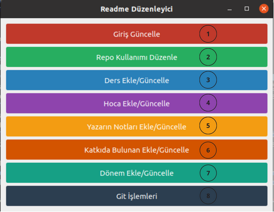
    <br>
    <strong>Ana Sayfa Ekranı</strong>
</p>

1. _Giriş Güncelle Butonu_

   - Bu buton ders dökümanları reposunun kök dizinindeki _README.md_ dosyasının **_Giriş_** kısmını manipüle edebilen ekranı açar. [Ana Sayfa Ekranı](#ana-sayfa-ekranı)'nda 1 numaralı butona karşılık gelmektedir.

<a id="readme_giris_ornek"></a>

<p align="center">
    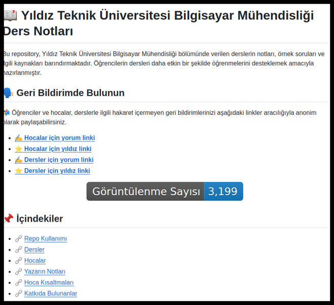
    <br>
    <strong>README.md Giriş Örneği</strong>
</p>

- [README.md Giriş Örneği](#readme_giris_ornek)'ndeki _İçindekiler_, _Başlık_ ve _Başlık Açıklaması_ kısımları bu [Giriş Güncelle Ekranından](#giris_guncelle_ekrani) düzenlenebilir.

1.  _Repo Kullanımı Düzenle Butonu_

    - Bu buton ders dökümanları reposunun kök dizinindeki _README.md_ dosyasının **_Repo Kullanımı_** kısmını manipüle edebilen ekranı açar. [Ana Sayfa Ekranı](#ana-sayfa-ekranı)'nda 2 numaralı butona karşılık gelmektedir. - [README.md Repo Kullanımı Örneği](#readme_repo_kullanimi_ornek)'ndeki _Açıklamalar_, _Talimatlar_ ve _Kavramlar_ kısımları bu [Repo Kullanımı Düzenle Ekranından](#repo_kullanimi_ekrani) düzenlenebilir.

    <a id="readme_repo_kullanimi_ornek"></a>

    <p align="center">
        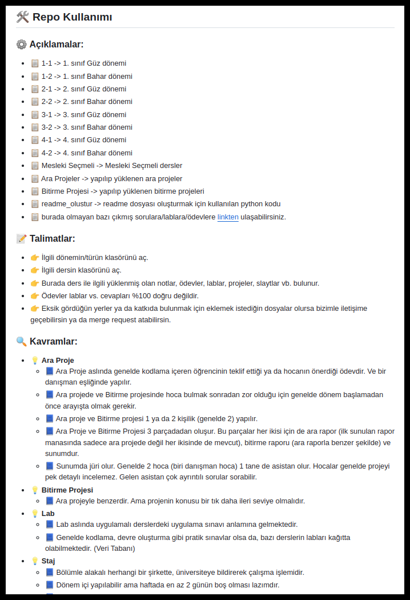
        <br>
        <strong>README.md Repo Kullanımı Örneği</strong>
    </p>

1.  _Ders Ekle/Güncelle Butonu_

    - Bu buton ders dökümanları reposunun kök dizinindeki _README.md_ dosyasının **_Dersler_** kısmını manipüle edebilen ekranı açar. Aynı zamanda her **dönem klasörü** ve **ders klasörü** içindeki _README.md_ dosyalarının içeriğini de etkiler.[Ana Sayfa Ekranı](#ana-sayfa-ekranı)'nda 3 numaralı butona karşılık gelmektedir. - [README.md Ders Ekle/Güncelle Kök Dosyası Örneği](#readme_ders_ekle_guncelle_ornek)'ndeki _Dersler'in_, _Ders Tipi_, _Ders Adı_ ve _Dersi Yürüten Akademisyenler_ kısımları - [README.md Ders Ekle/Güncelle Dönem Dosyası Örneği](#readme_ders_ekle_guncelle_donem_ornek) ve [README.md Ders Ekle/Güncelle Ders Dosyası Örneği](#readme_ders_ekle_guncelle_ders_ornek)'ndeki _Yıl_, _Dönem_, _Ders Tipi_ ve _Faydalı Olabilecek Kaynaklar_ kısımları [Ders Ekle/Güncelle Ekranından](#ders_ekle_guncelle_ekrani) düzenlenebilir.
    <a id="readme_ders_ekle_guncelle_ornek"></a>
    <p align="center">
        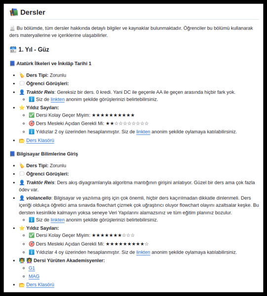
        <br>
        <strong>README.md Ders Ekle/Güncelle Kök Dosyası Örneği</strong>
    </p>
    <a id="readme_ders_ekle_guncelle_donem_ornek"></a>
    <p align="center">
        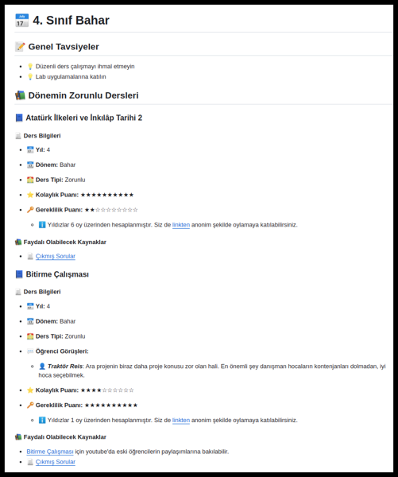
        <br>
        <strong>README.md Ders Ekle/Güncelle Dönem Dosyası Örneği</strong>
    </p>
    <a id="readme_ders_ekle_guncelle_ders_ornek"></a>
    <p align="center">
        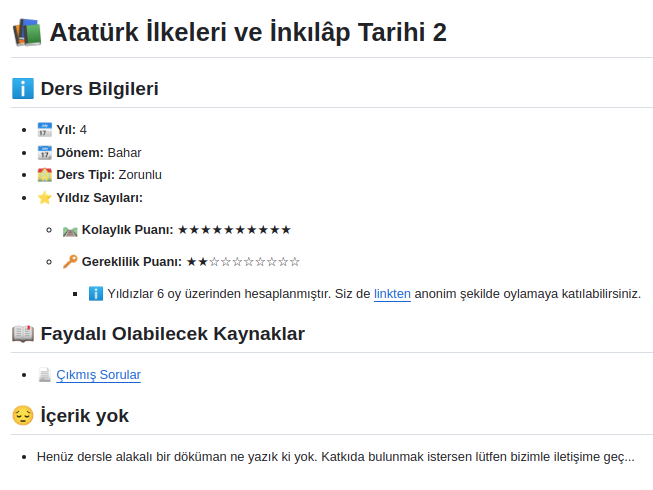
        <br>
        <strong>README.md Ders Ekle/Güncelle Ders Dosyası Örneği</strong>
    </p>

1.  _Hoca Ekle/Güncelle Butonu_

    - Bu buton ders dökümanları reposunun kök dizinindeki _README.md_ dosyasının **Hocalar** kısmını manipüle edebilen ekranı açar. [Ana Sayfa Ekranı](#ana-sayfa-ekranı)'nda 4 numaralı butona karşılık gelmektedir. - [README.md Hoca Ekle Güncelle Örneği](#readme_hoca_ekle_guncelle_ornek)'ndeki _Hoca Adı_, _Araştırma Sayfası_, _Ofis_, _Verdiği Dersler_ kısımları bu [Hoca Ekle/Güncelle Ekranından](#hoca_ekle_guncelle_ekrani) düzenlenebilir.

    <a id="readme_hoca_ekle_guncelle_ornek"></a>
    <p align="center">
    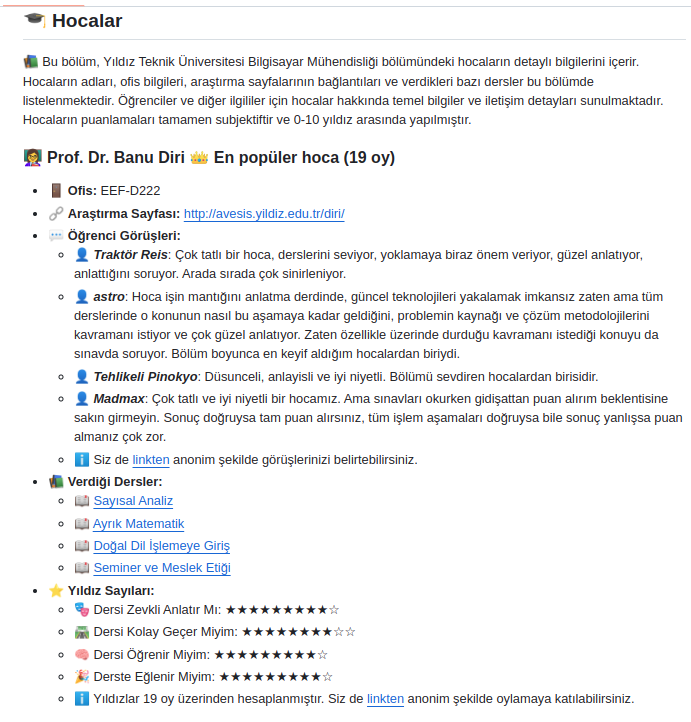
    <br>
    <strong>README.md Hoca Ekle/Güncelle Örneği</strong>
    </p>

    1.  _Yazarın Notları Ekle/Güncelle Butonu_

        - Bu buton ders dökümanları reposunun kök dizinindeki _README.md_ dosyasının **Yazarın Notları** kısmını manipüle edebilen ekranı açar. [Ana Sayfa Ekranı](#ana-sayfa-ekranı)'nda 5 numaralı butona karşılık gelmektedir. - [README.md Yazarın Notları Ekle Güncelle Örneği](#readme_yazarin_notlari_ekle_guncelle_ornek)'ndeki _Yazarın Notları_ kısmı bu [Yazarın Notları Ekle/Güncelle Ekranından](#yazarin_notlari_ekle_guncelle_ekrani) düzenlenebilir.

        <p align="center">
        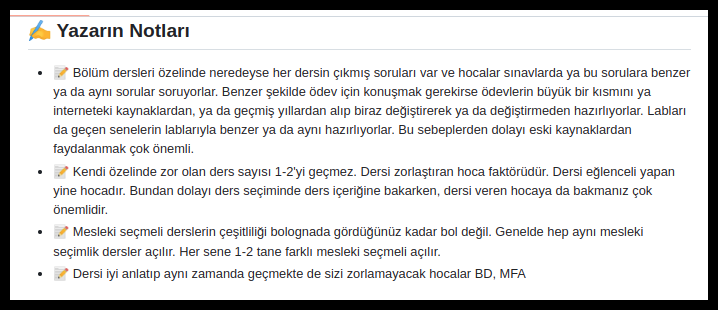
        <br>
        <strong>README.md Yazarın Notları Ekle/Güncelle Örneği</strong>
        </p>

    1.  _Katkıda Bulunan Ekle/Güncelle Butonu_

        - Bu buton ders dökümanları reposunun kök dizinindeki _README.md_ dosyasının **Katkıda Bulunanlar** kısmını manipüle edebilen ekranı açar. [Ana Sayfa Ekranı](#ana-sayfa-ekranı)'nda 6 numaralı butona karşılık gelmektedir. - [README.md Katkıda Bulunan Ekle Güncelle Örneği](#readme_katkida_bulunan_ekle_guncelle_ornek)'ndeki _Katkıda Bulunanlar_ kısmı bu [Katkıda Bulunan Ekle/Güncelle Ekranından](#katkida_bulunanlar_ekle_guncelle_ekrani) düzenlenebilir.

    <a id="readme_katkida_bulunan_ekle_guncelle_ornek"></a>
    <p align="center">
    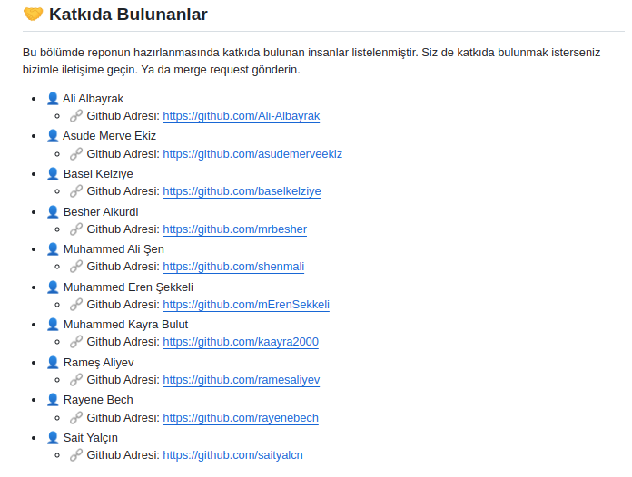
    <br>
    <strong>README.md Katkıda Bulunan Ekle/Güncelle Örneği</strong>
    </p>

    1. _Dönem Ekle/Güncelle Butonu_

       - Bu buton ders dökümanları reposunun kök dizinindeki _README.md_ dosyasının **Dönemler** kısmını aynı zamanda her dönem klasörü içindeki README.md dosyalarının içeriğini de etkileyen ekranı açar. [Ana Sayfa Ekranı](#ana-sayfa-ekranı)'nda 7 numaralı butona karşılık gelmektedir. - [README.md Ders Ekle/Güncelle Kök Dosyası Örneği](#readme_ders_ekle_guncelle_ornek)'ndeki _Dönem Adı_ kısmı - [README.md Ders Ekle/Güncelle Dönem Dosyası Örneği](#readme_ders_ekle_guncelle_donem_ornek)'ndeki _Dönem Adı_ ve _Genel Tabsiyeler_ kısmı [Dönem Ekle/Güncelle Ekranından](#donem_ekle_guncelle_ekrani) düzenlenebilir.

    1. _Git İşlemleri Butonu_

       - Bu buton yapılan değişiklikleri githuba gönderme gibi işleri yapabildiğimiz ekranı açar.
       - Eğer anketlerde bir değişiklik varsa değişiklikleri json dosyalarına uygulayan _Google Forum Güncelleme_ işlemi
       - Json dosyalarındaki her türlü değişikliği _README.md_ dosyalarına uygulayan _Readme Güncelleme_ işlemi
       - Bu arayzle alakalı herhangi bir değişiklik varsa _Arayüz Kodlarını Güncelleme_ işlemi
       - Ders dosyalarında herhangi bir değişiklik varsa _Dosya Değişikliklerini Github'dan Çekme_ işlemi
       - Anketlerdeki değişiklikleri otomatik ve periyodik olarak githubla senkronize etmek için _Rutin Kontrolü Başlatma_ işlemi
       - Ders dosyalarıyla alakalı yaptığımız tüm _Değişiklikleri Github'a Pushlama_ işlemi [Git İşlemleri Ekranından](#git_islemleri_ekrani) yapılabilir.

#### Giriş Güncelle Ekranı

<a id="giris_guncelle_ekrani"></a>

<p align="center">
    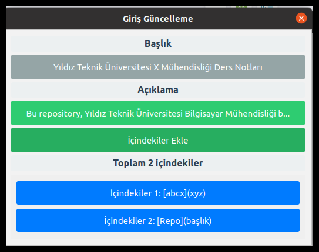
    <br>
    <strong>Giriş Güncelle Ekranı</strong>
</p>

1. _Başlık Düzenle Butonu_

   - Bu buton _Giriş_ alanının başlığını düzenlemeye yarayan [Giriş Başlık Düzenleme](#giris_ekrani_baslik_duzenle) ekranını açar.

1. _Açıklama Düzenle Butonu_

   - Bu buton _Giriş_ alanının açıklamasını düzenlemeye yarayan [Giriş Açıklama Düzenleme](#giris_ekrani_aciklama_duzenle) ekranını açar.

1. _İçindekiler Ekle Butonu_

   - Bu buton _Giriş_ alanının içindekiler kısmını düzenlemeye yarayan [Giriş İçindekiler Ekle](#giris_ekrani_icerik_ekle) ekranını açar.

1. _İçindekiler İçinde Yer Alan Herhangi Bir Buton_

   - Bu buton _Giriş_ alanının ilgili içeriğini düzenlemeye yarayan [Giriş İçindekiler Düzenle](#giris_ekrani_icerik_duzenle) ekranını açar.

#### Repo Kullanımı Düzenle Ekranı

<a id="repo_kullanimi_ekrani"></a>

<p align="center">
    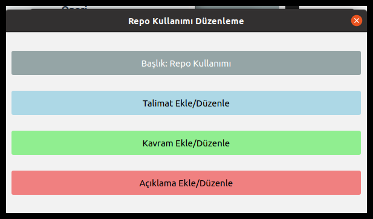
    <br>
    <strong>Repo Kullanımı Düzenleme Ekranı</strong>
</p>

1. _Başlık Düzenle Butonu_

   - Bu buton _Repo Kullanımı_ alanının başlığını düzenlemeye yarayan [Repo Kullanımı Başlık Düzenleme](#repo_kullanimi_baslik_duzenle) ekranını açar.

1. _Talimat Ekle Düzenle Butonu_

   - Bu buton _Repo Kullanımı_ alanının talimatlarını düzenlemeye yarayan [Talimat Ekle/Düzenle](#repo_kullanimi_ekrani_talimat_ekrani) ekranını açar.

1. _Kavram Ekle Düzenle Butonu_

   - Bu buton _Repo Kullanımı_ alanının kavramlarını düzenlemeye yarayan [Kavram Ekle/Düzenle](#repo_kullanimi_ekrani_kavram_ekle_ekrani) ekranını açar.

1. _Açıklama Ekle Düzenle Butonu_

   - Bu buton _Repo Kullanımı_ alanının açıklamalarını düzenlemeye yarayan [Repo Kullanımı Açıklama Ekle/Düzenle](#repo_kullanimi_ekrani_aciklama_ekle_ekrani) ekranını açar.

#### Ders Ekle/Güncelle Ekranı

<a id="ders_ekle_guncelle_ekrani"></a>

<p align="center">
    
    <br>
    <strong>Ders Ekle Güncelle Ekranı</strong>
</p>

1. _Bölüm Adı Düzenle Butonu_

   - Bu buton _Dersler_ bölümünün adını düzenlemeye yarayan [Dersler Bölüm Adı Düzenleme](#ders_ekrani_baslik_duzenle) ekranını açar.

1. _Açıklama Düzenle Butonu_

   - Bu buton _Dersler_ bölümünün açıklamasını düzenlemeye yarayan [Dersler Açıklama Düzenleme](#ders_ekrani_aciklama_duzenle) ekranını açar.

1. _Ders Ekle Butonu_

   - Bu buton _Dersler_ bölümündeki dersler arasına ders eklemeyi sağlayan [Ders Ekleme](#ders_ekrani_ders_ekle) ekranını açar.

1. _Dersler İçinde Yer Alan Ders Adını İçeren Buton_

   - Bu buton _Dersler_ bölümündeki ilgili dersi düzenlemeye yarayan [Ders Düzenleme](#ders_ekrani_ders_duzenle) ekranını açar.

1. _Dersler İçinde Yer Alan Ders Adının Karşısındaki Kaynak Ekle/Güncelle Butonu_

   - Bu buton _Dersler_ bölümündeki ilgili dersin kaynaklarını düzenlemeye yarayan [Kaynak Ekle/Güncelle](#ders_ekrani_kaynak_ekrani) ekranını açar.

1. _Dersler İçinde Yer Alan Ders Adının Karşısındaki Öneri Ekle/Güncelle Butonu_

   - Bu buton _Dersler_ bölümündeki ilgili dersin önerilerini düzenlemeye yarayan [Öneri Ekle/Güncelle](#ders_ekrani_oneri_ekrani) ekranını açar.

#### Hoca Ekle/Güncelle Ekranı

<a id="hoca_ekle_guncelle_ekrani"></a>

<p align="center">
    
    <br>
    <strong>Hoca Ekle Güncelle Ekranı</strong>
</p>

1. _Bölüm Adı Düzenle Butonu_

   - Bu buton _Hocalar_ bölümünün adını düzenlemeye yarayan [Hocalar Bölüm Adı Düzenleme](#hoca_ekrani_bolum_adi_duzenle) ekranını açar.

1. _Açıklama Düzenle Butonu_

   - Bu buton _Hocalar_ bölümünün açıklamasını düzenlemeye yarayan [Hocalar Açıklama Düzenleme](#hoca_ekrani_aciklama_duzenle) ekranını açar.

1. Hocalar Ekle Butonu\_

   - Bu buton _Hocalar_ bölümündeki hocalar arasına yeni hoca eklemeyi sağlayan [Hoca Ekleme](#hoca_ekrani_ekle) ekranını açar.

1. _Hocalar İçinde Yer Alan Herhangi Bir Buton_

   - Bu buton _Hocalar_ bölümündeki ilgili hocayı düzenlemeye yarayan [Hoca Düzenleme](#hoca_ekrani_duzenle) ekranını açar.

#### Yazarın Notları Ekle/Güncelle Ekranı

<a id="yazarin_notlari_ekle_guncelle_ekrani"></a>

<p align="center">
    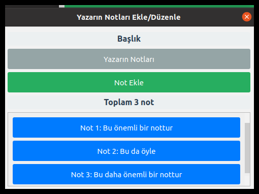
    <br>
    <strong>Yazarın Notları Ekle Güncelle Ekranı</strong>
</p>

1. _Başlık Düzenle Butonu_

- Bu buton _Yazarın Notları_ alanının başlığını düzenlemeye yarayan [Yazarın Notları Başlık Düzenleme](#yazarin_notlari_ekrani_baslik_duzenle) ekranını açar.

1. _Not Ekle Butonu_

   - Bu buton _Yazarın Notları_ alanının notları arasına yeni not eklemeye yarayan [Yazarın Notları Not Ekle](#yazarin_notlari_ekrani_not_ekle) ekranını açar.

1. _Notlar İçinde Yer Alan Herhangi Bir Buton_

   - Bu buton _Yazarın Notları_ bölümündeki ilgili notu düzenlemeye yarayan [Yazarın Notları Not Düzenleme](#yazarin_notlari_ekrani_not_duzenle) ekranını açar.

#### Katkıda Bulunanlar Ekle/Güncelle Ekranı

<a id="katkida_bulunanlar_ekle_guncelle_ekrani"></a>

<p align="center">
    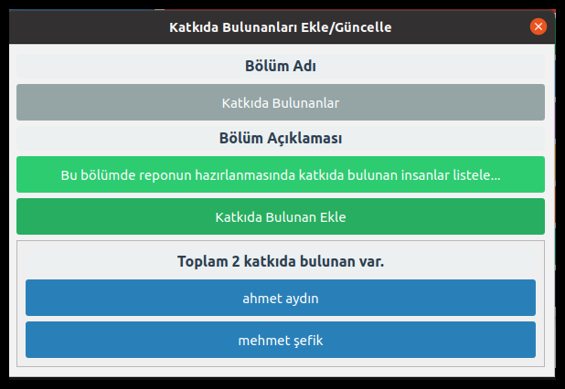
    <br>
    <strong>Katkıda Bulunanlar Ekle Güncelle Ekranı</strong>
</p>

1. _Bölüm Adı Düzenle Butonu_

   - Bu buton _Katkıda Bulunanlar_ alanının bölüm adını düzenlemeye yarayan [Katkıda Bulunanlar Bölüm Adı Düzenleme](#katkida_bulunan_ekle_guncelle_ekrani_ad_duzenle) ekranını açar.

1. _Bölüm Açıklaması Düzenle Butonu_

   - Bu buton _Katkıda Bulunanlar_ bölümünün açıklamasını düzenlemeye yarayan [Katkıda Bulunanlar Bölüm Açıklaması Düzenleme](#katkida_bulunan_ekle_guncelle_ekrani_aciklama_duzenle) ekranını açar.

1. _Katkıda Bulunan Ekle Butonu_

   - Bu buton _Katkıda Bulunanlar_ alanının katkıda bulunanları arasına yeni katkıda bulunan eklemeye yarayan [Katkıda Bulunanlar Katkıda Bulunan Ekle/Düzenle](#katkida_bulunan_ekle_guncelle_ekrani_ekleme) ekranını açar.

1. _Katkıda Bulunanlar İçinde Yer Alan Herhangi Bir Buton_

   - Bu buton _Katkıda Bulunanlar_ bölümündeki ilgili katkıda bulunanı düzenlemeye yarayan [Katkıda Bulunanlar Katkıda Bulunan Ekle/Düzenle](#katkida_bulunan_ekle_guncelle_ekrani_ekleme) ekranını açar.

#### Dönem Ekle/Güncelle Ekranı

<a id="donem_ekle_guncelle_ekrani"></a>

<p align="center">
    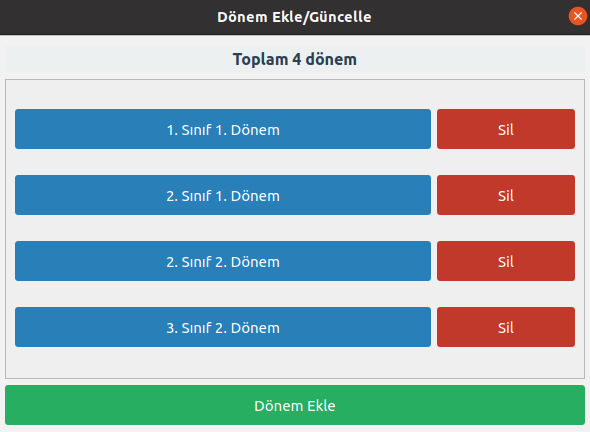
    <br>
    <strong>Dönem Ekle Güncelle Ekranı</strong>
</p>

1. _Dönem Ekle Butonu_

   - Bu buton _Dönemler_ alanının dönemleri arasına yeni dönem bulunan eklemeye yarayan [Dönemler Dönem Ekle/Düzenle](#donem_ekle_guncelle_ekrani_donem_duzenleme) ekranını açar.

1. _Dönemler İçinde Yer Alan Herhangi Bir Buton_

   - Bu buton _Dönemler_ bölümündeki ilgili dönemi düzenlemeye yarayan [Dönemler Dönem Ekle/Düzenle](#donem_ekle_guncelle_ekrani_donem_duzenleme) ekranını açar.

#### Git İşlemleri Ekranı

<a id="git_islemleri_ekrani"></a>

<p align="center">
    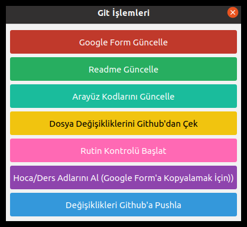
    <br>
    <strong>Git İşlemleri Ekranı</strong>
</p>

1. _Google Form Güncelle Butonu_

   - Bu buton güncel anket verilerini çeker.

1. _Readme Güncelle Butonu_
   - Bu buton _json dosyalarının_ son haline göre tüm **_README.md_** dosyalarını oluşturur.
1. _Arayüz Kodlarını Güncelle Butonu_
   - Bu buton arayüz kodlarının en güncel halini githubdan çeker.
1. _Dosya Değişikliklerini Githubdan Çek Butonu_
   - Bu buton eğer bilgisayardaki dosyalarda herhangi bir değişiklik yoksa githubdaki ders notları vb.'de olan değişiklikleri yerele çeker.
1. _Rutin Kontrol Başlat Butonu_
   - Bu buton sürekli bir kontrol başlatır. Anketlere herhangi bir cevap gelip gelmediğini sürekli kontrol eder. Eğer anketlerden herhangi birine cevap gelmişse değişiklikleri işler. İlk olarak _Google Form Güncelle Butonu_'nun işlevini gerçekleştirir. Daha sonra _Readme Güncelle Butonu_'nun işlevlerini gerçekleştirir. Sonra da değişiklikleri github'a pushlar.
1. _Hoca/Ders Adlarını Al Butonu_
   - Bu buton _Google Form_'da ankete hoca ve ders adlarını daha kolay ekleyebilmek için [Hoca ve Dersler Listesi](#git_islemleri_ekrani_hocalar_ve_dersler_listesi) ekranını açar.
1. _Değişiklikleri Github'a Pushla_
   - Bu buton yereldeki ders reposundaki tüm değişiklikleri githuba göndermeye yarayan [Değişiklikleri Pushlama](#git_islemleri_ekrani_degisiklikleri_githuba_pushla) ekranını açar.

#### Hoca ve Dersler Listesi

<a id="git_islemleri_ekrani_hocalar_ve_dersler_listesi"></a>

<p align="center">
    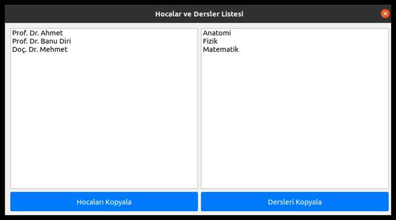
    <br>
    <strong>Hoca ve Dersler Listesi Ekranı</strong>
</p>

1. _Hocaları Kopyala Butonu_
   - Hoca isimlerini _Google Form_'lara eklemek üzere kopyalar.
1. _Dersleri Kopyala Butonu_
   - Ders isimlerini _Google Form_'lara eklemek üzere kopyalar.

#### Dersler Açıklama Düzenleme

<a id="ders_ekrani_aciklama_duzenle"></a>

<p align="center">
    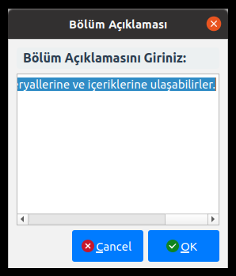
    <br>
    <strong>Dersler Açıklama Düzenleme Ekranı</strong>
</p>

1. _Bölüm Açıklamasını Giriniz_
   - Değiştirilmek istenen _Bölüm Açıklaması_ buraya girilir ve _**OK**_ butonuna basılıp kaydedilir.

#### Dersler Bölüm Adı Düzenleme

<a id="ders_ekrani_baslik_duzenle"></a>

<p align="center">
    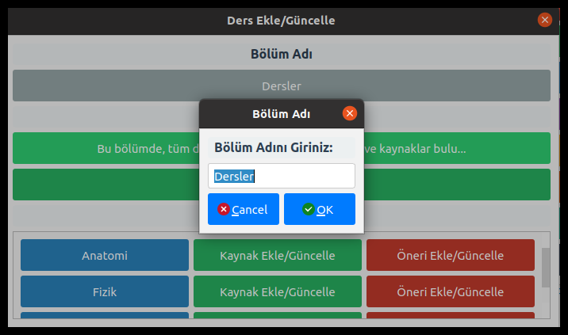
    <br>
    <strong>Dersler Bölüm Adı Düzenleme Ekranı</strong>
</p>

1. _Bölüm Adını Giriniz_
   - Değiştirilmek istenen _Bölüm Adı_ buraya girilir ve _**OK**_ butonuna basılıp kaydedilir.

#### Ders Düzenleme

<a id="ders_ekrani_ders_duzenle"></a>

<p align="center">
    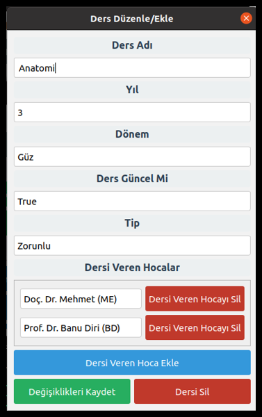
    <br>
    <strong>Ders Düzenleme Ekranı</strong>
</p>

1. _Ders Adı_
   - Dersin adı buraya girilir.
2. _Yıl_
   - Dersin yılı buraya girilir.
3. _Dönem_
   - Dersin dönemi seçilir.
4. _Ders Güncel Mi?_
   - Ders şu an güncel müfredatta varsa _**True**_ yoksa _**False**_ seçilir.
5. _Tip_
   - Dersin tipi buradan seçilir.
6. _Dersi Veren Hoca Ekle Butonu_
   - Dersi veren hoca eklemek için bu buton kullanılır. Sonrasında _Dersi Veren Hocalar_'a gelen seçme alanından hocanın adı seçilir.
7. _Değişiklikleri Kaydet_
   - Yapılan değişiklikler eğer kaydedilmek isteniyorsa bu buton kullanılmalıdır.
8. _Dersi Sil_
   - Eğer ders silinmek isteniyorsa bu buton kullanılmalıdır.

#### Ders Ekleme

<a id="ders_ekrani_ders_ekle"></a>

<p align="center">
    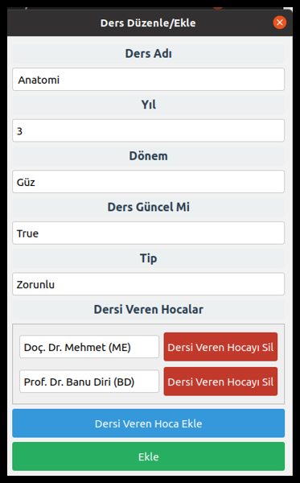
    <br>
    <strong>Ders Ekleme Ekranı</strong>
</p>

1. _Ders Adı_
   - Dersin adı buraya girilir.
2. _Yıl_
   - Dersin yılı buraya girilir.
3. _Dönem_
   - Dersin dönemi seçilir.
4. _Ders Güncel Mi?_
   - Ders şu an güncel müfredatta varsa _**True**_ yoksa _**False**_ seçilir.
5. _Tip_
   - Dersin tipi buradan seçilir.
6. _Dersi Veren Hoca Ekle Butonu_
   - Dersi veren hoca eklemek için bu buton kullanılır. Sonrasında _Dersi Veren Hocalar_'a gelen seçme alanından hocanın adı seçilir.
7. _Ekle_
   - Yapılan değişiklikler eğer kaydedilmek isteniyorsa bu buton kullanılmalıdır.

#### Kaynak Ekle/Güncelle

<a id="ders_ekrani_kaynak_ekrani"></a>

<p align="center">
    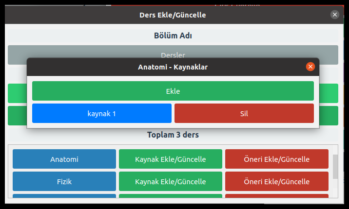
    <br>
    <strong>Kaynak Ekle/Güncelle Ekranı</strong>
</p>

1. _Ekle_
   - Bu buton _Dersler_ bölümündeki ilgili derse kaynak eklemeye yarayan [Dersler Kaynak Ekleme]() ekranını açar.
1. _Kaynaklar İçinde Yer Alan Herhangi Bir Buton_
   - Bu buton _Dersler_ bölümündeki ilgili dersin ilgili kaynağını düzenlemeye yarayan [Dersler Kaynak Düzenleme]() ekranını açar.

#### Öneri Ekle/Güncelle

<a id="ders_ekrani_oneri_ekrani"></a>

<p align="center">
    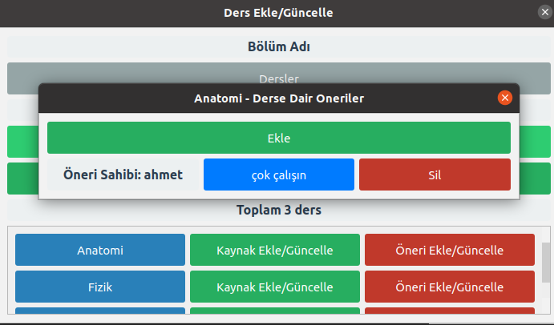
    <br>
    <strong>Öneri Ekle/Güncelle Ekranı</strong>
</p>

1. _Ekle_
   - Bu buton _Dersler_ bölümündeki ilgili derse öneri eklemeye yarayan [Dersler Öneri Ekleme/Düzenleme](#ders_ekrani_oneri_ekrani_ekle) ekranını açar.
1. _Öneriler İçinde Yer Alan Herhangi Bir Buton_
   - Bu buton _Dersler_ bölümündeki ilgili dersin ilgili önerisini düzenlemeye yarayan [Dersler Öneri Ekleme/Düzenleme](#ders_ekrani_oneri_ekrani_ekle) ekranını açar.

#### Dersler Öneri Ekleme/Düzenleme

<a id="ders_ekrani_oneri_ekrani_ekle"></a>

<p align="center">
    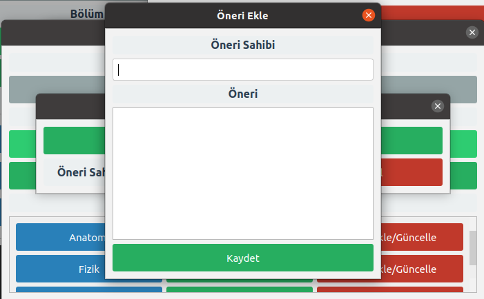
    <br>
    <strong>Dersler Öneri Ekleme/Düzenleme Ekranı</strong>
</p>

1. _Öneri Sahibi_
   - Öneri sahibinin _**adı/nicki**_'ni buraya yazmalısın.
1. _Öneri_
   - Dersle ilgili önerini buraya yazmalısın.
1. _Kaydet Butonu_
   - Yapılan değişiklikleri kaydetmek için bu butonu kullanmalısın.

#### Dönemler Dönem Ekle/Düzenle

<a id="donem_ekle_guncelle_ekrani_donem_duzenleme"></a>

<p align="center">
    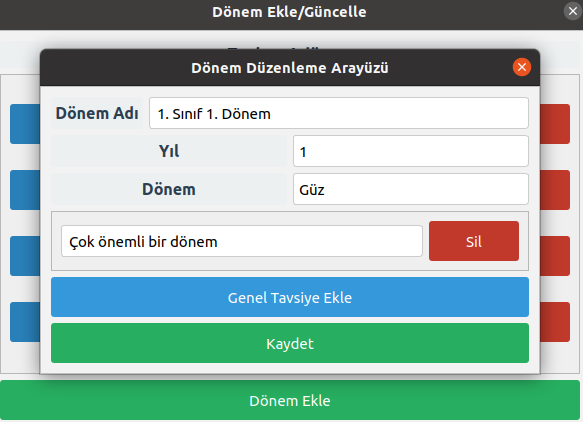
    <br>
    <strong>Dönemler Dönem Ekle/Düzenle Ekranı</strong>
</p>

1. _Dönem Adı_
   - Dönem'in _**README.md**_'de gözükecek adı.
1. _Yıl_
   - Dönemin ait olduğu yıl.
1. _Dönem_
   - Dönemin ait olduğu dönem.
1. _Genel Tavsiye Ekle_
   - Tavsiyeler arasına bir yenisini ekler. Silmek için yanındaki **_Sil_** butonuna tıklayabilirsin.
1. _Kaydet Butonu_
   - Kaydetmeye yarayan buton.

#### Giriş Açıklama Düzenleme

<a id="giris_ekrani_aciklama_duzenle"></a>

<p align="center">
    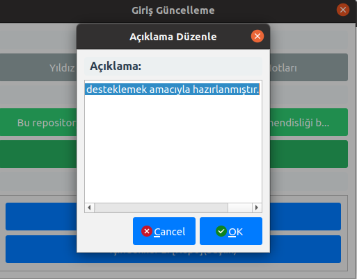
    <br>
    <strong>Giriş Açıklama Düzenleme</strong>
</p>

1. _Açıklama_
   - _Giriş_ kısmında gözükmesi istenen açıklama içeriği buraya yazılır. **_Ok_** butonuna basarak değişiklikler kaydedilir.

#### Giriş Başlık Düzenleme

<a id="giris_ekrani_baslik_duzenle"></a>

<p align="center">
    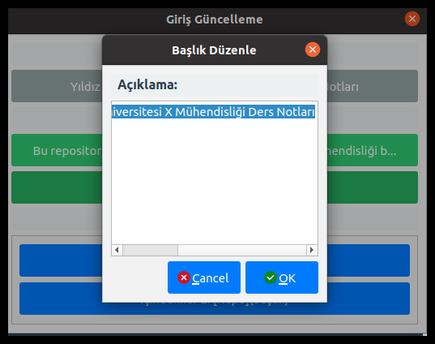
    <br>
    <strong>Giriş Başlık Düzenleme</strong>
</p>

1. _Açıklama_
   - _Giriş_ kısmında gözükmesi istenen başlık içeriği buraya yazılır. **_Ok_** butonuna basarak değişiklikler kaydedilir.

#### Giriş İçindekiler Düzenle

<a id="giris_ekrani_icerik_duzenle"></a>

<p align="center">
    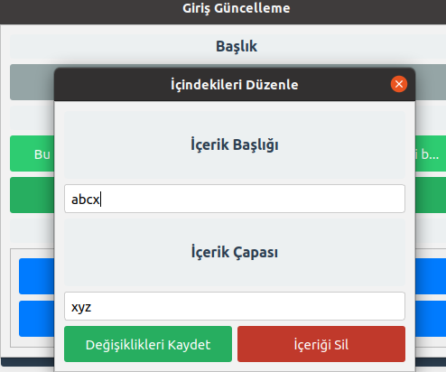
    <br>
    <strong>Giriş İçindekiler Düzenle</strong>
</p>

1. _İçerik Başlığı_
   - _Giriş_ kısmında içindekiler arasında yer alan içeriğin başlığı buraya yazılır.
1. _İçerik Çapası_
   - Bu **_README.md_** dosyalarındaki _çapa_'nın girildiği alandır. Konu hakkında bilginiz yoksa _ChatGPT_'ye sorun hemen cevaplar.
1. _İçeriği Sil_
   - İlgili içeriği _Giriş_ kısmından kaldırmak için butona tıklayın.
1. _Değişiklikleri Kaydet_
   - İlgili içeriğin güncellemesini kaydetmek için butona bas.

#### Giriş İçindekiler Ekle

<a id="giris_ekrani_icerik_ekle"></a>

<p align="center">
    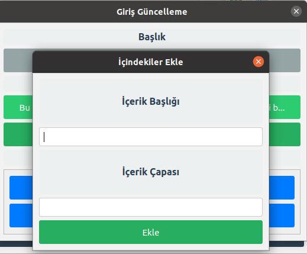
    <br>
    <strong>Giriş İçindekiler Ekle</strong>
</p>

1. _İçerik Başlığı_
   - _Giriş_ kısmında içindekiler arasında yer alan içeriğin başlığı buraya yazılır.
1. _İçerik Çapası_
   - Bu **_README.md_** dosyalarındaki _çapa_'nın girildiği alandır. Konu hakkında bilginiz yoksa _ChatGPT_'ye sorun hemen cevaplar.
1. _Ekle_
   - İlgili içeriğin _Giriş_ kısmına eklenmesi için butona bas.

#### Değişiklikleri Pushlama

<a id="git_islemleri_ekrani_degisiklikleri_githuba_pushla"></a>

<p align="center">
    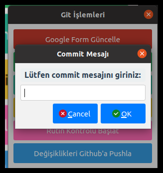
    <br>
    <strong>Değişiklikleri Pushlama</strong>
</p>

1. _Commit Mesajı_
   - _Commit Mesajı_ GitHub'da yapılan değişikliğin etiketidir. Dosyalarda kaydedilen son değişiklikten sonra ne tür değişiklikler yaptığınızı yazabilirsiniz. Sonrasında **_OK_** tuşuna basarak değişikliği GitHub'da görebilirsiniz.
   - Bu işlemi yaparken GitHub'da değişiklik yapılmamış olması gerekmektedir. Eğer sizin değişikliklerinizden önce birisi herhangi bir değişiklik yapmış ve GitHub'a göndermişse ve siz de bu değişikliği yerel bilgisayarınıza çekmeden değişiklik yapmışsanız, bu işlemi gerçekleştiremezsiniz.
   - Eğer böyle bir işlem yapmışsanız ve bu sayfaya geçmeye çalışırken uyarı alıyorsanız _ChatGPT_'ye **Rebase İşlemini Nasıl Yaparım?** ya da **Stash İşlemini Nasıl Yaparım** sorusunu sorabilirsiniz.

#### Hocalar Açıklama Düzenleme

<a id="hoca_ekrani_aciklama_duzenle"></a>

<p align="center">
    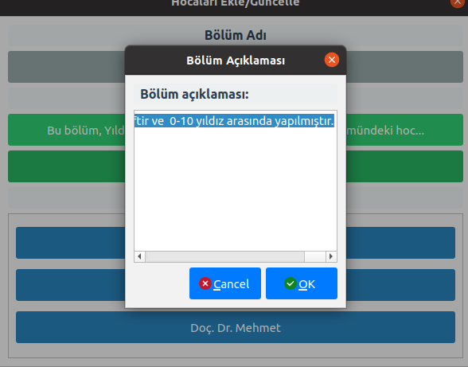
    <br>
    <strong>Hocalar Açıklama Düzenleme</strong>
</p>

1. _Bölüm Açıklaması_
   - _Hocalar_ kısmında gözükmesi istenen açıklama içeriği buraya yazılır. **_Ok_** butonuna basarak değişiklikler kaydedilir.

#### Hocalar Bölüm Adı Düzenleme

<a id="hoca_ekrani_bolum_adi_duzenle"></a>

<p align="center">
    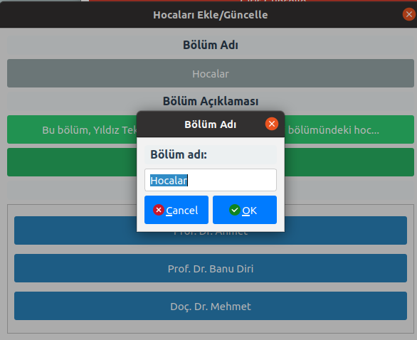
    <br>
    <strong>Hocalar Bölüm Adı Düzenleme</strong>
</p>

1. _Bölüm Adı_
   - _Hocalar_ kısmında gözükmesi istenen bölüm adı içeriği buraya yazılır. **_OK_** butonuna basarak değişiklikler kaydedilir.

#### Hoca Düzenleme

<a id="hoca_ekrani_duzenle"></a>

<p align="center">
    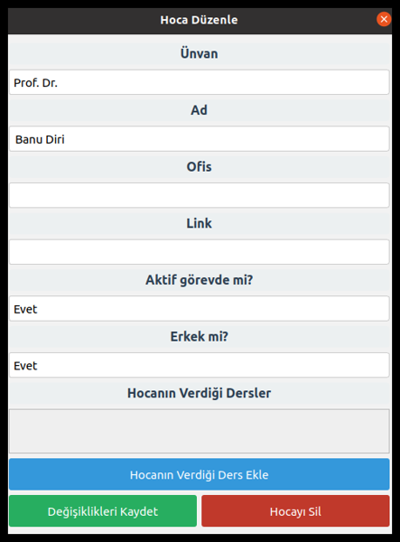
    <br>
    <strong>Hoca Düzenleme</strong>
</p>

1. _Ünvan_
   - İlgili hocanın ünvanı buradan seçilir.
2. _Ofis_
   - İlgili hocanın ofis bilgisi buraya girilir.
3. _Link_
   - Eğer varsa ilgili hocanın sayfasının linki buraya girilir.
4. _Aktif Görevde Mi?_
   - Eğer hoca hala üniversitede ders veriyorsa True, vermiyorsa False işaretlenir.
5. _Erkek Mi?_
   - Hoca erkekse True, değilse False işaretlenir.
6. _Hocanın Verdiği Ders Ekle Butonu_
   - Hocanın verdiği dersi eklemek için butona tıklanır ve üstteki _Hocanın Verdiği Dersler_ kısmına bir ders eklenir. Burada ders seçme işlemi yapılabilir.
7. _Değişiklikleri Kaydet_
   - Güncellenen hoca bilgileri eğer kaydedilmek isteniyorsa bu butona basılır.
8. _Hocayı Sil_
   - Eğer ilgili hoca bilgileri silinmek isteniyorsa bu butona basılır.

#### Hoca Ekleme

<a id="hoca_ekrani_ekle"></a>

<p align="center">
    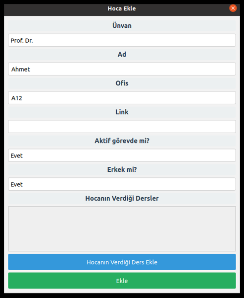
    <br>
    <strong>Hoca Ekleme</strong>
</p>

1. _Ünvan_
   - İlgili hocanın ünvanı buradan seçilir.
2. _Ofis_
   - İlgili hocanın ofis bilgisi buraya girilir.
3. _Link_
   - Eğer varsa ilgili hocanın sayfasının linki buraya girilir.
4. _Aktif Görevde Mi?_
   - Eğer hoca hala üniversitede ders veriyorsa True, vermiyorsa False işaretlenir.
5. _Erkek Mi?_
   - Hoca erkekse True, değilse False işaretlenir.
6. _Hocanın Verdiği Ders Ekle Butonu_
   - Hocanın verdiği dersi eklemek için butona tıklanır ve üstteki _Hocanın Verdiği Dersler_ kısmına bir ders eklenir. Burada ders seçme işlemi yapılabilir.
7. _Ekle_
   - Seçilen hoca bilgileri eğer kaydedilmek isteniyorsa bu butona basılır. Bu işlem yapıldıktan sonra artık ilgili hoca bilgileri _Hocalar_ arasına eklenmiş olur.

#### Repo Kullanımı Başlık Düzenleme

<a id="repo_kullanimi_baslik_duzenle"></a>

<p align="center">
    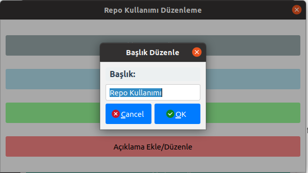
    <br>
    <strong>Repo Kullanımı Başlık Düzenleme</strong>
</p>

1. _Başlık_
   - _Repo Kullanımı_ kısmında gözükmesi istenen başlık içeriği buraya yazılır. **_OK_** butonuna basarak değişiklikler kaydedilir.

#### Repo Kullanımı Açıklama Ekle/Düzenle

<a id="repo_kullanimi_ekrani_aciklama_ekle_ekrani"></a>

<p align="center">
    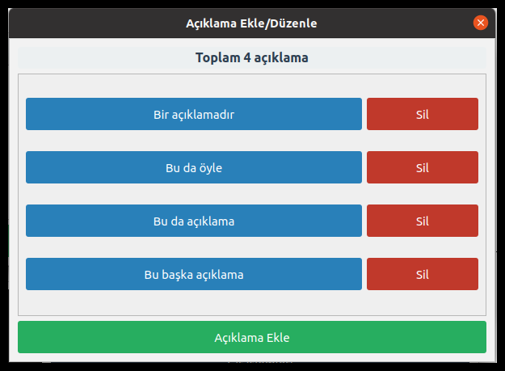
    <br>
    <strong>Repo Kullanımı Açıklama Ekle/Düzenle</strong>
</p>

1. _Açıklamalar İçinde Yer Alan Herhangi Bir Buton_

   - Bu buton _Repo Kullanımı_ bölümündeki ilgili açıklamayı düzenlemeye yarayan [Repo Kullanımı Açıklamalarında Açıklama Ekle/Düzenle](#repo_kullanimi_ekrani_aciklama_ekle_ekrani_aciklama_ekle) ekranını açar.

1. _Açıklama Ekle Butonu_
   - Bu buton _Repo Kullanımı_ bölümündeki açıklamalar arasına bir yenisini eklemeye yarayan [Repo Kullanımı Açıklamalarında Açıklama Ekle/Düzenle](#repo_kullanimi_ekrani_aciklama_ekle_ekrani_aciklama_ekle) ekranını açar.

#### Repo Kullanımı Açıklamalarında Açıklama Ekle/Düzenle

<a id="repo_kullanimi_ekrani_aciklama_ekle_ekrani_aciklama_ekle"></a>

<p align="center">
    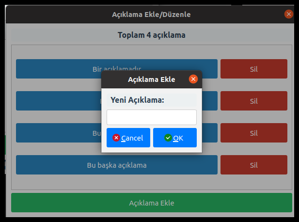
    <br>
    <strong>Repo Kullanımı Açıklamalarında Açıklama Ekle/Düzenle</strong>
</p>

1. _Yeni Açıklama_
   - _Repo Kullanımı_ kısmında gözükmesi istenen açıklamanın içeriği yazılır. **_Ok_** butonuna basarak değişiklikler kaydedilir. (Güncellenir ya da Eklenir)

#### Kavram Ekle/Düzenle

<a id="repo_kullanimi_ekrani_kavram_ekle_ekrani"></a>

<p align="center">
    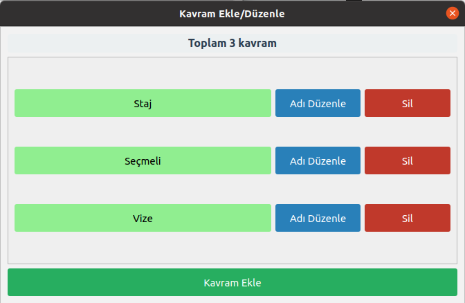
    <br>
    <strong>Kavram Ekle/Düzenle</strong>
</p>

1. _Kavramlar İçinde Yer Alan Herhangi Bir Buton_
   - Bu buton _Repo Kullanımı_ bölümündeki ilgili kavramları düzenlemeye yarayan [Kavram Açıklamaları Ekleme/Düzenleme](#repo_kullanimi_ekrani_kavram_ekle_ekrani_kavram_aciklama_duzenle_ekrani) ekranını açar.
1. _Adı Düzenle Butonu_
   - İlgili kavramın adını düzenlemek için[Kavram Ekleme/Ad Düzenleme](#repo_kullanimi_ekrani_kavram_ekle_ekrani_kavram_ekle) ekranını açar.
1. _Sil Butonu_

   - İlgili kavramı siler.

1. _Kavram Ekle Butonu_
   - Bu buton _Repo Kullanımı_ bölümündeki kavramlar arasına bir yenisini eklemeye yarayan [Kavram Ekleme/Ad Düzenleme](#repo_kullanimi_ekrani_kavram_ekle_ekrani_kavram_ekle) ekranını açar.

#### Kavram Açıklamaları Ekleme/Düzenleme

<a id="repo_kullanimi_ekrani_kavram_ekle_ekrani_kavram_aciklama_duzenle_ekrani"></a>

<p align="center">
    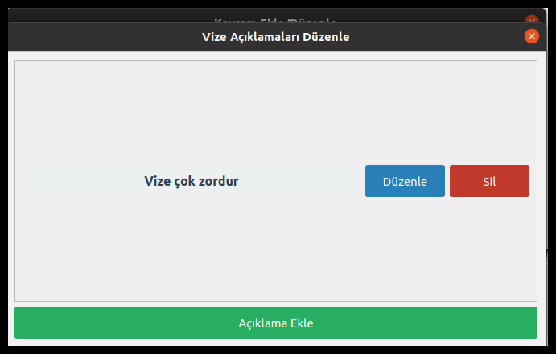
    <br>
    <strong>Kavram Açıklamaları Ekleme/Düzenleme</strong>
</p>

1. _Açıklama Ekle Butonu_
   - Kavramla ilgili açıklama eklemeye yarayan [Kavram Açıklaması Ekleme/Düzenleme](#repo_kullanimi_ekrani_kavram_ekle_ekrani_kavram_aciklama_duzenle_ekrani_aciklama_ekle) ekranını açar.
1. _Açıklamalar İçinde Yer Alan Herhangi Bir Buton_
   - Bu buton _Repo Kullanımı_ bölümündeki ilgili kavramın ilgilş açıklamasını düzenlemeye yarayan [Kavram Açıklaması Ekleme/Düzenleme](#repo_kullanimi_ekrani_kavram_ekle_ekrani_kavram_aciklama_duzenle_ekrani) ekranını açar.

#### Kavram Açıklaması Ekleme/Düzenleme

<a id="repo_kullanimi_ekrani_kavram_ekle_ekrani_kavram_aciklama_duzenle_ekrani_aciklama_ekle"></a>

<p align="center">
    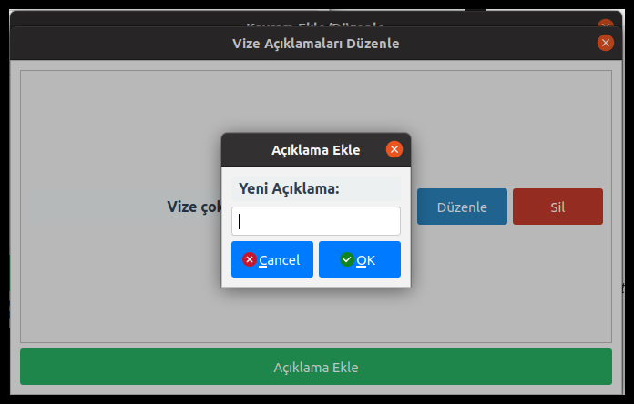
    <br>
    <strong>Kavram Açıklamaları Ekleme/Düzenleme</strong>
</p>

1. _Yeni Açıklama_
   - İlgili kavramın altında gözükmesi istenen istenen açıklamanın içeriği yazılır. **_Ok_** butonuna basarak değişiklikler kaydedilir. (Güncellenir ya da Eklenir)

#### Kavram Ekleme/Ad Düzenleme

<a id="repo_kullanimi_ekrani_kavram_ekle_ekrani_kavram_ekle"></a>

<p align="center">
    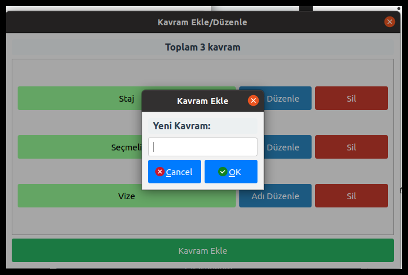
    <br>
    <strong>Kavram Ekleme/Ad Düzenleme</strong>
</p>

1. _Yeni Kavram_
   - _Repo Kullanımı_ kısmına eklenmesi istenen kavramın adı yazılır. **_Ok_** butonuna basarak değişiklikler kaydedilir. (Güncellenir ya da Eklenir)

#### Talimat Ekle/Düzenle

<a id="repo_kullanimi_ekrani_talimat_ekrani"></a>

<p align="center">
    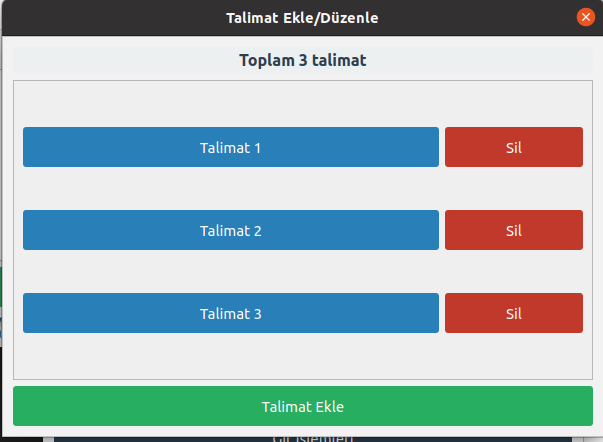
    <br>
    <strong>Talimat Ekle/Düzenle</strong>
</p>

1. _Talimatlar İçinde Yer Alan Herhangi Bir Buton_

   - Bu buton _Repo Kullanımı_ bölümündeki ilgili talimatı düzenlemeye yarayan [Repo Kullanımı Talimatlarında Talimat Ekle/Düzenle](#repo_kullanimi_ekrani_talimat_ekrani_talimat_ekle) ekranını açar.

1. _Talimat Ekle Butonu_
   - Bu buton _Repo Kullanımı_ bölümündeki talimatlar arasına bir yenisini eklemeye yarayan [Repo Kullanımı Talimatlarında Talimat Ekle/Düzenle](#repo_kullanimi_ekrani_talimat_ekrani_talimat_ekle) ekranını açar.

#### Repo Kullanımı Talimatlarında Talimat Ekle/Düzenle

<a id="repo_kullanimi_ekrani_talimat_ekrani_talimat_ekle"></a>

<p align="center">
    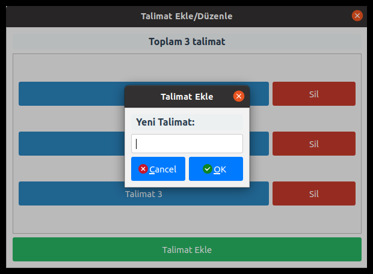
    <br>
    <strong>Repo Kullanımı Talimatlarında Talimat Ekle/Düzenle</strong>
</p>

1. _Yeni Talimat_
   - _Repo Kullanımı_ kısmına eklenmesi istenen talimat yazılır. **_Ok_** butonuna basarak değişiklikler kaydedilir. (Güncellenir ya da Eklenir)

#### Yazarın Notları Başlık Düzenleme

<a id="yazarin_notlari_ekrani_baslik_duzenle"></a>

<p align="center">
    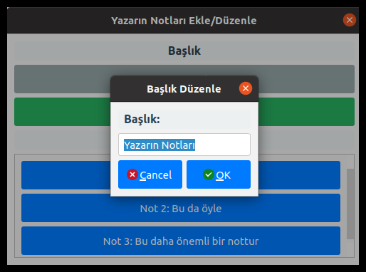
    <br>
    <strong>Yazarın Notları Başlık Düzenleme</strong>
</p>

1. _Başlık_
   - _Yazarın Notları_ kısmında gözükmesi istenen başlık içeriği buraya yazılır. **_OK_** butonuna basarak değişiklikler kaydedilir.

#### Katkıda Bulunanlar Bölüm Adı Düzenleme

<a id="katkida_bulunan_ekle_guncelle_ekrani_ad_duzenle"></a>

<p align="center">
    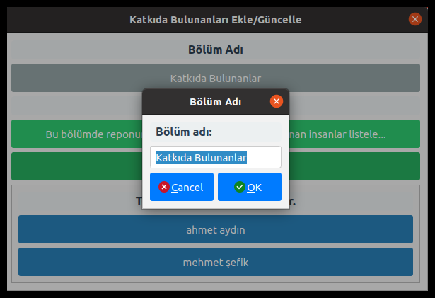
    <br>
    <strong>Katkıda Bulunanlar Bölüm Adı Düzenleme</strong>
</p>

1. _Bölüm Adı_
   - _Katkıda Bulunanlar_ kısmında gözükmesi istenen bölüm adı içeriği buraya yazılır. **_OK_** butonuna basarak değişiklikler kaydedilir.

#### Katkıda Bulunanlar Bölüm Açıklaması Düzenleme

<a id="katkida_bulunan_ekle_guncelle_ekrani_aciklama_duzenle"></a>

<p align="center">
    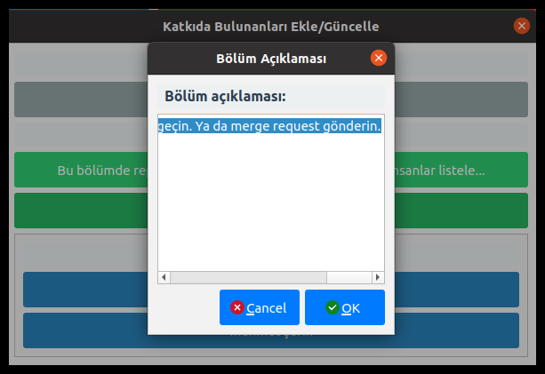
    <br>
    <strong>Katkıda Bulunanlar Bölüm Açıklaması Düzenleme</strong>
</p>

1. _Bölüm Açıklaması_
   - _Katkıda Bulunanlar_ kısmında gözükmesi istenen bölüm açıklaması içeriği buraya yazılır. **_OK_** butonuna basarak değişiklikler kaydedilir.

#### Katkıda Bulunanlar Katkıda Bulunan Ekle/Düzenle

<a id="katkida_bulunan_ekle_guncelle_ekrani_ekleme"></a>

<p align="center">
    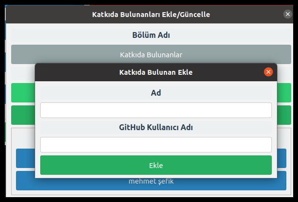
    <br>
    <strong>Katkıda Bulunanlar Katkıda Bulunan Ekle/Düzenle</strong>
</p>

1. _Ad_
   - Eklenmek/Düzenlenmek istenen kişinin adı buraya yazılır.
1. _GitHub Kullanıcı Adı_
   - Eklenmek/Düzenlenmek istenen kişinin GitHub kullanıcı adı buraya yazılır.
1. _Ekle Butonu_
   - Bu buton _GitHub Kullanıcı Adı_ geçerli mi kontrolü yapar. Geçerşiyse değişiklikleri kaydeder.

#### Yazarın Notları Not Düzenleme

<a id="yazarin_notlari_ekrani_not_duzenle"></a>

<p align="center">
    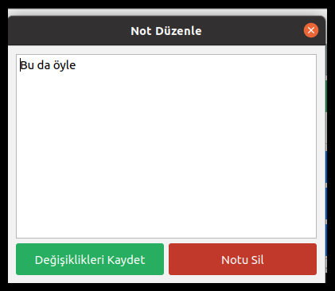
    <br>
    <strong>Yazarın Notları Not Düzenleme</strong>
</p>

1. _Notu Düzenle_
   - _Yazarın Notları_ kısmında güncellenmek istenen not içeriği buraya yazılır.
1. _Değişiklikleri Kaydet Butonu_
   - Eğer değişiklikler geçerli olsun istiyorsanız bu butona basın.
1. _Sil Butonu_
   - İlgili notu silmek için bu butona basın.

#### Yazarın Notları Not Ekle

<a id="yazarin_notlari_ekrani_not_ekle"></a>

<p align="center">
    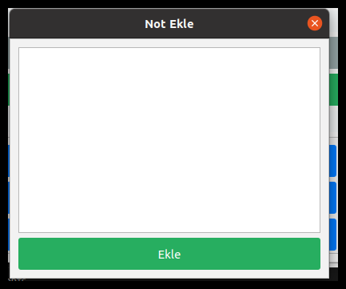
    <br>
    <strong>Yazarın Notları Not Ekle</strong>
</p>

1. _Not Ekle_
   - _Yazarın Notları_ kısmına eklenmek istenen not içeriği buraya yazılır.
1. _Ekle Butonu_
   - Eğer notu _Yazarın Notları_ arasına eklemek istiyorsanız bu butona basın.
